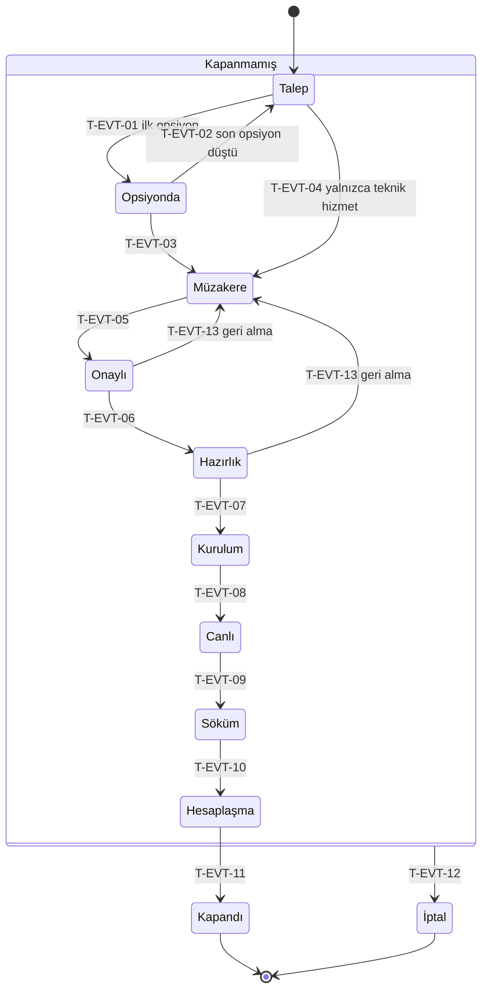
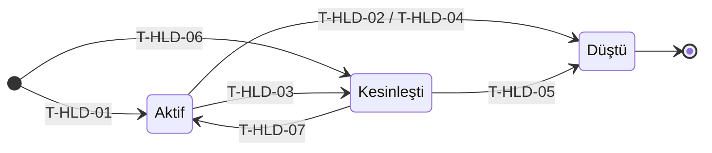
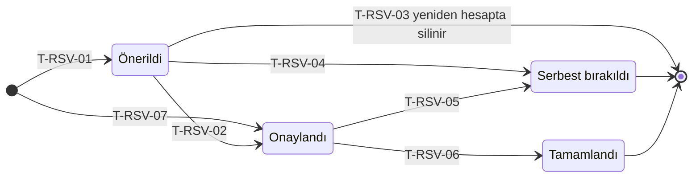
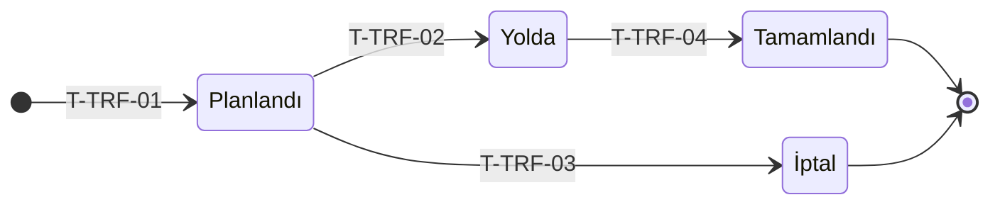
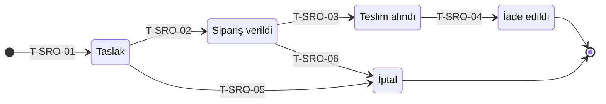
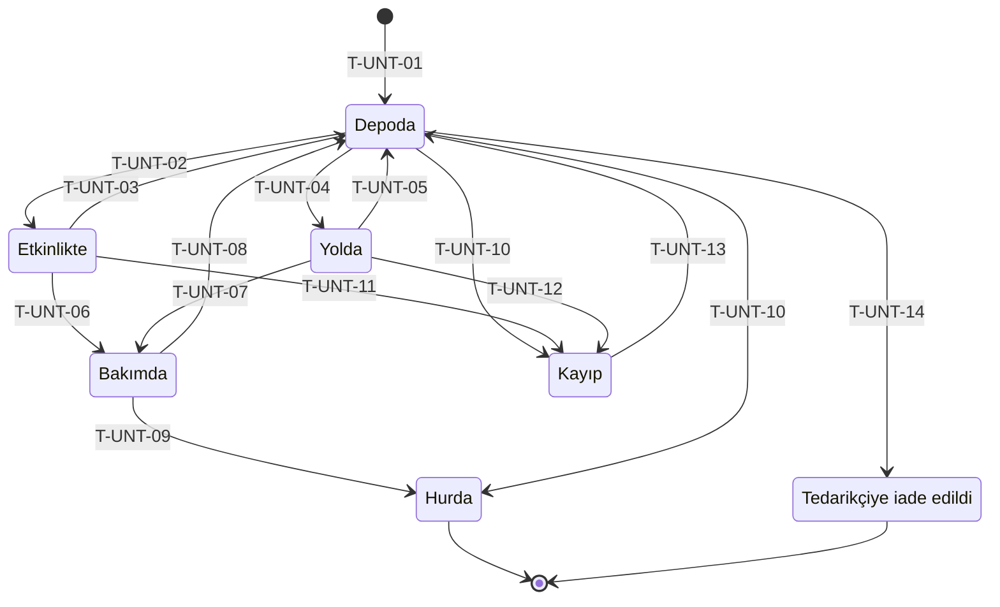
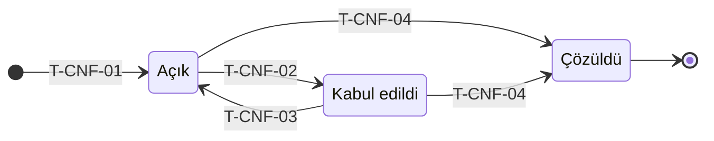

# 04 — Durum Makineleri

> **Durum:** v1.1 · **Son güncelleme:** 2026-09-25
> **Kararlar:** [Bölüm 12](#12-kararlar)

## 1. Bu belge ne işe yarar

Yaşam döngüsü olan her varlığın durumlarını ve durumlar arasındaki **tüm** geçişleri tanımlar. Burada olmayan bir geçiş sistemde yapılamaz ve sunucu tarafından reddedilir ([BR-EVT-015](03-business-rules.md#br-evt-015--durum-geçmişi-ve-geçersiz-geçişler)).

Her geçişin şu bilgileri vardır:

| Alan | Anlamı |
|---|---|
| **No** | `T-<MAKİNE>-<NN>`. Testler ve kod bu numarayla referans verir; silinen numara tekrar kullanılmaz. |
| **Tetikleyen** | Geçişi başlatan şey: bir kullanıcı işlemi (elle), bir okutma ya da başka bir geçişin yan etkisi (otomatik). |
| **Kim** | Elle geçişte bu işlemi yapabilen roller. |
| **Koşul** | Geçişin yapılabilmesi için doğru olması gerekenler. |
| **Etkiler** | Geçişin başka varlıklarda yol açtığı değişiklikler. |
| **Kural** | Geçişi tanımlayan iş kuralları. |

Durum ve kod adları [sözlükteki](01-glossary.md) gibidir. Diyagramlarda durumların kod adları kimlik, Türkçe adları etiket olarak kullanılır.

**Bu belgedeki makineler (S1):**

| Makine | Varlık | Bölüm |
|---|---|---|
| `EVT` | Etkinlik | [3](#3-etkinlik-eventstatus) |
| `HLD` | Opsiyon | [4](#4-opsiyon-holdstatus) |
| `RSV` | Rezervasyon | [5](#5-rezervasyon-reservationstatus) |
| `TRF` | Transfer | [6](#6-transfer-transferstatus) |
| `SRO` | Dış kiralama siparişi | [7](#7-dış-kiralama-siparişi-subrentalorderstatus) |
| `UNT` | Birim | [8](#8-birim-unitstatus) |
| `CNF` | Çakışma | [9](#9-çakışma-conflictstatus) |
| `CLC` | İhtiyaç hesabı güncelliği | [10](#10-i̇htiyaç-hesabı-güncelliği) |
| `USR` | Kullanıcı hesabı | [11](#11-kullanıcı-hesabı) |

Durum makinesi olmayanlar:
- **Rider versiyonu:** Kaydedildiği anda değişmez hale gelir (BR-RDR-003).
- **Kasa:** Kendi durumu yoktur. Konumu içeriğiyle birlikte okutma işlemleriyle değişir (BR-EQP-006).
- **Adetli stok:** Durum yerine miktar kümeleriyle izlenir ([Bölüm 8.3](#83-adetli-stok-hareketleri)).
- **Ana veriler:** Taraf, mekan, depo, model, kategori ve kit yalnızca **Aktif** / **Pasif** olur (BR-SYS-001).

## 2. Genel kurallar

1. Her durum geçişi, önceki ve yeni durum, kullanıcı (otomatik geçişte tetikleyen işlem), zaman ve isteğe bağlı notla işlem geçmişine yazılır (BR-SYS-010).
2. Aynı modüldeki otomatik geçişler, onları tetikleyen işlemle aynı işlem biriminde (transaction) gerçekleşir; işlem başarısız olursa hiçbir geçiş kalıcı olmaz. Başka bir modülde tetiklenen otomatik geçişler ise işlem tamamlandıktan sonra, entegrasyon olayıyla ve kaybolmadan gerçekleşir. Bu geçişlerin listesi [05-module-map.md §9.4](05-module-map.md#94-modüller-arası-otomatik-geçişler)'te.
3. Bir geçişin koşulu sağlanmıyorsa geçiş reddedilir ve kullanıcıya ilgili kuralın numarası gösterilir.
4. Arayüz, o an koşulları sağlanan elle geçişleri sunar. Koşulu sağlanmayan geçiş, nedeniyle birlikte pasif gösterilebilir.

---

## 3. Etkinlik (`EventStatus`)

### 3.1 Diyagram

### 3.2 Geçişler

| No | Geçiş | Tetikleyen | Kim | Koşul | Etkiler | Kural |
|---|---|---|---|---|---|---|
| T-EVT-01 | Talep → Opsiyonda | Otomatik: etkinliğe ilk opsiyon eklenir | — | — | — | BR-EVT-001, BR-EVT-003 |
| T-EVT-02 | Opsiyonda → Talep | Otomatik: son aktif opsiyon düşer | — | — | — | BR-EVT-007 |
| T-EVT-03 | Opsiyonda → Müzakere | Elle | Booking müdürü | En az bir aktif opsiyon var | — | BR-EVT-001 |
| T-EVT-04 | Talep → Müzakere | Elle | Booking müdürü | Etkinlik türü **Teknik hizmet** | — | BR-EVT-001 |
| T-EVT-05 | Müzakere → Onaylı | Elle | Booking müdürü | Opsiyon koşulları sağlanır; "Sözleşme imzalandı" elle onayı verilir | Aktif opsiyonlar **Kesinleşti** olur (T-HLD-03) | BR-EVT-009 |
| T-EVT-06 | Onaylı → Hazırlık | Elle | Booking müdürü, teknik müdür | Mekan, kaynak depo ve bağlı rider versiyonu var | İhtiyaç hesabı çalışır (T-CLC-02) | BR-EVT-010 |
| T-EVT-07 | Hazırlık → Kurulum | Elle ya da otomatik: başlangıç zamanı | Booking müdürü, teknik müdür | Çıkışı tamamlanmamış onaylı rezervasyon varsa elle geçişte kullanıcı uyarıyı onaylar; otomatik geçişte uyarı etkinliğe not olarak düşer | — | BR-EVT-011, BR-EVT-018 |
| T-EVT-08 | Kurulum → Canlı | Elle ya da otomatik: kapı açılışı | Booking müdürü, teknik müdür | — | Artık çıkış geri alınamaz | BR-WHS-005, BR-EVT-018 |
| T-EVT-09 | Canlı → Söküm | Elle ya da otomatik: söküm başlangıcı | Booking müdürü, teknik müdür | — | — | BR-EVT-018 |
| T-EVT-10 | Söküm → Hesaplaşma | Elle ya da otomatik: bitiş zamanı | Booking müdürü, teknik müdür | — | — | BR-EVT-018 |
| T-EVT-11 | Hesaplaşma → Kapandı | Elle | Booking müdürü | **Etkinlikte** durumunda birim ya da girişi yapılmamış adet yok; "Hesaplaşma onaylandı" elle onayı verilir | Onaylı rezervasyonlar **Tamamlandı** olur (T-RSV-06); etkinlik ve bağlı kayıtlar değiştirilemez hale gelir | BR-EVT-012, BR-EVT-013 |
| T-EVT-12 | Kapandı ve İptal dışındaki her durum → İptal | Elle | Booking müdürü | İptal nedeni girilir | Bölüm 3.4 | BR-EVT-014 |
| T-EVT-13 | Onaylı / Hazırlık → Müzakere | Elle | Booking müdürü | Etkinlik için çıkışı yapılmış ekipman yok; neden girilir | Kesinleşmiş opsiyonlar **Aktif** olur (T-HLD-07); "Sözleşme imzalandı" onayı geçersiz olur; onaylı rezervasyonlar ve transferler korunur | BR-EVT-019 |

**Kapanış durumları:** **Kapandı** ve **İptal** son durumlardır; bu durumlardan çıkış yoktur.

**Geri dönüş:** Tek geri dönüş geçişi T-EVT-13'tür (**Onaylı** / **Hazırlık** → **Müzakere**). Şartlar yeniden görüşülürken ekipman kaybedilmesin diye rezervasyonlar korunur. Etkinlik yeniden onaylandığında **Onaylı** durumuna döner.

**Otomatik operasyon geçişleri:** Etkinliğin operasyon geçiş modu **Otomatik** ise T-EVT-07…T-EVT-10 zamanı geldiğinde sistem tarafından yapılır (BR-EVT-018). Bitiş zamanı geldiğinde hâlâ **Kurulum** ya da **Canlı**'daki etkinlik, ara durumlardan sırayla geçerek **Hesaplaşma**'ya ilerler; her ara geçiş ayrı kaydedilir.

### 3.3 Durumlara göre izin verilen işlemler

Bir işlem, etkinlik yalnızca işaretli durumlardan birindeyken yapılabilir.

| İşlem | Talep | Opsiyonda | Müzakere | Onaylı | Hazırlık | Kurulum | Canlı | Söküm | Hesaplaşma | Kapandı | İptal |
|---|---|---|---|---|---|---|---|---|---|---|---|
| Genel bilgileri düzenleme | ✓ | ✓ | ✓ | ✓ | ✓ | ✓ | ✓ | ✓ | ✓ | | |
| Etkinlik türünü değiştirme | ✓ | | | | | | | | | | |
| Başlangıç / bitiş zamanını değiştirme | ✓ | ✓ | ✓ | ✓¹ | ✓¹ | ✓¹ | ✓¹ | ✓¹ | ✓¹ | | |
| Opsiyon ekleme | ✓ | ✓ | ✓ | | | | | | | | |
| Opsiyon düşürme (aktif) | | ✓ | ✓ | | | | | | | | |
| Rider versiyonu bağlama / değiştirme | ✓ | ✓ | ✓ | ✓ | ✓² | ✓² | | | | | |
| Hazırlık ve dönüş payını değiştirme | ✓ | ✓ | ✓ | ✓ | ✓ | ✓ | ✓ | ✓ | | | |
| İhtiyaç hesabını elle çalıştırma | | | | ✓ | ✓ | ✓ | | | | | |
| Rezervasyon onaylama / düzenleme | | | | ✓ | ✓ | ✓ | ✓ | ✓ | | | |
| Onaylı rezervasyonu serbest bırakma | | | ✓⁵ | ✓ | ✓ | ✓ | ✓ | ✓ | | | |
| Transfer önerisini onaylama | | | | ✓ | ✓ | ✓ | | | | | |
| Dış kiralama siparişi oluşturma | | | | ✓ | ✓ | ✓ | ✓ | | | | |
| Çıkış okutma | | | | ✓ | ✓ | ✓ | ✓ | | | | |
| Çıkışı geri alma | | | | ✓ | ✓ | ✓ | | | | | |
| Giriş okutma | | | | ✓³ | ✓³ | ✓ | ✓ | ✓ | ✓ | | ✓⁴ |
| Dönmeyen birimi kayıp işaretleme | | | | | | | | ✓ | ✓ | | ✓⁴ |
| Operasyon geçiş modunu değiştirme | ✓ | ✓ | ✓ | ✓ | ✓ | ✓ | ✓ | ✓ | | | |
| Onaydan geri alma (T-EVT-13) | | | | ✓ | ✓ | | | | | | |

1. "Mekan yeni tarihi onayladı" elle onayıyla (BR-EVT-017).
2. İhtiyaç hesabı "güncel değil" olur (BR-MRP-010).
3. Etkinlikten önce çıkışı yapılıp geri getirilen ekipman için.
4. Yalnızca iptal anında çıkışı yapılmış ve henüz dönmemiş ekipman için (BR-EVT-014).
5. Onaydan geri alınan etkinlikte korunan rezervasyonlar için (BR-EVT-019).

### 3.4 İptalin etkileri

| Etkilenen | Önceki durum | Sonraki durum | Geçiş |
|---|---|---|---|
| Opsiyon | Aktif, Kesinleşti | Düştü (neden: etkinlik iptal) | T-HLD-04, T-HLD-05 |
| Rezervasyon | Önerildi, Onaylandı | Serbest bırakıldı | T-RSV-04, T-RSV-05 |
| Transfer | Planlandı | İptal | T-TRF-03 |
| Transfer | Yolda | Değişmez, tamamlanmaya devam eder | — |
| Dış kiralama siparişi | Taslak | İptal | T-SRO-05 |
| Dış kiralama siparişi | Sipariş verildi | Değişmez; tedarikçiye haber verilmesi için uyarı gösterilir | — |
| Birim | Etkinlikte | Değişmez; etkinlik "dönmemiş ekipman" olarak işaretlenir, giriş okutması açık kalır | — |

---

## 4. Opsiyon (`HoldStatus`)

Opsiyon, bir etkinliğe ya da (dış opsiyonda) bilinmeyen bir sahibe ait, tek bir mekan ve takvim günü için tutulan sıradır. **Süresi geçti** bir durum değil, son tarihten hesaplanan bir işarettir (BR-EVT-008).

| No | Geçiş | Tetikleyen | Kim | Koşul | Etkiler | Kural |
|---|---|---|---|---|---|---|
| T-HLD-01 | Oluşturma → Aktif | Elle (kendi veya dış opsiyon) ya da otomatik (eksik sıra dolduran dış opsiyon) | Booking müdürü | Etkinlik **Talep**, **Opsiyonda** veya **Müzakere**'de; etkinliğin aynı mekan ve günde başka aktif opsiyonu yok | Girilen sıradaki ve arkasındaki opsiyonlar bir geri kayar; eksik sıralar dış opsiyonla dolar; ilk opsiyonsa T-EVT-01 | BR-EVT-001…004 |
| T-HLD-02 | Aktif → Düştü | Elle | Booking müdürü | Neden girilir (iptal, süre doldu, mekan başkasına verdi) | Arkadaki opsiyonlar bir öne çıkar; etkinliğin son aktif opsiyonuysa T-EVT-02 | BR-EVT-005, BR-EVT-007 |
| T-HLD-03 | Aktif → Kesinleşti | Otomatik: etkinlik **Onaylı** olur (T-EVT-05) | — | Opsiyon 1. sırada ve süresi geçmemiş | Sırası değişmez; elle düşürülemez hale gelir | BR-EVT-009 |
| T-HLD-04 | Aktif → Düştü | Otomatik: etkinlik iptali (T-EVT-12) ya da zaman değişikliğiyle günü aralık dışında kalması | — | — | Arkadaki opsiyonlar bir öne çıkar | BR-EVT-014, BR-EVT-017 |
| T-HLD-05 | Kesinleşti → Düştü | Otomatik: etkinlik iptali ya da zaman değişikliğiyle günü aralık dışında kalması | — | — | Arkadaki opsiyonlar bir öne çıkar | BR-EVT-014, BR-EVT-017 |
| T-HLD-07 | Kesinleşti → Aktif | Otomatik: etkinlik onaydan geri alınır (T-EVT-13) | — | — | Sırası değişmez; yeniden elle düşürülebilir | BR-EVT-019 |
| T-HLD-06 | Oluşturma → Kesinleşti | Otomatik: **Onaylı** ve sonraki durumdaki etkinliğin zamanı yeni günleri kapsayacak şekilde değişir | — | "Mekan yeni tarihi onayladı" elle onayı verilmiş | Opsiyon 1. sıraya yerleşir; mevcutlar bir geri kayar | BR-EVT-017 |

**Sıra kuralı:** Aynı mekan ve gündeki **Aktif** ve **Kesinleşti** opsiyonlar birlikte 1'den başlayarak boşluksuz sıralanır. **Düştü** opsiyonlar sıraya girmez (BR-EVT-002).

---

## 5. Rezervasyon (`ReservationStatus`)

| No | Geçiş | Tetikleyen | Kim | Koşul | Etkiler | Kural |
|---|---|---|---|---|---|---|
| T-RSV-01 | Oluşturma → Önerildi | Otomatik: ihtiyaç hesabı | — | Etkinlik **Onaylı** … **Söküm** arasında | Müsaitliği düşürmez | BR-MRP-002, BR-MRP-012 |
| T-RSV-02 | Önerildi → Onaylandı | Elle | Teknik müdür | Onay anında müsaitlik yeterli; model satırın eşleşme kuralına uyuyor | Müsaitliği düşürür; aşırı rezervasyon kontrolü çalışır | BR-MRP-012…014 |
| T-RSV-03 | Önerildi → (silinir) | Otomatik: ihtiyaç hesabının yeniden çalışması | — | — | Yeni öneriler üretilir | BR-MRP-009 |
| T-RSV-04 | Önerildi → Serbest bırakıldı | Otomatik: etkinlik iptali | — | — | — | BR-EVT-014 |
| T-RSV-05 | Onaylandı → Serbest bırakıldı | Elle ya da otomatik (etkinlik iptali) | Teknik müdür | Elle ise neden girilir | Müsaitlik geri kazanılır | BR-MRP-015, BR-EVT-014 |
| T-RSV-06 | Onaylandı → Tamamlandı | Otomatik: etkinlik **Kapandı** olur (T-EVT-11) | — | — | Kayıt değişmez hale gelir | BR-EVT-012 |
| T-RSV-07 | Oluşturma → Onaylandı | Otomatik: çıkışta listede olmayan kalemin eklenmesi ya da transfer önerisinin onayı | Depo sorumlusu (çıkışta), teknik müdür (transferde) | Müsaitlik yeterli | Müsaitliği düşürür | BR-WHS-004, BR-MRP-007 |

**Fazla** işareti bir durum değildir. Yeniden hesaptan sonra net ihtiyacı aşan **Onaylandı** rezervasyonlara konur (BR-MRP-009).

---

## 6. Transfer (`TransferStatus`)

| No | Geçiş | Tetikleyen | Kim | Koşul | Etkiler | Kural |
|---|---|---|---|---|---|---|
| T-TRF-01 | Oluşturma → Planlandı | Elle: transfer önerisinin onayı ya da etkinlikten bağımsız elle transfer | Teknik müdür (öneriden), depo sorumlusu (elle) | Gönderen depoda müsaitlik yeterli; öneriden oluşuyorsa varış rezervasyon aralığının başlangıcından sonra değil | Kalemler planlanan çıkıştan itibaren gönderen depoda ayrılır | BR-MRP-007, BR-WHS-012 |
| T-TRF-02 | Planlandı → Yolda | Okutma: gönderen depoda ilk çıkış okutması | Gönderen deponun sorumlusu | — | Okutulan birimler **Yolda** olur (T-UNT-04) | BR-WHS-011 |
| T-TRF-03 | Planlandı → İptal | Elle ya da otomatik (bağlı etkinliğin iptali) | Teknik müdür, transferi oluşturan depo sorumlusu | Henüz hiçbir kalem okutulmamış | Gönderen depodaki ayırma kalkar | BR-EVT-014 |
| T-TRF-04 | Yolda → Tamamlandı | Okutma: tüm kalemlerin varışı okutulur ya da alan depo eksiklerle tamamlar | Alan deponun sorumlusu | — | Birimler hedef depoda **Depoda** (T-UNT-05); varışı okutulmayan birimler **Kayıp** (T-UNT-12); adetli eksikler sayım farkı olur; gerçekleşen varış zamanı kaydedilir | BR-WHS-008, BR-WHS-011 |

Transferin planı ve durumu **Planning**'de, okutmaları **Inventory**'de tutulur ([05-module-map.md §6](05-module-map.md#6-tartışmalı-sahiplik-kararları)). T-TRF-02 ve T-TRF-04, Inventory'deki okutmaların olaylarıyla Planning'de gerçekleşir. **Yolda** transfer iptal edilemez. Yanlış gönderilen ekipman için transfer tamamlanır ve ters yönde yeni bir transfer açılır. **Gecikmiş** bir işarettir: planlanan varış geçtiği halde **Yolda** olan transfere konur. Gecikmiş transferin kalemleri hedef depoda müsait sayılmaz (BR-MRP-002).

---

## 7. Dış kiralama siparişi (`SubRentalOrderStatus`)

| No | Geçiş | Tetikleyen | Kim | Koşul | Etkiler | Kural |
|---|---|---|---|---|---|---|
| T-SRO-01 | Oluşturma → Taslak | Elle: dış kiralama önerisinden | Teknik müdür | Etkinlik **Onaylı** … **Canlı** arasında; tedarikçi, Tedarikçi rolünde aktif bir taraf | İhtiyaç hesabında henüz karşılanmış sayılmaz | BR-MRP-008, BR-PTY-004 |
| T-SRO-02 | Taslak → Sipariş verildi | Elle | Teknik müdür | En az bir satır var | Satırlar ihtiyaç hesabında karşılanmış sayılır | BR-MRP-008 |
| T-SRO-03 | Sipariş verildi → Teslim alındı | Elle | Teknik müdür; teslim yeri depoysa o deponun sorumlusu | Teslim yeri depoysa satır bazında "QR ile takip et" seçilebilir | QR ile takip edilen satırlar için **Dış kiralama** sahipli birim ve adetli stok oluşur (T-UNT-01) | BR-WHS-013 |
| T-SRO-04 | Teslim alındı → İade edildi | QR ile takip edilen satırlar varsa otomatik: tüm satırların iadesi okutulur. Yoksa elle. | Teknik müdür, teslim yeri deposunun sorumlusu | QR'lı birimlerin tümü **Tedarikçiye iade edildi**, **Kayıp** ya da **Bakımda** | Eksikler sayım farkı olur | BR-WHS-013 |
| T-SRO-05 | Taslak → İptal | Elle ya da otomatik (etkinlik iptali) | Teknik müdür | — | — | BR-EVT-014 |
| T-SRO-06 | Sipariş verildi → İptal | Elle | Teknik müdür | Tedarikçiye haber verildiği onaylanır | Satırlar karşılanmış sayılmaz; ihtiyaç hesabı "güncel değil" olur | BR-MRP-008 |

---

## 8. Birim (`UnitStatus`)

### 8.1 Diyagram

### 8.2 Geçişler

| No | Geçiş | Tetikleyen | Kim | Koşul | Etkiler | Kural |
|---|---|---|---|---|---|---|
| T-UNT-01 | Oluşturma → Depoda | Elle: birim ekleme ya da dış kiralamanın QR ile teslim alınması | Depo sorumlusu | Kullanıcının bağlı deposunda | Etiket kodu atanır | BR-EQP-004, BR-WHS-013 |
| T-UNT-02 | Depoda → Etkinlikte | Okutma: çıkış | Depo sorumlusu | BR-WHS-003'teki çıkış koşulları | Konum etkinlik olur; rezervasyonun karşılanmamış kısmına yazılır | BR-WHS-002…004 |
| T-UNT-03 | Etkinlikte → Depoda | Okutma: giriş ya da çıkışın geri alınması | Depo sorumlusu | Geri almada etkinlik **Canlı**'dan önce | Konum, okutan kullanıcının deposu olur | BR-WHS-005, BR-WHS-007 |
| T-UNT-04 | Depoda → Yolda | Okutma: transfer çıkışı | Gönderen deponun sorumlusu | Birim transferde; konumu gönderen depo | Konum transfer olur | BR-WHS-011 |
| T-UNT-05 | Yolda → Depoda | Okutma: transfer varışı | Alan deponun sorumlusu | — | Konum hedef depo olur | BR-WHS-011 |
| T-UNT-06 | Etkinlikte → Bakımda | Okutma: hasarlı işaretlenerek giriş | Depo sorumlusu | Hasar açıklaması girilir | Hasar kaydı açılır; konum okutan deponun deposu olur | BR-WHS-009 |
| T-UNT-07 | Yolda → Bakımda | Okutma: hasarlı işaretlenerek transfer varışı | Alan deponun sorumlusu | Hasar açıklaması girilir | Hasar kaydı açılır | BR-WHS-009 |
| T-UNT-08 | Bakımda → Depoda | Elle: onarıldı | Depo sorumlusu | Neden girilir | Açık hasar kaydı kapanır; aşırı rezervasyon kontrolü çalışır | BR-EQP-008 |
| T-UNT-09 | Bakımda → Hurda | Elle | Depo sorumlusu | Neden girilir | Açık hasar kaydı kapanır | BR-EQP-008 |
| T-UNT-10 | Depoda → Kayıp / Hurda | Elle | Depo sorumlusu | Neden girilir | Aşırı rezervasyon kontrolü çalışır | BR-EQP-008, BR-MRP-017 |
| T-UNT-11 | Etkinlikte → Kayıp | Elle | Teknik müdür | Etkinlik **Söküm**, **Hesaplaşma** ya da **İptal**'de | Etkinliğin kapanışını engellemez | BR-WHS-010, BR-EVT-012 |
| T-UNT-12 | Yolda → Kayıp | Otomatik: transfer eksiklerle tamamlanır (T-TRF-04) | — | Birimin varışı okutulmamış | — | BR-WHS-011 |
| T-UNT-13 | Kayıp → Depoda | Elle ya da okutma: bulundu | Depo sorumlusu | Neden girilir | Konum, kullanıcının deposu olur | BR-EQP-008 |
| T-UNT-14 | Depoda → Tedarikçiye iade edildi | Okutma: dış kiralama iadesi | Depo sorumlusu | Sahiplik **Dış kiralama** | Etiket kodu bir daha kullanılmaz; tüm satırlar iade edildiyse T-SRO-04 | BR-WHS-013 |

**Son durumlar:** **Hurda** ve **Tedarikçiye iade edildi**. **Kayıp** son durum değildir; birim bulunursa depoya döner.

### 8.3 Adetli stok hareketleri

Adetli kalemlerin tek tek durumu yoktur. Her model ve depo için miktarlar dört kümede tutulur: **Depoda**, **Yolda**, **Etkinlikte**, **Bakımda**. İşlemler miktarı bu kümeler arasında taşır ya da stoğa ekler / stoktan düşer:

| İşlem | Hareket | Kural |
|---|---|---|
| Stok girişi (satın alma, bulundu) | + Depoda | BR-EQP-005 |
| Stok düzeltmesi (hurda, sayım düzeltmesi) | − Depoda | BR-EQP-005 |
| Etkinliğe çıkış | Depoda → Etkinlikte | BR-WHS-002 |
| Etkinlikten giriş | Etkinlikte → okutan deponun Depoda kümesi | BR-WHS-007 |
| Girişte hasarlı adet | Etkinlikte → Bakımda | BR-WHS-009 |
| Girişte eksik adet | − Etkinlikte, sayım farkı kaydı | BR-WHS-008 |
| Girişte fazla adet | + Depoda, sayım farkı (fazla) kaydı | BR-WHS-008 |
| Transfer çıkışı / varışı | Depoda → Yolda → hedef deponun Depoda kümesi | BR-WHS-011 |
| Transferde eksik adet | − Yolda, sayım farkı kaydı | BR-WHS-008 |
| Onarım | Bakımda → Depoda | BR-EQP-008 |

---

## 9. Çakışma (`ConflictStatus`)

| No | Geçiş | Tetikleyen | Kim | Koşul | Etkiler | Kural |
|---|---|---|---|---|---|---|
| T-CNF-01 | Oluşturma → Açık | Otomatik: ihtiyaç hesabı (rakip talep) ya da çakışma kontrolü (aşırı rezervasyon) | — | Aynı model, depo ve zaman aralığı için açık bir çakışma yok; varsa mevcut çakışma güncellenir | Etkinlik listesindeki çakışma sayısı artar | BR-MRP-016, BR-MRP-017 |
| T-CNF-02 | Açık → Kabul edildi | Elle | Teknik müdür | Not girilir | — | BR-MRP-018 |
| T-CNF-03 | Kabul edildi → Açık | Otomatik | — | Eksik adet, kabul anındaki değerden büyük | — | BR-MRP-018 |
| T-CNF-04 | Açık / Kabul edildi → Çözüldü | Otomatik | — | Çakışmanın nedeni ortadan kalktı | — | BR-MRP-018 |

---

## 10. İhtiyaç hesabı güncelliği

İhtiyaç hesabının sonucu **Güncel** ya da **Güncel değil** olur (`RequirementCalculation.IsStale`).

| No | Geçiş | Tetikleyen | Kural |
|---|---|---|---|
| T-CLC-01 | Güncel → Güncel değil | Otomatik: bağlı rider versiyonu, mekan, mekan ekipmanı, etkinlik zamanı, hazırlık veya dönüş payı ya da kaynak depo değişir | BR-MRP-010 |
| T-CLC-02 | (Yok / Güncel değil) → Güncel | Otomatik (**Hazırlık**'a geçiş) ya da elle (**Onaylı**, **Hazırlık**, **Kurulum**) hesap çalışır | BR-MRP-009, BR-MRP-011, BR-MRP-012 |

---

## 11. Kullanıcı hesabı

| No | Geçiş | Tetikleyen | Kim | Kural |
|---|---|---|---|---|
| T-USR-01 | Oluşturma → Aktif (şifre değiştirmeli) | Elle | Sistem yöneticisi | BR-SYS-006 |
| T-USR-02 | Şifre değiştirmeli → Aktif | Kullanıcı yeni şifre belirler | Kullanıcı | BR-SYS-006, BR-SYS-007 |
| T-USR-03 | Aktif → Pasif | Elle | Sistem yöneticisi | BR-SYS-008, BR-SYS-009 |
| T-USR-04 | Pasif → Aktif (şifre değiştirmeli) | Elle | Sistem yöneticisi | BR-SYS-006 |
| T-USR-05 | Aktif → Aktif (şifre değiştirmeli) | Elle: şifre sıfırlama | Sistem yöneticisi | BR-SYS-006 |

**Kilitli** bir durum değil, süreli bir işarettir: P-01 hatalı denemeden sonra konur, P-02 süre sonunda kendiliğinden kalkar (BR-SYS-005).

---

## 12. Kararlar

| No | Soru | Karar | Gerekçe |
|---|---|---|---|
| D-01 | Kurulum, Canlı, Söküm ve Hesaplaşma geçişleri elle mi, otomatik mi? | İkisi de. Her etkinliğin bir operasyon geçiş modu (**Elle** / **Otomatik**) var. Varsayılan mod ayarlardan seçilir, başlangıç değeri **Otomatik**. Otomatik modda da geçiş elle, zamanından önce yapılabilir (BR-EVT-018). Otomatik geçişler için kapı açılışı ve söküm başlangıcı zamanları S1'e alındı. | Saha yoğunken durum güncellemesi unutulabilir; otomatik mod durumu zamanla uyumlu tutar. Elle geçiş hep açık olduğu için sahadaki gerçek durum da yansıtılabilir. |
| D-02 | Etkinlik zamanı neyi kapsar? | Mekanın bizde olduğu süre: kurulumun başlangıcından sökümün bitişine. Depodaki hazırlık ve yol hazırlık payına, dönüş yolu ve depodaki kontrol dönüş payına dahildir. | Opsiyonun kapsaması gereken günler, mekanın bizde olduğu günlerdir. |
| D-03 | S1'de "Hesaplaşma onaylandı" onayını kim verir? | Booking müdürü. S4'te bu onayı muhasebe, hesaplaşma kaydı üzerinden verir. | Anlaşma şartlarını en iyi booking müdürü bilir. Genel müdür S1'de salt okur (BR-SYS-004), muhasebenin ekranları S4'te gelir. |
| D-04 | Onaylı etkinlik Müzakere'ye geri alınabilir mi? | Evet; **Onaylı** ya da **Hazırlık** durumundan, etkinlik için çıkışı yapılmış ekipman yoksa (T-EVT-13, BR-EVT-019). | Şartlar onaydan sonra da yeniden açılabilir. Rezervasyonlar korunduğu ve ekipman henüz depodan çıkmadığı için geri alma veri kaybına ya da tutarsızlığa yol açmaz. |

## 13. Değişiklik kaydı

| Tarih | Versiyon | Değişiklik |
|---|---|---|
| 2026-09-24 | v0.1 | İlk taslak: S1 durum makineleri |
| 2026-09-25 | v1.0 | Kararlar: otomatik operasyon geçişleri (BR-EVT-018), onaydan geri alma (T-EVT-13, T-HLD-07). |
| 2026-09-25 | v1.1 | Modül haritasıyla uyum: modüller arası otomatik geçişlerin olayla gerçekleşmesi; transferin plan ve okutma sahipliği. |
