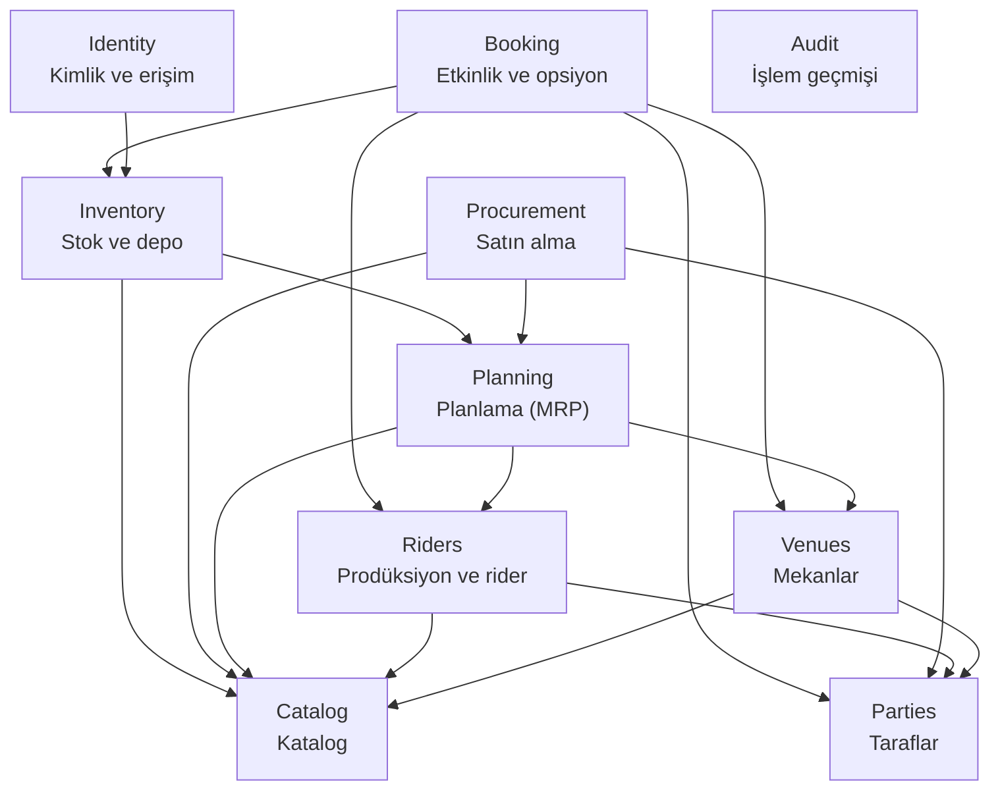
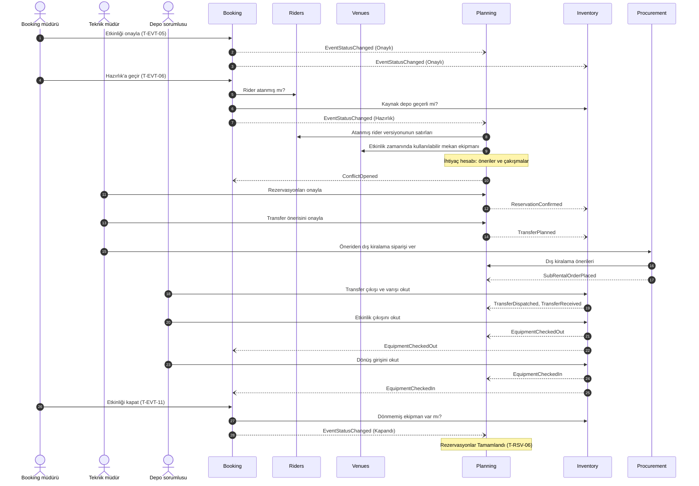

# 05 — Modül Haritası

> **Durum:** v1.3 · **Son güncelleme:** 2026-09-25
> **Kararlar:** [Bölüm 15](#15-kararlar)

## 1. Bu belge ne işe yarar

Sistemin modüllere nasıl bölüneceğini tanımlar. Şu sorulara cevap verir:

- Hangi modüller var, her birinin sorumluluğu ne?
- Her veri hangi modüle ait?
- Hangi modül hangisini doğrudan çağırabilir?
- Modüller birbirine hangi olaylarla haber verir?
- Modüller arası işlemlerde tutarlılık nasıl sağlanır?

Kod klasörleri, veritabanı şemaları ve modüller arası sözleşmeler bu belgeye göre kurulur. Mimari tarz **modüler monolittir**: tek bir uygulama olarak çalışır ve tek bir veritabanı kullanır. Ama içeride modüller, ayrı servislermiş gibi net sınırlarla ayrılır.

## 2. Temel ilkeler

1. **Her verinin tek sahibi vardır.** Bir tabloya yalnızca sahibi olan modül yazar ve yalnızca o modül okur. Her modülün kendi veritabanı şeması vardır.
2. **Başka modülün verisine iki yoldan erişilir.**
   - **Senkron sözleşme:** Diğer modülün `Contracts` katmanında yayınladığı sorgu ya da komut çağrılır.
   - **Entegrasyon olayı ve yerel kopya:** Diğer modülün yayınladığı olaylar dinlenir. Gereken veri, dinleyen modülün kendi şemasında bir yerel kopya (projeksiyon) olarak tutulur.

   Başka bir modülün şemasını doğrudan okumak yasaktır.
3. **Senkron çağrılar yalnızca aşağı katmana yapılır** ([Bölüm 4](#4-bağımlılıklar)). Böylece bağımlılıklarda döngü oluşmaz. Ters yöndeki ihtiyaç olay ve yerel kopyayla karşılanır.
4. **İşlem birimi (transaction) modülün içindedir.** Bir komut yalnızca kendi modülünün şemasına yazar. Başka modüllerdeki etkiler, işlem tamamlandıktan sonra entegrasyon olaylarıyla gerçekleşir ([Bölüm 9](#9-tutarlılık-ve-işlem-kuralları)).
5. **Koruma kontrolleri senkron sorguyla, yan etkiler olayla yapılır.** Bir geçişin koşulu başka modülün güncel verisine bağlıysa o modül senkron olarak sorgulanır (ör. etkinliği kapatmadan önce dönmemiş ekipman var mı?). Bir işlemin başka modüllerdeki sonuçları ise olayla tetiklenir (ör. etkinlik iptal edilince rezervasyonların serbest kalması).
6. **Taahhüt ile olgu ayrıdır.** "Neyin ne zaman kime söz verildiği" (rezervasyon, transfer planı) **Planning** modülünün, "neyin şu an nerede olduğu" (birim, stok, okutma) **Inventory** modülünün verisidir. Çifte rezervasyonu önlemek için tüm taahhütler tek modülde, tek kilit altında tutulur ([Bölüm 6](#6-tartışmalı-sahiplik-kararları)).
7. **Modüller arası yabancı anahtar yoktur.** Başka modüldeki bir kayda yalnızca kimliğiyle (UUID) referans verilir. Bu yüzden başka modüllerin referans verebildiği ana veriler hiç silinmez, yalnızca pasifleştirilir (BR-SYS-001).

## 3. Modüller

### 3.1 S1 modülleri

| Modül | Türkçe adı | Sorumluluk | Şema | Hikaye ve kural önekleri |
|---|---|---|---|---|
| `Identity` | Kimlik ve erişim | Kullanıcılar, roller, yetkiler, oturumlar, depo atamaları | `identity` | SYS |
| `Audit` | İşlem geçmişi | Tüm modüllerin değişiklik kayıtlarının saklanması ve sorgulanması | `audit` | SYS |
| `Parties` | Taraflar | Kişi ve firmalar, rolleri, iletişim bilgileri | `parties` | PTY |
| `Catalog` | Ekipman kataloğu | Kategoriler, modeller, kitler | `catalog` | EQP |
| `Venues` | Mekanlar | Mekanlar ve mekan ekipmanı | `venues` | VEN |
| `Riders` | Prodüksiyon ve rider | Prodüksiyonlar, rider'lar, versiyonlar, rider'ın etkinliğe atanması | `riders` | ART, RDR |
| `Booking` | Etkinlik ve opsiyon | Etkinlik yaşam döngüsü, opsiyon sırası, elle onaylar, etkinlik varsayılanları | `booking` | EVT |
| `Planning` | Planlama (MRP) | İhtiyaç hesabı, müsaitlik, rezervasyon, transfer planı, çakışma | `planning` | MRP |
| `Inventory` | Stok ve depo | Depolar, birimler, adetli stok, kasalar, etiketler, okutma ve stok hareketleri | `inventory` | EQP, WHS |
| `Procurement` | Satın alma ve dış kiralama | Dış kiralama siparişleri | `procurement` | MRP, WHS |

### 3.2 Sonraki sürümlerde eklenecek modüller

| Modül | Türkçe adı | Sürüm | Sorumluluk |
|---|---|---|---|
| `Crew` | Ekip | S2 | Crew üyeleri, yetkinlik, sertifika, çalışma tipi ve ücret. Çağrılar (atamalar) **Planning**'de tutulur. |
| `Files` | Belgeler | S2 | Yüklenen dosyalar ve hangi kayda ait oldukları |
| `Notifications` | Bildirimler | S2 | Olaylardan uygulama içi bildirim (S6'da e-posta) |
| `Sales` | Satış (CRM) | S3 | Anlaşma hunisi, aktiviteler, fiyat listesi, teklif, sözleşme, sponsorluk |
| `Finance` | Finans | S4 | Bütçe, gelir, gider, bilet satış importu, kur, hesaplaşma |
| `Logistics` | Lojistik | S5 | Araçlar, sevkiyatlar, yükleme listeleri. Araç atamaları **Planning**'de tutulur. |
| `Reporting` | Raporlama | S6 | Tüm modüllerin olaylarından beslenen salt okunur rapor ve dashboard modelleri |

Mevcut modüllerin sonraki sürümlerdeki genişlemeleri [Bölüm 5](#5-modül-kartları)'teki kartlarda belirtilir.

## 4. Bağımlılıklar

### 4.1 Katmanlar

Bir modül yalnızca **kendinden aşağıdaki katmanlardaki** modüllerin sözleşmelerini senkron çağırabilir. Aynı katmandaki modüller birbirini çağırmaz.

| Katman | Modüller | Açıklama |
|---|---|---|
| 4 | `Booking`, `Identity` | Süreci yöneten ve kullanıcıya en yakın modüller. Kimse onları senkron çağırmaz. |
| 3 | `Inventory`, `Procurement` | Fiziksel ve ticari yürütme: okutma, stok hareketi, sipariş |
| 2 | `Planning` | Taahhütler ve hesaplama: müsaitlik, rezervasyon, transfer planı |
| 1 | `Venues`, `Riders` | Etkinliğe bağlanan ana veriler |
| 0 | `Parties`, `Catalog`, `Audit` | Temel ana veriler; hiçbir modüle bağımlı değildir |

### 4.2 Senkron bağımlılık diyagramı

Ok, çağıran modülden çağrılan modüle doğrudur.



### 4.3 İzin verilen senkron çağrılar

Listede olmayan bir çağrı yapılamaz. Bu kural, derleme sırasında mimari testlerle doğrulanır ([Bölüm 13](#13-kod-ve-veritabanına-yansıması)).

| Çağıran | Çağrılan | Ne için | Kural |
|---|---|---|---|
| Booking | Parties | Teknik hizmet müşterisinin Müşteri rolünde olduğunu doğrulamak | BR-PTY-004 |
| Booking | Venues | Mekanın var ve aktif olduğunu doğrulamak | BR-EVT-010 |
| Booking | Riders | Prodüksiyonu doğrulamak; etkinliğe rider atanmış mı? | BR-EVT-016, BR-EVT-010 |
| Booking | Inventory | Kaynak depoyu doğrulamak; dönmemiş ekipman, çıkışı yapılmış ekipman ve tamamlanmamış çıkış var mı? | BR-EVT-010, BR-EVT-011, BR-EVT-012, BR-EVT-019 |
| Identity | Inventory | Kullanıcıya atanan deponun var ve aktif olduğunu doğrulamak | BR-SYS-014 |
| Inventory | Catalog | Modelin takip tipini öğrenmek | BR-EQP-001 |
| Inventory | Planning | Çıkışta listede olmayan kalem için rezervasyon eklemek; elle transfer istemek; depoda açık taahhüt var mı? | BR-WHS-004, BR-WHS-012, BR-SYS-013 |
| Procurement | Planning | Etkinliğin dış kiralama önerilerini almak | BR-MRP-008 |
| Procurement | Parties | Tedarikçinin Tedarikçi rolünde olduğunu doğrulamak | BR-PTY-004 |
| Procurement | Catalog | Sipariş satırındaki modeli doğrulamak | — |
| Planning | Riders | Etkinliğe atanmış rider versiyonunun satırlarını almak | BR-MRP-003…005 |
| Planning | Venues | Etkinlik zamanında kullanılabilir mekan ekipmanını almak | BR-VEN-001, BR-MRP-003 |
| Planning | Catalog | Kategori ağacı, kit içeriği ve model bilgisi | BR-MRP-004 |
| Riders | Catalog | Rider satırındaki model, kategori ve kiti doğrulamak | BR-RDR-001 |
| Riders | Parties | Prodüksiyonun sanatçısını doğrulamak | BR-PTY-004 |
| Venues | Catalog | Mekan ekipmanı satırını doğrulamak | BR-VEN-001 |
| Venues | Parties | Mekan işletmecisini doğrulamak | BR-PTY-004 |

### 4.4 Ters yöndeki ihtiyaçlar nasıl karşılanır

Katman kuralı bazı doğal ihtiyaçları doğrudan çağrıyla karşılamayı yasaklar. Bunlar olay ve yerel kopyayla çözülür:

| İhtiyaç | Neden doğrudan çağrılamaz | Çözüm |
|---|---|---|
| Planning, ihtiyaç hesabı için etkinliğin zamanını, paylarını ve kaynak deposunu bilmeli | Booking → Inventory → Planning yolu var; Planning → Booking döngü yaratır | Planning, Booking olaylarından **etkinlik kopyası** tutar |
| Planning, müsaitlik için stoğun şu anki halini bilmeli | Inventory → Planning var; tersi döngü yaratır | Planning, Inventory olaylarından **stok kopyası** tutar |
| Inventory, çıkışta etkinliğin durumunu ve rezervasyonları bilmeli | Booking → Inventory var; Inventory → Booking döngü yaratır | Inventory, Booking ve Planning olaylarından kopya tutar |
| Riders, etkinliğe özel versiyon için etkinliğin türünü ve prodüksiyonunu bilmeli | Booking → Riders var | Riders, Booking olaylarından **etkinlik kopyası** tutar |
| Catalog, takip tipini kilitlemek için modelin stoğu oluştu mu bilmeli | Inventory → Catalog var | Catalog, `StockCreatedForModel` olayıyla modeli işaretler |
| Identity, pasifleşen depoyu kullanıcı atamalarından düşmeli | Identity → Inventory var | Identity `WarehouseDeactivated` olayını dinler; atamayı kaldırır ve yöneticiyi uyarır |
| Procurement, siparişte etkinliğin durumunu ve teslim deposunu doğrulamalı | Inventory ile aynı katmanda, Booking ise üst katmanda | Procurement, Booking ve Inventory olaylarından **etkinlik ve depo kopyası** tutar |
| Etkinlik listesi çakışma sayısını, dönmemiş ekipmanı ve yeni rider versiyonunu göstermeli | Booking bu modüllerin üstünde ama liste filtrelenebilir olmalı | Booking, bu göstergeleri olaylardan **etkinlik göstergeleri** kopyasında tutar |

### 4.5 Sonraki sürümlerde beklenen bağımlılıklar

Bu satırlar geçicidir; ilgili sürümün tasarımında kesinleşir. Katman kuralı onları da bağlar.

| Sürüm | Çağıran → Çağrılan | Ne için |
|---|---|---|
| S2 | Crew → Parties | Crew üyesinin taraf kaydı |
| S2 | Planning → Crew | Çağrı atarken yetkinlik ve sertifika kontrolü |
| S2 | Booking → Planning | Day sheet ve call sheet için çağrılar |
| S3 | Sales → Parties, Catalog, Riders, Planning | Tekliften fiyat ve müsaitlik |
| S3 | Booking → Sales | Onayda imzalı sözleşme kontrolü (BR-EVT-009'un S3 hali) |
| S4 | Finance → Sales, Procurement | Anlaşma şartları ve maliyetler |
| S4 | Booking → Finance | Kapanışta onaylı hesaplaşma kontrolü (BR-EVT-012'nin S4 hali) |
| S5 | Logistics → Catalog | Kasa ve model ağırlık / hacim bilgisi |

**Dikkat edilecek nokta (S5):** Planning araç atamalarında Logistics'i çağırırsa Logistics, Inventory'yi senkron çağıramaz. Aksi halde Planning → Logistics → Inventory → Planning döngüsü oluşur. Logistics kasa bilgisini Inventory olaylarından kopyalamalıdır. Katman kuralının tasarımı nasıl yönlendirdiğine bir örnek.

## 5. Modül kartları

Her kartta modülün sahip olduğu veriler, sunduğu senkron sözleşmeler, yayınladığı ve dinlediği olaylar ile kapsadığı hikayeler bulunur. Olayların ayrıntısı [Bölüm 7](#7-entegrasyon-olayları-s1)'de.

### 5.1 Identity — Kimlik ve erişim

- **Sahip olduğu veriler:** Kullanıcı, rol (S1'de sabit), yetki, kullanıcı–rol ataması, kullanıcı–depo ataması, giriş denemesi ve kilit bilgisi, oturum.
- **Senkron sözleşme:** Yok. Diğer modüller kullanıcıyı ve yetkilerini istek bağlamından (oturum belirteci) alır.
- **Bağımlı olduğu:** Inventory.
- **Yayınladığı olaylar:** Yok.
- **Dinlediği olaylar:** `WarehouseDeactivated`.
- **Hikayeler:** US-SYS-001, 002, 003, 006, 010, 011, 012.
- **Kurallar:** BR-SYS-002…009, BR-SYS-014.
- **Yetki modeli:** Her modül kendi yetkilerini tanımlar (ör. `Planning.Reservations.Confirm`); Identity rollerle yetkileri eşler.
- **Sonraki sürümler:** 2FA ve kayıt bazlı ince yetki (S6).

### 5.2 Audit — İşlem geçmişi

- **Sahip olduğu veriler:** İşlem geçmişi kaydı.
- **Nasıl yazılır:** Tüm modüller, kendi işlem birimleri içinde ortak bir yapı taşıyla `audit` şemasına yazar. Başka bir modülün şemasına yazmanın tek istisnası budur. Kayıt, işlemle aynı anda kalıcı olur ya da hiç olmaz.
- **Senkron sözleşme:** Yok; yalnızca işlem geçmişi ekranlarına API sunar.
- **Hikayeler:** US-SYS-004. **Kurallar:** BR-SYS-010.

### 5.3 Parties — Taraflar

- **Sahip olduğu veriler:** Taraf (kişi, firma), taraf rolü, iletişim bilgisi, iletişim kişisi, temsil (ajans–sanatçı).
- **Senkron sözleşme:** Tarafları kimlikle getirme; bir tarafın belirli bir rolde ve aktif olup olmadığı.
- **Bağımlı olduğu:** Yok.
- **Yayınladığı / dinlediği olaylar:** S1'de yok.
- **Hikayeler:** US-PTY-001, 002; US-ART-001'in sanatçı kısmı. **Kurallar:** BR-PTY-001…004.
- **Sonraki sürümler:** Crew (S2) ve Sponsor (S3) rolleri; mükerrer kayıt birleştirme (S6).

### 5.4 Catalog — Ekipman kataloğu

- **Sahip olduğu veriler:** Ekipman kategorisi, ekipman modeli, kit ve kit satırı.
- **Senkron sözleşme:** Modelleri getirme; bir kategorinin tüm alt kategorileri; kitin modellere açılmış içeriği; model, kategori ve kit doğrulama.
- **Bağımlı olduğu:** Yok.
- **Yayınladığı olaylar:** S1'de yok.
- **Dinlediği olaylar:** `StockCreatedForModel` (takip tipini kilitler).
- **Hikayeler:** US-EQP-001, 002, 005. **Kurallar:** BR-EQP-001…003.
- **Sonraki sürümler:** Sarf malzeme tanımı (S6).

### 5.5 Venues — Mekanlar

- **Sahip olduğu veriler:** Mekan, mekan ekipmanı, mekan ekipmanı kullanılamama dönemleri.
- **Senkron sözleşme:** Mekanı getirme ve doğrulama; belirli bir zaman aralığında kullanılabilir mekan ekipmanı.
- **Bağımlı olduğu:** Catalog, Parties.
- **Yayınladığı olaylar:** `VenueEquipmentChanged`.
- **Dinlediği olaylar:** Yok.
- **Hikayeler:** US-VEN-001, 002. **Kurallar:** BR-VEN-001.
- **Sonraki sürümler:** Mekan dosyaları (S2, Files ile); güç kapasitesinin güç hesabında kullanılması (S2).

### 5.6 Riders — Prodüksiyon ve rider

- **Sahip olduğu veriler:** Prodüksiyon, rider, rider versiyonu, rider satırı, muadil model, **rider ataması** (hangi etkinliğe hangi versiyonun bağlı olduğu).
- **Yerel kopya:** Etkinlik kopyası (tür, prodüksiyon, müşteri, durum).
- **Senkron sözleşme:** Prodüksiyonu getirme ve doğrulama; etkinliğe rider atanmış mı; etkinliğe atanmış versiyonun satırları.
- **Bağımlı olduğu:** Catalog, Parties.
- **Yayınladığı olaylar:** `RiderVersionCreated`, `EventRiderAssigned`.
- **Dinlediği olaylar:** `EventCreated`, `EventDetailsChanged`, `EventStatusChanged`.
- **Hikayeler:** US-ART-001 (prodüksiyon), US-RDR-001…005. **Kurallar:** BR-RDR-001…008.
- **Sonraki sürümler:** Input list, hospitality rider, stage plot (S2).

### 5.7 Booking — Etkinlik ve opsiyon

- **Sahip olduğu veriler:** Etkinlik (tür, zamanlar, kapı açılışı, söküm başlangıcı, paylar, operasyon geçiş modu, mekan, kaynak depo, prodüksiyon ya da müşteri, iptal nedeni), durum geçmişi, elle onaylar, opsiyon kuyruğu ve opsiyonlar (dış opsiyon dahil), etkinlik varsayılanları (ayarlar).
- **Yerel kopya:** Etkinlik göstergeleri (açık çakışma sayısı, dönmemiş ekipman, rider atanmış mı, yeni rider versiyonu var mı).
- **Senkron sözleşme:** S1'de yok (en üst katman).
- **Bağımlı olduğu:** Parties, Venues, Riders, Inventory.
- **Yayınladığı olaylar:** `EventCreated`, `EventDetailsChanged`, `EventScheduleChanged`, `EventStatusChanged`.
- **Dinlediği olaylar:** `ConflictOpened`, `ConflictResolved`, `EquipmentCheckedOut`, `EquipmentCheckedIn`, `CheckOutReversed`, `RiderVersionCreated`, `EventRiderAssigned`.
- **Zamanlanmış işler:** Otomatik operasyon geçişleri (BR-EVT-018, P-13).
- **Hikayeler:** US-EVT-001…008, US-SYS-007. **Kurallar:** BR-EVT-001…019.
- **Sonraki sürümler:** Seanslar, diğer zaman noktaları, day sheet / run of show / call sheet (S2); turne ve turne tarihleri (S5).

### 5.8 Planning — Planlama (MRP)

- **Sahip olduğu veriler:** İhtiyaç hesabı, ihtiyaç satırları ve karşılamalar, rezervasyon, transfer (plan, kalemler ve durum), çakışma.
- **Yerel kopyalar:**
  - Etkinlik kopyası: durum, zamanlar, paylar, mekan, kaynak depo.
  - Stok kopyası: birimlerin modeli, sahipliği, durumu ve konumu; adetli stok kümeleri; etkinliklere çıkmış ekipman.
  - Dış kiralama kapsamı: etkinlik ve model bazında sipariş satırları ve durumları.
- **Senkron sözleşme:**
  - Etkinliğin dış kiralama önerileri (sorgu).
  - Depoda açık taahhüt var mı (sorgu).
  - Çıkışta rezervasyon ekleme (komut).
  - Elle transfer isteme (komut).
- **Bağımlı olduğu:** Riders, Venues, Catalog.
- **Yayınladığı olaylar:** `ReservationConfirmed`, `ReservationChanged`, `ReservationReleased`, `ReservationsCompleted`, `TransferPlanned`, `TransferPlanCancelled`, `ConflictOpened`, `ConflictResolved`.
- **Dinlediği olaylar:** Booking'in dört olayı; `EventRiderAssigned`; `VenueEquipmentChanged`; Inventory'nin stok, okutma ve transfer olayları; Procurement'ın sipariş olayları.
- **Zamanlanmış işler:** Günlük çakışma kontrolü (P-12); gecikmiş transfer tespiti.
- **Hikayeler:** US-MRP-001…004, 006…008; US-MRP-005'in öneri kısmı; US-EQP-008'in rezerve ve müsait sütunları. **Kurallar:** BR-MRP-001…020.
- **Sonraki sürümler:** Crew çağrıları, ekip ve mekan çakışmaları, kaynak takvimi, güç hesabı (S2); araç atamaları ve mesafeye göre depo seçimi (S5).

### 5.9 Inventory — Stok ve depo

- **Sahip olduğu veriler:** Depo, birim, adetli stok, kasa ve içeriği, kasa standart içeriği, etiket kodu sırası, **stok hareketi** (çıkış, giriş, transfer çıkışı ve varışı, düzeltme, geri alma), hasar kaydı, sayım farkı.
- **Yerel kopyalar:**
  - Etkinlik kopyası: durum, ad, kaynak depo.
  - Rezervasyon talebi: etkinlik, depo ve model bazında onaylı adetler.
  - Transfer beklentisi: planlanan transferlerin kalemleri.
- **Senkron sözleşme:** Depo doğrulama; etkinliğin dönmemiş ekipmanı; etkinlik için hiç çıkış yapıldı mı; tamamlanmamış çıkışlar.
- **Bağımlı olduğu:** Catalog, Planning.
- **Yayınladığı olaylar:** `WarehouseCreated`, `WarehouseDeactivated`, `StockCreatedForModel`, `UnitRegistered`, `UnitStatusChanged`, `BulkStockChanged`, `EquipmentCheckedOut`, `EquipmentCheckedIn`, `CheckOutReversed`, `TransferDispatched`, `TransferReceived`, `TransferCancellationRejected`, `SubRentedItemsReturned`.
- **Dinlediği olaylar:** `EventCreated`, `EventDetailsChanged`, `EventStatusChanged`, Planning'in rezervasyon ve transfer olayları, `SubRentalOrderReceived`.
- **Hikayeler:** US-SYS-005, US-EQP-003, 004, 006, 007, 008 (olgu sütunları), 009, US-WHS-001…007. **Kurallar:** BR-SYS-003, BR-SYS-013, BR-EQP-004…010, BR-WHS-001…013.
- **Sonraki sürümler:** Bakım kayıtları ve depo sayımı (S2); sarf malzeme stoğu (S6).

### 5.10 Procurement — Satın alma ve dış kiralama

- **Sahip olduğu veriler:** Dış kiralama siparişi ve satırları (QR ile takip seçimi ve karşıladığı rider satırı dahil).
- **Yerel kopyalar:** Etkinlik kopyası (durum); depo kopyası.
- **Senkron sözleşme:** S1'de yok.
- **Bağımlı olduğu:** Planning, Parties, Catalog.
- **Yayınladığı olaylar:** `SubRentalOrderPlaced`, `SubRentalOrderCancelled`, `SubRentalOrderReceived`, `SubRentalOrderReturned`.
- **Dinlediği olaylar:** `EventCreated`, `EventStatusChanged`, `WarehouseCreated`, `WarehouseDeactivated`, `SubRentedItemsReturned`, `UnitStatusChanged` (dış kiralama birimleri için).
- **Hikayeler:** US-MRP-005'in sipariş kısmı; US-WHS-007'nin teslim alma kısmı. **Kurallar:** BR-MRP-008, BR-WHS-013 (ilgili kısımlar).
- **Sonraki sürümler:** Sipariş formu PDF (S3); siparişlerin gider olarak finansa aktarılması (S4); satın alma önerileri (S6).

## 6. Tartışmalı sahiplik kararları

Sahibi ilk bakışta belli olmayan veriler ve verilen kararlar:

| Veri | Sahip | Neden |
|---|---|---|
| Opsiyon | Booking | Opsiyonun kuralları etkinlik durumlarıyla iç içe (T-EVT-01, T-EVT-02, T-HLD-03…07). Mekan modülünde olsaydı bu geçişlerin hepsi modüller arası olurdu. |
| Mekan, mekan ekipmanı | Venues | Planning mekan ekipmanını okur. Mekan Booking'de olsaydı Planning → Booking bağımlılığı döngü yaratırdı. |
| Prodüksiyon | Riders | Rider'lar prodüksiyona bağlı; Booking ve Planning ikisini birlikte okur. Arayüzde booking müdürü prodüksiyonu yine kendi ekranından oluşturur. |
| Rider ataması (etkinlik ↔ versiyon) | Riders | Etkinliğe özel versiyonun kuralları (BR-RDR-004, BR-RDR-006) atamaya dayanır. Atama Booking'de olsaydı Riders → Booking gerekirdi. |
| Depo | Inventory | Depo fiziksel stoğun yeridir. Identity, Booking ve Planning depoya kimlikle referans verir. |
| Rezervasyon | Planning | Taahhüttür. Onayda müsaitlik ile birlikte, tek kilit altında yazılmalıdır (BR-MRP-013). |
| Transfer | Planning (plan ve durum), Inventory (okutmalar) | Transfer planı müsaitliği etkileyen bir taahhüttür; çifte ayırmayı önlemek için rezervasyonlarla aynı modülde olmalıdır. Okutmalar fiziksel harekettir ve Inventory'nin stok hareketi olarak kaydedilir. Transferin durumu Planning'de tutulur, Inventory'nin okutma olaylarıyla ilerler. |
| Birimin etkinliğe çıkışı (hangi birim hangi rezervasyona gitti) | Inventory | Okutma, birim durumu ve konumuyla aynı işlem biriminde yazılmalıdır (BR-WHS-002, BR-WHS-006). Planning karşılanan adetleri olaylardan öğrenir. |
| Dış kiralama siparişi | Procurement | MRP öneri üretir, satın alma sipariş verir; bu ERP'deki klasik ayrımdır. S3–S4'te tedarikçi, maliyet ve gider akışları bu modülde büyüyecek. |
| Kasa | Inventory | Kasa fiziksel bir kutudur ve içeriğiyle birlikte hareket eder (BR-EQP-006). |
| Kit | Catalog | Kit mantıksal bir tanımdır; katalogdaki modellerden oluşur. |
| Ayarlar | Kuralın sahibi olan modül | Etkinlik varsayılanları (paylar, operasyon geçiş modu) Booking'dedir. Ayarlar ekranı, ilgili modüllerin API'lerini bir araya getirir. |
| İşlem geçmişi | Audit | Her modül kendi işlem biriminde yazar ([5.2](#52-audit--i̇şlem-geçmişi)). |

## 7. Entegrasyon olayları (S1)

Olay adları kodda `IntegrationEvent` sonekiyle yazılır (ör. `EventStatusChangedIntegrationEvent`). Modül içi olaylar ise `DomainEvent` sonekiyle yazılır ve modül dışına çıkmaz. Her olay; olay kimliği, oluşma zamanı, yayınlayan modül ve ilgili kaydın kimliğini taşır.

### 7.1 Booking

| Olay | Ne zaman | Dinleyen → ne yapar |
|---|---|---|
| `EventCreated` | Etkinlik oluşturuldu | Riders, Planning, Inventory, Procurement → etkinlik kopyasını oluşturur |
| `EventDetailsChanged` | Mekan, kaynak depo, tür, prodüksiyon, müşteri ya da ad değişti | Riders, Inventory → kopyayı günceller. Planning → kopyayı günceller; mekan ya da kaynak depo değiştiyse hesabı "güncel değil" yapar (T-CLC-01) |
| `EventScheduleChanged` | Zamanlar ya da hazırlık / dönüş payı değişti | Planning → etkinliğin rezervasyon aralıklarını günceller, hesabı "güncel değil" yapar (T-CLC-01), aşırı rezervasyon kontrolü çalıştırır (BR-MRP-017) |
| `EventStatusChanged` | Her durum geçişi (yeni durum, önceki durum, elle / otomatik, neden) | Bkz. [7.7](#77-etkinlik-durum-değişikliklerinin-diğer-modüllerdeki-etkileri) |

### 7.2 Riders

| Olay | Ne zaman | Dinleyen → ne yapar |
|---|---|---|
| `RiderVersionCreated` | Rider'da yeni versiyon kaydedildi | Booking → aynı rider'ın eski versiyonuna bağlı etkinlikleri "yeni rider versiyonu var" olarak işaretler (BR-RDR-005) |
| `EventRiderAssigned` | Etkinliğe versiyon bağlandı ya da değişti | Booking → "rider atanmış" göstergesini günceller. Planning → hesap varsa "güncel değil" yapar (T-CLC-01) |

### 7.3 Venues

| Olay | Ne zaman | Dinleyen → ne yapar |
|---|---|---|
| `VenueEquipmentChanged` | Mekan ekipmanı satırı ya da kullanılamama dönemi değişti (etkilenen tarih aralığıyla) | Planning → o mekandaki, zamanı bu aralıkla örtüşen **Onaylı**, **Hazırlık** ve **Kurulum** etkinliklerinin hesabını "güncel değil" yapar (T-CLC-01) |

### 7.4 Planning

| Olay | Ne zaman | Dinleyen → ne yapar |
|---|---|---|
| `ReservationConfirmed` | Rezervasyon onaylandı (T-RSV-02, T-RSV-07) | Inventory → rezervasyon talebine ekler (toplama listesi, çıkış eşleşmesi) |
| `ReservationChanged` | Onaylı rezervasyonun modeli, adedi, deposu ya da aralığı değişti | Inventory → talebi günceller |
| `ReservationReleased` | Rezervasyon serbest bırakıldı (T-RSV-04, T-RSV-05) | Inventory → talepten çıkarır |
| `ReservationsCompleted` | Etkinlik kapandı, rezervasyonlar tamamlandı (T-RSV-06) | Inventory → etkinliğin talebini kapatır |
| `TransferPlanned` | Transfer planlandı (T-TRF-01) | Inventory → transfer beklentisi oluşturur; okutma ekranlarında görünür |
| `TransferPlanCancelled` | Planlanmış transfer iptal edildi (T-TRF-03) | Inventory → beklentiyi kapatır. Okutma başlamışsa iptali reddeder ve `TransferCancellationRejected` yayınlar |
| `ConflictOpened` | Çakışma açıldı ya da yeniden açıldı (T-CNF-01, T-CNF-03) | Booking → etkilenen etkinliklerin çakışma sayısını günceller |
| `ConflictResolved` | Çakışma çözüldü (T-CNF-04) | Booking → çakışma sayısını günceller |

### 7.5 Inventory

| Olay | Ne zaman | Dinleyen → ne yapar |
|---|---|---|
| `WarehouseCreated` | Depo tanımlandı | Planning → stok kopyasına depo ekler. Procurement → depo kopyasına ekler |
| `WarehouseDeactivated` | Depo pasifleştirildi | Planning → depoyu hesaptan çıkarır. Identity → depo atamalarını kaldırır, deposu kalmayan depo sorumlularını yöneticiye bildirir. Procurement → depoyu teslim yeri seçeneklerinden çıkarır |
| `StockCreatedForModel` | Bir modelin ilk birimi ya da ilk adetli stoğu oluştu | Catalog → modelin takip tipini kilitler (BR-EQP-001) |
| `UnitRegistered` | Birim oluşturuldu (T-UNT-01) | Planning → stok kopyasına ekler |
| `UnitStatusChanged` | Birim durumu ya da konumu değişti | Planning → stok kopyasını günceller, aşırı rezervasyon kontrolü çalıştırır (BR-MRP-017). Procurement → dış kiralama birimiyse iade durumunu değerlendirir (T-SRO-04) |
| `BulkStockChanged` | Adetli stok kümelerinden biri değişti (neden ve ilgili etkinlik / transfer ile) | Planning → stok kopyasını günceller, aşırı rezervasyon kontrolü çalıştırır |
| `EquipmentCheckedOut` | Etkinlik için çıkış okutuldu | Planning → karşılanan adedi ve etkinlikteki ekipmanı günceller. Booking → dönmemiş ekipman göstergesini günceller |
| `EquipmentCheckedIn` | Etkinlikten giriş okutuldu (dönüş deposu, hasarlı ve eksik adetlerle) | Planning, Booking → aynı şekilde günceller |
| `CheckOutReversed` | Çıkış geri alındı (BR-WHS-005) | Planning, Booking → aynı şekilde günceller |
| `TransferDispatched` | Transferin ilk çıkış okutması yapıldı | Planning → transferi **Yolda** yapar (T-TRF-02) |
| `TransferReceived` | Transfer tamamlandı (gelen, eksik ve hasarlı kalemlerle) | Planning → transferi **Tamamlandı** yapar (T-TRF-04) ve stok kopyasını günceller |
| `TransferCancellationRejected` | Okutma başladığı için iptal reddedildi | Planning → transferin iptalini geri alır ve kullanıcıyı uyarır |
| `SubRentedItemsReturned` | Dış kiralama kalemlerinin tedarikçiye iadesi okutuldu (T-UNT-14) | Procurement → satırların iade durumunu günceller; tümü döndüyse siparişi **İade edildi** yapar (T-SRO-04) |

### 7.6 Procurement

| Olay | Ne zaman | Dinleyen → ne yapar |
|---|---|---|
| `SubRentalOrderPlaced` | Sipariş verildi (T-SRO-02) | Planning → dış kiralama kapsamını günceller (BR-MRP-008) |
| `SubRentalOrderCancelled` | Verilmiş sipariş iptal edildi (T-SRO-06) | Planning → kapsamdan çıkarır, hesabı "güncel değil" yapar (T-CLC-01) |
| `SubRentalOrderReceived` | Sipariş teslim alındı (T-SRO-03); QR ile takip edilecek satırlarla | Inventory → bu satırlar için dış kiralama birimleri ve adetli stok oluşturur (T-UNT-01). Planning → kapsamı günceller |
| `SubRentalOrderReturned` | Sipariş iade edildi (T-SRO-04) | Planning → kapsamı kapatır |

### 7.7 Etkinlik durum değişikliklerinin diğer modüllerdeki etkileri

`EventStatusChanged` olayını dinleyen modüller, yeni duruma göre şunları yapar:

| Yeni durum | Planning | Inventory | Riders | Procurement |
|---|---|---|---|---|
| Her durum | Etkinlik kopyasını günceller | Etkinlik kopyasını günceller (çıkışa izin var mı?) | Etkinlik kopyasını günceller | Etkinlik kopyasını günceller (sipariş açılıp verilebilir mi?) |
| Onaylı | Rezervasyona izin verir (BR-MRP-012) | Çıkışa izin verir | — | — |
| Hazırlık | İhtiyaç hesabını çalıştırır (T-CLC-02) | — | — | — |
| Müzakere (geri alma) | Yeni rezervasyonu ve hesabı durdurur; mevcut rezervasyonları korur (BR-EVT-019) | Çıkışı durdurur | — | — |
| Kapandı | Rezervasyonları **Tamamlandı** yapar (T-RSV-06) | — | Atamayı ve etkinliğe özel versiyonları kilitler (BR-EVT-013) | — |
| İptal | Rezervasyonları serbest bırakır (T-RSV-04, T-RSV-05); planlanmış transferleri iptal eder (T-TRF-03); etkinliğin dönmemiş ekipmanını havuzdan çıkarır (BR-MRP-002) | Çıkışı durdurur; girişi açık tutar | Atamayı kilitler | Taslak siparişleri iptal eder (T-SRO-05); verilmiş siparişler için uyarı üretir |

## 8. Yerel kopyalar (projeksiyonlar)

Yerel kopya, bir modülün başka bir modülün verisinden ihtiyaç duyduğu kısmı kendi şemasında tuttuğu, olaylarla güncellenen salt okunur tablodur. Kopyalar yalnızca okunur, kullanıcı tarafından değiştirilmez. Tamamen silinip olaylardan yeniden kurulabilirler.

| Tutan modül | Kopya | Kaynak olaylar | Kullanım |
|---|---|---|---|
| Booking | Etkinlik göstergeleri | `ConflictOpened` / `Resolved`, `EquipmentCheckedOut` / `CheckedIn`, `CheckOutReversed`, `RiderVersionCreated`, `EventRiderAssigned` | Etkinlik listesindeki işaretler ve filtreler (US-EVT-007) |
| Riders | Etkinlik kopyası | Booking'in olayları | Etkinliğe özel versiyon ve ihtiyaç listesi kuralları, kapanıştan sonra kilitleme |
| Planning | Etkinlik kopyası | Booking'in olayları | Rezervasyon aralıkları, izin verilen durumlar, iptal etkileri |
| Planning | Stok kopyası | Inventory'nin stok, okutma ve transfer olayları | Müsaitlik hesabı (BR-MRP-002), aşırı rezervasyon kontrolü |
| Planning | Dış kiralama kapsamı | Procurement'ın sipariş olayları | Dış kiralamanın karşılanmış sayılması (BR-MRP-008), karşılama raporu |
| Inventory | Etkinlik kopyası | Booking'in olayları | Çıkışa izin verilen durumlar (BR-WHS-003), ekranlarda etkinlik adı |
| Inventory | Rezervasyon talebi | Planning'in rezervasyon olayları | Toplama listesi (BR-WHS-001), çıkış eşleşmesi (BR-WHS-004) |
| Inventory | Transfer beklentisi | `TransferPlanned`, `TransferPlanCancelled` | Transfer çıkış ve varış ekranları |
| Procurement | Etkinlik kopyası | `EventCreated`, `EventStatusChanged` | Sipariş açma ve verme koşulları (T-SRO-01, T-SRO-02), iptal etkileri |
| Procurement | Depo kopyası | `WarehouseCreated`, `WarehouseDeactivated` | Teslim deposunun seçimi ve doğrulanması |

## 9. Tutarlılık ve işlem kuralları

### 9.1 İşlem birimi

- Bir kullanıcı komutu tek modülde, tek işlem biriminde çalışır. Bu işlem biriminde yalnızca şunlar yazılır: modülün kendi şeması, işlem geçmişi kaydı ve modülün giden olay kutusu (outbox).
- Aynı modül içindeki otomatik geçişler (ör. ilk opsiyonla etkinliğin **Opsiyonda** olması) tetikleyen komutla aynı işlem biriminde gerçekleşir.

### 9.2 Olayların teslimi

- **Outbox:** Olay, onu doğuran değişiklikle aynı işlem biriminde modülün `outbox` tablosuna yazılır. İşlem geri alınırsa olay da yok olur. İşlem tamamlanırsa olay kesinlikle yayınlanır.
- **En az bir kez teslim:** Olay dinleyene birden fazla kez ulaşabilir. Her dinleyen, işlediği olay kimliklerini kendi `inbox` tablosunda tutar ve aynı olayı ikinci kez işlemez.
- **Sıra:** Aynı kaydın olayları (ör. aynı etkinliğin durum değişiklikleri) yayınlanma sırasıyla işlenir. Farklı kayıtların olayları arasında sıra garantisi yoktur.
- **Anında gönderim:** Olay, outbox'ta beklemez. İşlem birimi tamamlanır tamamlanmaz dağıtıcı süreç içi bir sinyalle uyarılır ve olayı hemen dinleyenlere iletir. Dağıtıcı ayrıca outbox'ı düzenli aralıklarla tarar, ama bu yalnızca sinyalin kaybolduğu durumlar (ör. uygulamanın yeniden başlaması) için bir yedektir.
- **Paralel işleme:** Aynı olayı dinleyen modüller olayı birbirini beklemeden, aynı anda işler.
- **Ekrana yansıma:** Dinleyen modül olayı işler işlemez değişiklik SignalR ile açık ekranlara iletilir. İşlemi yapan kullanıcının kendi ekranı olayı beklemez; komutun cevabıyla anında güncellenir.
- **Gecikme hedefi:** Bir değişikliğin başka modüllerde işlenip ekranlara yansıması, normal koşullarda işlemlerin %95'inde P-08 (300 milisaniye), en geç P-15 (1 saniye) içinde tamamlanır. Hata ve yeniden deneme durumunda bu süre uzayabilir ama olay kaybolmaz.
- **Ölçüm:** Her olayın oluşma ve işlenme zamanı kaydedilir. Gecikme hedefi aşıldığında sistem bunu loglar, böylece yavaşlama fark edilmeden birikmez.
- **Hata:** İşlenemeyen olay artan aralıklarla yeniden denenir. Belirli sayıda denemeden sonra hatalı olaylar listesine alınır ve sistem yöneticisine görünür. Olay kaybolmaz.

### 9.3 Senkron komutlar

Modüller arası senkron komut yalnızca iki tanedir, ikisi de Inventory'den Planning'e yapılır. Kural: **önce taahhüt, sonra fiziksel kayıt.** Çağrılan modül kendi işlem biriminde taahhüdü yazar, çağıran modül ardından kendi kaydını yazar. İkinci adım başarısız olursa geride yalnızca zararsız bir taahhüt kalır.

| Komut | Akış | İkinci adım başarısız olursa |
|---|---|---|
| Çıkışta rezervasyon ekleme (BR-WHS-004) | Planning müsaitliği kontrol eder, rezervasyonu **Onaylandı** olarak yazar (T-RSV-07). Ardından Inventory okutmayı kaydeder. Planning, etkinliğin aynı model için zaten karşılanmamış rezervasyonu varsa yenisini oluşturmaz. | Rezervasyon kalır, ekipman depoda kalır; kullanıcı yeniden okutur. |
| Elle transfer isteme (BR-WHS-012) | Planning müsaitliği kontrol eder, transferi **Planlandı** olarak yazar ve `TransferPlanned` yayınlar. Inventory transfer beklentisini olaydan oluşturur. | İkinci adım olay olduğu için başarısız olmaz, yeniden denenir. |

### 9.4 Modüller arası otomatik geçişler

[04-state-machines.md](04-state-machines.md)'deki otomatik geçişlerden şunlar başka bir modülde tetiklenir. Bu geçişler tetikleyen işlemle aynı işlem biriminde değil, olay teslim edildikten sonra gerçekleşir:

| Geçiş | Tetikleyen (modül) | Gerçekleştiği modül | Olay |
|---|---|---|---|
| T-RSV-04, T-RSV-05 (iptal) | T-EVT-12 (Booking) | Planning | `EventStatusChanged` |
| T-RSV-06 | T-EVT-11 (Booking) | Planning | `EventStatusChanged` |
| T-TRF-02 | Transfer çıkış okutması (Inventory) | Planning | `TransferDispatched` |
| T-TRF-03 (iptal) | T-EVT-12 (Booking) | Planning | `EventStatusChanged` |
| T-TRF-04 | Transfer varış okutması (Inventory) | Planning | `TransferReceived` |
| T-SRO-04 | İade okutması (Inventory) | Procurement | `SubRentedItemsReturned` |
| T-SRO-05 | T-EVT-12 (Booking) | Procurement | `EventStatusChanged` |
| T-UNT-01 (dış kiralama) | T-SRO-03 (Procurement) | Inventory | `SubRentalOrderReceived` |
| T-CLC-01 | Rider, mekan ekipmanı, etkinlik ya da sipariş değişikliği | Planning | Bölüm 7'deki ilgili olaylar |
| T-CLC-02 | T-EVT-06 (Booking) | Planning | `EventStatusChanged` |
| T-CNF-01, T-CNF-03, T-CNF-04 | Stok ve okutma değişiklikleri (Inventory) | Planning | Inventory olayları |

Tabloda olmayan otomatik geçişler (ör. T-EVT-01, T-HLD-03, T-UNT-12) kendi modülünde, tetikleyen işlemle aynı işlem biriminde gerçekleşir.

### 9.5 Kabul edilen yarış durumları

Olaylar kısa bir gecikmeyle işlendiği için bazı nadir durumlarda iki işlem çakışabilir. Bunlar bilinçli olarak kabul edilir ve her birinin bir telafisi vardır:

| Durum | Ne olur | Telafi |
|---|---|---|
| Planlanmış transfer iptal edilirken aynı anda ilk çıkış okutulur | Inventory okutmayı kaydetmiş, Planning iptali yazmış olur | Inventory `TransferCancellationRejected` yayınlar; Planning iptali geri alır ve kullanıcıyı uyarır |
| Etkinlik iptal edilirken aynı anda çıkış okutulur | Inventory iptali henüz görmediği için çıkışı kabul eder | Ekipman "dönmemiş ekipman" olarak görünür; iptal bu durumu zaten destekler (BR-EVT-014) |
| Etkinlik Müzakere'ye geri alınırken (BR-EVT-019) aynı anda ilk çıkış okutulur | Booking kontrolü yaptığı anda çıkış yoktu | Booking, Müzakere'deki etkinlik için `EquipmentCheckedOut` alırsa etkinliği "Müzakere'de çıkış yapılmış" olarak uyarıyla işaretler |
| Rezervasyon onaylanırken aynı anda bir birim bakıma girer | Planning birimi henüz havuzda sayar | Aşırı rezervasyon kontrolü `UnitStatusChanged` ile çalışır ve çakışma açar (BR-MRP-017); bu kural tam da bunun için vardır |
| Rezervasyon onaylandıktan hemen sonra, Inventory olayı almadan çıkış okutulur | Inventory kalemi "listede yok" sanır | Çıkışta rezervasyon ekleme komutu mevcut rezervasyonu bulur; çift rezervasyon oluşmaz ([9.3](#93-senkron-komutlar)) |

Güvenliğin tehlikeye girdiği yönde yarış yoktur. Örneğin etkinliği kapatma kontrolü (BR-EVT-012) senkron sorguyla yapılır; kapanıştan sonra çıkış zaten yapılamaz.

## 10. Uçtan uca akış: MVP demo senaryosu

Demo senaryosunun ([00-scope.md §6.1](00-scope.md#61-bitti-kriteri-mvp-demo-senaryosu)) modüller arasındaki akışı. Düz oklar senkron çağrıları, kesikli oklar entegrasyon olaylarını gösterir. Catalog çağrıları sadelik için gösterilmemiştir.



## 11. Çapraz kesen yapı taşları

Bunlar iş modülü değildir; tüm modüllerin kullandığı ortak altyapıdır (`BuildingBlocks`) ya da uygulamanın ana bileşenidir (`Host`).

| Yapı taşı | Yeri | Görevi |
|---|---|---|
| İşlem geçmişi yazıcısı | BuildingBlocks | Her modülün işlem biriminde değişiklikleri `audit` şemasına yazar (BR-SYS-010) |
| Outbox ve inbox | BuildingBlocks | Olayların güvenli yayını ve tekrar işlenmeme ([9.2](#92-olayların-teslimi)) |
| Olay yolu | BuildingBlocks | S1'de süreç içi (in-process). Arayüzü, ileride bir mesaj kuyruğuna geçilebilecek şekilde soyuttur. |
| İş kuralı hatası | BuildingBlocks | Kural numarasını taşıyan hata; API bunu standart hata biçimine çevirir |
| Ortak değer tipleri | BuildingBlocks | Tutar (`Money`), zaman aralığı, süre (paylar için) |
| Saat soyutlaması | BuildingBlocks | Otomatik geçişlerin ve son tarih kurallarının testlerde zaman ilerletilerek sınanabilmesi |
| Anlık yayın | Host | Entegrasyon olaylarını dinler; ilgili ekranlara (depo, etkinlik gruplarına) SignalR ile iletir (BR-SYS-012) |
| Kimlik doğrulama ve yetki kontrolü | Host + Identity | Oturum belirtecini doğrular; her uç nokta, modülün tanımladığı yetkiyi ister (BR-SYS-002) |
| Zamanlanmış işler | Host | Modüllerin tanımladığı işleri çalıştırır: otomatik operasyon geçişleri (Booking), günlük çakışma kontrolü ve gecikmiş transfer tespiti (Planning) |

## 12. Ekran bileşimi

Bir ekran birden fazla modülün verisini gösterebilir. Bu durumda ön yüz, her bölümü ilgili modülün API'sinden alır.

| Ekran | Modüller |
|---|---|
| Etkinlik listesi | Booking (göstergeler Booking'in yerel kopyasından) |
| Etkinlik detayı: Genel, Opsiyonlar, Durum geçmişi | Booking |
| Etkinlik detayı: Rider | Riders |
| Etkinlik detayı: İhtiyaç ve rezervasyon | Planning, Procurement (siparişler) |
| Etkinlik detayı: Depo işlemleri | Inventory |
| Çakışma paneli, müsaitlik sorgusu | Planning |
| Depo stok görünümü | Inventory (durum sütunları), Planning (rezerve ve müsait sütunları) |
| Toplama listesi, çıkış, giriş, transfer okutma, QR etiketleri | Inventory |
| Dış kiralama siparişleri | Procurement |
| Rider karşılama raporu (PDF) | Planning |
| Katalog / Mekanlar / Taraflar | Catalog / Venues / Parties |
| Prodüksiyonlar ve rider'lar | Riders |
| Kullanıcılar ve roller | Identity |
| Ayarlar | Booking (etkinlik varsayılanları) |
| İşlem geçmişi | Audit |

## 13. Kod ve veritabanına yansıması

Ayrıntılar Faz 0'ın C bölümünde (`standards/` ve ADR'ler) tanımlanacak. Bu belgeden doğan zorunluluklar:

**Kod:** Her modül beş projeden oluşur (ayrıntı [08-architecture.md §3](08-architecture.md#3-bir-modülün-yapısı)):

```
src/
├── BuildingBlocks/
├── Modules/
│   ├── Booking/
│   │   ├── Booking.Domain/          iş kuralları, varlıklar, domain event'ler
│   │   ├── Booking.Application/     komutlar, sorgular, olay dinleyicileri
│   │   ├── Booking.Infrastructure/  veritabanı, outbox, dış sistemler
│   │   ├── Booking.Contracts/       senkron sözleşme
│   │   └── Booking.IntegrationEvents/ entegrasyon olayları
│   └── …
└── Host/                            API, SignalR, zamanlanmış işler
tests/
└── ArchitectureTests/
```

- Bir modül başka bir modülün `Contracts` projesine yalnızca [4.3](#43-i̇zin-verilen-senkron-çağrılar)'teki tabloda o yönde bir çağrı varsa referans verebilir.
- Başka bir modülün `IntegrationEvents` projesine, olaylarını dinlemek için her yönde referans verilebilir ([ADR-0018](adr/0018-integration-events-project.md)).
- `Contracts` ve `IntegrationEvents` projeleri yalnızca `BuildingBlocks`'a referans verir.
- Mimari testler bu iki kuralı ve katman sırasını her derlemede doğrular.

**Veritabanı:**
- Tek PostgreSQL veritabanı, her modül için bir şema.
- Her modülün kendi veritabanı bağlamı ve kendi migration'ları vardır.
- Şemalar arası yabancı anahtar yoktur.
- Her şemada `outbox` ve `inbox` tabloları bulunur.
- `audit` şemasına tüm modüller yazar ([5.2](#52-audit--i̇şlem-geçmişi)).

## 14. Değerlendirilen alternatifler

| Alternatif | Neden seçilmedi |
|---|---|
| Stok ve planlamayı tek modülde toplamak | Çifte rezervasyonu önlemek tek işlem biriminde daha kolay olurdu. Ama bu modül S1'in yaklaşık üçte ikisini kapsar ve S2'deki ekip ile S5'teki araç planlamasıyla büyümeye devam ederdi. ERP'nin iki ayrı katmanı olan stok yönetimi ile MRP de iç içe geçerdi. Bedeli: Planning'in stok kopyası tutması ve bazı etkilerin birkaç yüz milisaniye gecikmesi. |
| Opsiyonu mekan modülüne koymak | Opsiyonun kuralları etkinlik durumlarıyla iç içe; her geçiş modüller arası olurdu. |
| Mekanı ve rider'ı etkinlik modülüne koymak | Planning ikisini de okur; Planning → Booking bağımlılığı döngü yaratırdı. |
| Dış kiralamayı Planning'de tutmak | S1'de daha az olay gerektirirdi. Ama öneri ile sipariş ERP'de ayrı sorumluluklardır ve S3–S4'te tedarikçi, maliyet ve gider akışları eklendiğinde ayırmak zorunlu olurdu. |
| Modüller arası etkileri aynı işlem biriminde, senkron bildirimlerle yapmak | Başta daha basittir. Ama bir modüldeki hata diğer modüllerin işlemini de geri alır, modül sınırları kodda görünmez olur ve modülleri ileride ayırmak çok zorlaşır. |
| Her modüle ayrı veritabanı | Tek kişilik bir projede gereksiz işletim yükü getirir. Şema ayrımı ve mimari testler aynı izolasyonu sağlar. |

Bu kararlar Faz 0'ın C bölümünde ADR olarak kaydedilecek: modüler monolit, modül sınırları, entegrasyon olayları ve outbox, taahhüt–olgu ayrımı.

## 15. Kararlar

| No | Soru | Karar | Gerekçe |
|---|---|---|---|
| M-01 | Modüller arası etkilerin gecikmesi | Olaylar outbox'ta beklemeden, işlem biter bitmez gönderilir. Hedef: işlemlerin %95'inde 300 milisaniye (P-08), en geç 1 saniye (P-15). İşlemi yapan kullanıcının ekranı olayı hiç beklemez ([9.2](#92-olayların-teslimi)). | Kullanıcı değişikliklerin olabildiğince anlık yansımasını istiyor. Anında gönderim, düzenli aralıklarla tarama yaklaşımının getirdiği bekleme süresini ortadan kaldırır. Tek uygulama ve tek veritabanı olduğu için olayın taşınması milisaniyeler sürer. |

## 16. Değişiklik kaydı

| Tarih | Versiyon | Değişiklik |
|---|---|---|
| 2026-09-25 | v0.1 | İlk taslak: S1 modülleri, bağımlılıklar, entegrasyon olayları, tutarlılık kuralları |
| 2026-09-25 | v1.0 | M-01: olayların anında gönderimi; gecikme hedefi %95'te 300 ms, en geç 1 s. |
| 2026-09-25 | v1.1 | Kavramsal modelle uyum: Procurement'a etkinlik ve depo kopyası eklendi (katman kuralı gereği); Parties, Booking, Planning ve Procurement kartlarındaki veri listeleri güncellendi. |
| 2026-09-25 | v1.2 | Mekan ekipmanı tarihe göre değişir: Venues sözleşmesi ve `VenueEquipmentChanged` olayı etkilenen tarih aralığını taşır. |
| 2026-09-25 | v1.3 | Modül beş projeye çıktı: entegrasyon olayları `Contracts`'tan ayrı `IntegrationEvents` projesinde (ADR-0018). |
