# 06 — Kavramsal Veri Modeli (ERD)

> **Durum:** v1.0 · **Son güncelleme:** 2026-09-25
> **Kararlar:** [Bölüm 11](#11-kararlar)

## 1. Bu belge ne işe yarar

Sistemin tüm varlıklarını, aralarındaki ilişkileri ve her varlığın temel niteliklerini, modül modül gösterir. Kapsam belgesinde kararlaştırılan iki seviyeli yaklaşımın ilk seviyesidir:

| Seviye | Nerede | Ne içerir |
|---|---|---|
| **Kavramsal model** | Bu belge; baştan, tüm sistem için | Varlıklar, ilişkiler ve kaça kaç oldukları, temel nitelikler, toplu kökler, modül sınırları |
| **Fiziksel şema** | `docs/modules/`; her modülün geliştirmesine başlarken | Kolonlar, veri tipleri, indeksler, kısıtlar, migration'lar |

Bu belgede kolon adı, veri tipi ya da indeks yoktur. Onlar, bu model ile `standards/database.md`'deki kurallardan türetilir.

S1 ayrıntılı modellenmiştir. S2–S6, sonraki sürümlerde S1 modelinin yeniden tasarlanmasına gerek kalmasın diye varlık ve ilişki seviyesinde modellenmiştir ([Bölüm 9](#9-sonraki-sürümler-s2s6)).

## 2. Okuma rehberi

**İlişki gösterimi (Mermaid, kaz ayağı notasyonu):**

| Sembol | Anlamı |
|---|---|
| `\|\|` | Tam olarak bir |
| `\|o` | Sıfır ya da bir |
| `}\|` | Bir ya da daha fazla |
| `}o` | Sıfır ya da daha fazla |
| Düz çizgi (`--`) | **Aynı modül** içinde ilişki. Fiziksel şemada yabancı anahtar olur. |
| Kesikli çizgi (`..`) | **Modüller arası** referans. Yalnızca kimlik tutulur, yabancı anahtar yoktur ([05 ilke 7](05-module-map.md#2-temel-ilkeler)). |

**Adlandırma:**
- Varlıklar [sözlükteki](01-glossary.md) kod adlarıyla yazılır.
- Başka modüle ait varlıklar diyagramda `Modül_Varlık` biçiminde gösterilir (ör. `Catalog_EquipmentModel`). Birden fazla modülü içeren diyagramlarda tüm varlıklar bu biçimdedir.
- İlişki etiketleri Türkçedir ve okun baktığı yönde okunur: `Venue ||--o{ VenueEquipment : "kendi ekipmanı"` → "Bir mekanın sıfır ya da daha fazla kendi ekipmanı vardır."

**Diyagramlarda gösterilmeyenler:**
- **"Kim yaptı" referansları:** Oluşturan, onaylayan ya da okutan kullanıcı. Bunlar neredeyse her varlıkta bulunur; oturum bağlamından yazılır.
- **Yerel kopyalar:** Bunlar olaylardan türeyen salt okunur tablolardır ([05 §8](05-module-map.md#8-yerel-kopyalar-projeksiyonlar)).
- **Teknik tablolar:** `outbox`, `inbox`, etiket kodu sırası gibi.

**Tablolarda ★:** Varlığın **toplu kök** (aggregate root) olduğunu gösterir. Toplu kök, kendisine bağlı varlıklarla birlikte tek bir tutarlılık birimi oluşturur. Dışarıdan yalnızca köke erişilir ve kök, içindekilerle birlikte tek seferde kaydedilir ([Bölüm 7](#7-toplu-kökler-ve-eşzamanlılık)).

## 3. Genel bakış (S1)

S1'in ana varlıkları ve modüller arası temel referanslar. Identity ve Audit sadelik için gösterilmemiştir.

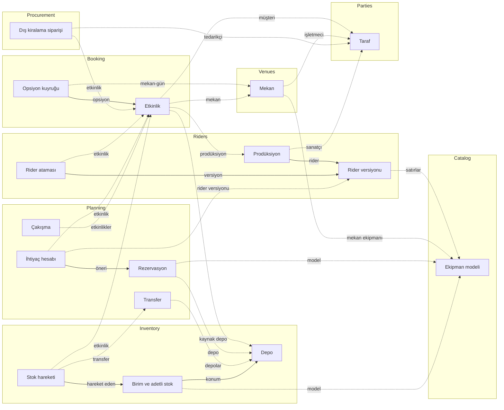

## 4. Önemli modelleme kararları

Modeli çıkarırken verilen ve önceki belgelerde açıkça yazmayan kararlar:

| # | Karar | Gerekçe |
|---|---|---|
| 1 | **Taraf tek varlıktır; kişi ve firma onun alt türleridir.** Sanatçı, tedarikçi, müşteri ayrı varlık değil, taraf rolüdür. | Aynı firma hem tedarikçi hem müşteri olabilir (BR-PTY-001). İletişim bilgileri bir kez tutulur. |
| 2 | **Ajans–sanatçı ilişkisi ayrı bir varlıktır (`ArtistRepresentation`).** | US-ART-001 "varsa ajansı bağlanır" diyordu ama bağın nerede tutulacağı tanımsızdı. Bir sanatçıyı farklı bölgelerde farklı ajanslar temsil edebilir (bkz. E-02). |
| 3 | **Hedefi "ya model ya kategori ya kit" olan satırlarda tam olarak biri doludur** (rider satırı, mekan ekipmanı, kit satırı, dış kiralama satırı). | Tek bir "hedef türü + hedef kimliği" alanı yerine ayrı referanslar kullanılır; böylece her referans kendi modülünde doğrulanabilir. |
| 4 | **Prodüksiyonun tek bir rider'ı, rider'ın çok sayıda değişmez versiyonu vardır.** Etkinliğe versiyon, ayrı bir **rider ataması** ile bağlanır. | Versiyon değişmezliği (BR-RDR-003) ve etkinliğe özel versiyon (BR-RDR-006) böylece basitleşir. Atama Riders modülündedir ([05 §6](05-module-map.md#6-tartışmalı-sahiplik-kararları)). |
| 5 | **Opsiyonlar, mekan ve gün başına bir opsiyon kuyruğu (`HoldQueue`) altında toplanır.** | Sıranın boşluksuz olması (BR-EVT-002) birden fazla etkinliğin opsiyonunu kapsayan bir kuraldır. Aynı mekan ve güne aynı anda iki opsiyon eklenirse sıranın bozulmaması için kuyruk tek tutarlılık birimi olmalıdır. |
| 6 | **Rezervasyon rider satırına kalıcı olarak bağlanmaz.** Hangi rezervasyonun hangi rider satırını karşıladığı, her ihtiyaç hesabının **karşılama** (`Fulfillment`) satırlarında yeniden hesaplanır. | Rider versiyonu değişince satırlar değişir ama onaylı rezervasyonlar korunur (BR-MRP-009). Kalıcı bağ her versiyon değişikliğinde bozulurdu. |
| 7 | **Rezervasyon, rezervasyon aralığını kendi üzerinde tutar.** | Müsaitlik hesabı Booking'e gitmeden yapılabilir. Etkinlik zamanı değişince Planning aralıkları olayla günceller ([05 §7.1](05-module-map.md#71-booking)). |
| 8 | **Adetli stok, model + konum + durum kümesi + sahiplik başına bir miktardır.** Konum depo, etkinlik ya da transfer olabilir. | Etkinliğe çıkan 20 kablonun hangi etkinlikte olduğu ve dönüşte kaç tane beklendiği (BR-WHS-008) ancak konum bazında izlenebilir. |
| 9 | **Konum bir varlık değil, türü ve kimliği olan bir referanstır:** depo, etkinlik ya da transfer. | Birim, kasa ve adetli stok aynı konum kavramını kullanır; konum türüne göre farklı modüle referans verir. |
| 10 | **Kasanın standart içeriği ile gerçek içeriği ayrıdır.** Seri no'lu birimler kasaya birim üzerinden bağlanır; adetli kalemlerin kasadaki miktarı **kasa içeriği** (`CaseContent`) olarak tutulur. | "Eksik kasa" işareti (BR-EQP-007) ikisinin karşılaştırılmasıdır. Kasadaki adetli miktar, kasanın bulunduğu konumdaki adetli stoğun bir parçasıdır, ona eklenmez. |
| 11 | **Stok hareketi tek, değişmez bir defterdir.** Çıkış, giriş, transfer, düzeltme, geri alma ve adetli durum değişikliği aynı varlıkla kaydedilir; geri alma yeni bir ters hareket olarak yazılır. | Bir birimin ya da modelin tüm geçmişi tek yerden okunur. Kayıp oranı (BR-EQP-010) ve S6'daki kullanım oranı bu defterden hesaplanır. |
| 12 | **Elle onaylar ayrı bir varlıktır (`EventApproval`) ve geçersiz kılınabilir.** | Onaydan geri almada (BR-EVT-019) sözleşme onayı silinmez, geçersiz işaretlenir; geçmiş korunur. S3–S4'te bu onayların yerini gerçek kayıtlar alır. |
| 13 | **Çakışma baştan kaynak türüyle modellenir.** S1'de tek değer "ekipman"dır. | S2'de ekip, mekan ve araç çakışmaları eklendiğinde çakışma varlığı yeniden tasarlanmaz. |
| 14 | **Serbest açıklamalı dış kiralama satırı, oluşturulduğu önerinin rider satırına bağlanır.** | Katalogda olmayan bir model için sipariş verildiğinde, bu satırın hangi ihtiyacı karşıladığı model üzerinden bulunamaz (BR-MRP-008). |
| 15 | **Tüm tutarlar para birimiyle birlikte tutulur**, S1'de para içeren alan olmasa da. | S4'te çoklu para birimi geldiğinde tutar alanları değişmez. |
| 16 | **Mekan ekipmanı tarihe göre değişir.** Her satırın isteğe bağlı bir geçerlilik aralığı vardır (kalıcı değişiklikler: mekan yeni ekipman aldı ya da bir ekipmanı elden çıkardı). Geçici durumlar için satıra **kullanılamama dönemi** eklenir (ör. mekan ekipmanı belirli tarihlerde başka etkinliğe verdi). | Mekan ekipmanı sabit değildir (E-03). İki ayrı yapı, kalıcı değişiklik ile geçici eksikliği karıştırmadan ve geçmişi silmeden tutar. |

## 5. S1 modülleri

Her modül için diyagram, varlık tablosu ve varlıklar arası kısıtlar verilir.

### 5.1 Identity — Kimlik ve erişim

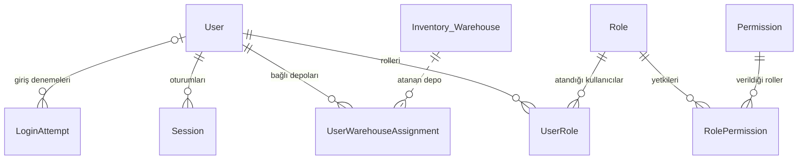

| | Varlık | Türkçe | Temel nitelikler |
|---|---|---|---|
| ★ | `User` | Kullanıcı | ad soyad, e-posta (tekil), aktif mi, şifre değiştirmeli mi, kilit bitiş zamanı |
| | `UserRole` | Kullanıcı–rol ataması | kullanıcı, rol |
| | `UserWarehouseAssignment` | Depo ataması | kullanıcı, depo |
| ★ | `Role` | Rol | kod, ad. S1'de sabittir, yapılandırmadan yüklenir. |
| | `RolePermission` | Rol–yetki eşlemesi | rol, yetki |
| ★ | `Permission` | Yetki | kod (`Modül.Kaynak.İşlem`); her modül kendi yetkilerini tanımlar |
| ★ | `Session` | Oturum | kullanıcı, açılış zamanı, son hareket zamanı, sonlanma zamanı |
| | `LoginAttempt` | Giriş denemesi | e-posta, başarılı mı, zaman |

**Kısıtlar:** Depo sorumlusu rolündeki kullanıcının en az bir aktif depo ataması vardır (BR-SYS-014). En az bir aktif sistem yöneticisi bulunur (BR-SYS-009).

### 5.2 Audit — İşlem geçmişi

| | Varlık | Türkçe | Temel nitelikler |
|---|---|---|---|
| ★ | `AuditEntry` | İşlem geçmişi kaydı | zaman, modül, kayıt türü, kayıt kimliği, işlem, değişen alanların eski ve yeni değerleri, kullanıcı kimliği, kullanıcı adı (o anki haliyle), ilişki kimliği |

**Kısıtlar:** Değişmezdir; güncellenmez, silinmez (BR-SYS-010). Kullanıcı adı yazıldığı anki haliyle saklanır; kullanıcı sonradan pasifleşse de kayıt okunabilir kalır.

### 5.3 Parties — Taraflar

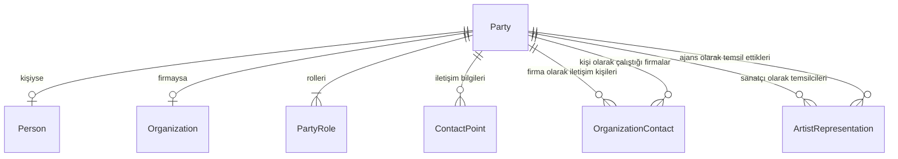

| | Varlık | Türkçe | Temel nitelikler |
|---|---|---|---|
| ★ | `Party` | Taraf | tür (kişi / firma), görünen ad, aktif mi |
| | `Person` | Kişi | ad, soyad |
| | `Organization` | Firma | unvan |
| | `PartyRole` | Taraf rolü | rol |
| | `ContactPoint` | İletişim bilgisi | tür (telefon / e-posta / adres), değer, etiket, birincil mi |
| | `OrganizationContact` | İletişim kişisi | firma, kişi, görevi |
| | `ArtistRepresentation` | Temsil | sanatçı, ajans, açıklama (ör. bölge) |

**Kısıtlar:** Bir tarafın her rolü bir kez bulunur ve en az bir rolü vardır (BR-PTY-001). Her iletişim türünde en fazla bir birincil kayıt olur (BR-PTY-002). İletişim kişisi firma ile kişiyi bağlar (BR-PTY-003). Temsilde sanatçı Sanatçı, ajans Ajans rolündedir (BR-PTY-004).

### 5.4 Catalog — Ekipman kataloğu

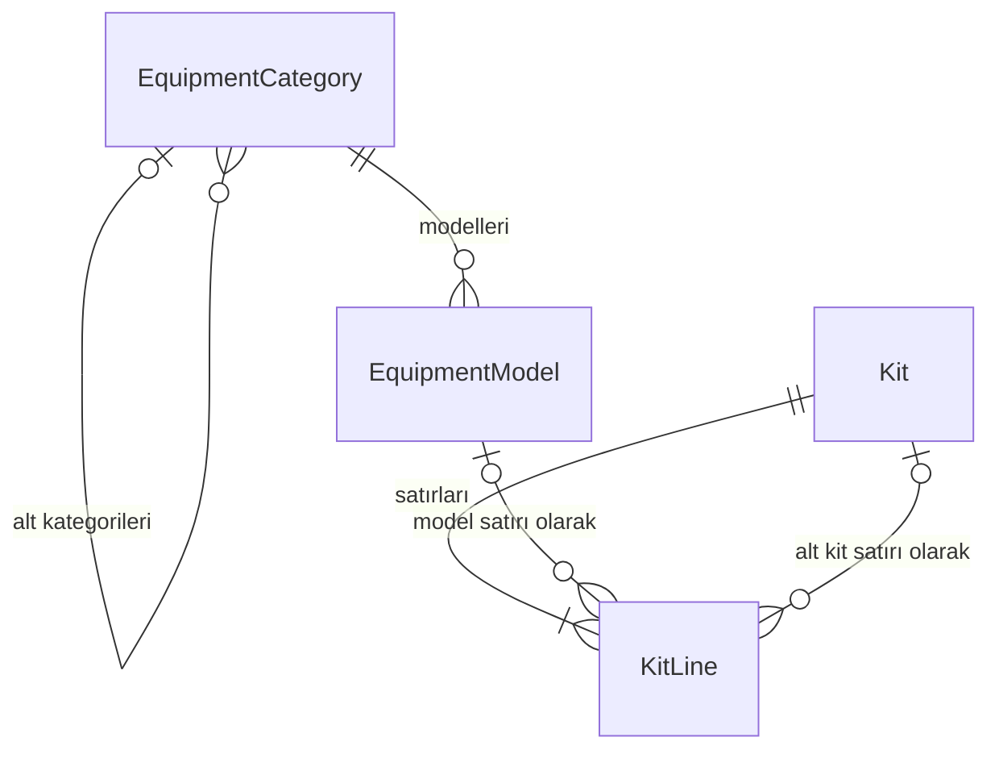

| | Varlık | Türkçe | Temel nitelikler |
|---|---|---|---|
| ★ | `EquipmentCategory` | Ekipman kategorisi | ad, üst kategori, aktif mi |
| ★ | `EquipmentModel` | Ekipman modeli | marka, model adı, kategori, takip tipi, ağırlık (kg), güç tüketimi (W), taşıma hacmi (m³), stoğu oluştu mu, aktif mi |
| ★ | `Kit` | Kit | ad, aktif mi |
| | `KitLine` | Kit satırı | hedef (model ya da alt kit, tam olarak biri), adet, sıra |

**Kısıtlar:** Kategori ve kit hiyerarşilerinde döngü olmaz (BR-EQP-002, BR-EQP-003). Marka ve model adı birlikte tekildir. Stoğu oluşmuş modelin takip tipi değişmez (BR-EQP-001).

### 5.5 Venues — Mekanlar

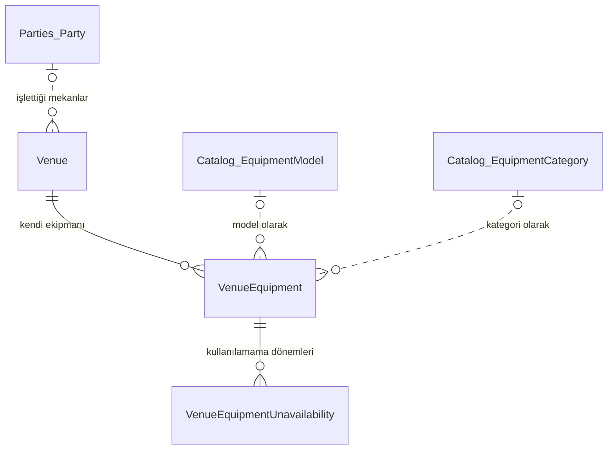

| | Varlık | Türkçe | Temel nitelikler |
|---|---|---|---|
| ★ | `Venue` | Mekan | ad, şehir, adres, işletmeci, kapasite, sahne genişliği / derinliği / yüksekliği, yükleme kapısı açıklaması, güç kapasitesi (A), sessizlik saati, aktif mi |
| | `VenueEquipment` | Mekan ekipmanı | hedef (model, kategori ya da serbest açıklama, tam olarak biri), adet, geçerlilik başlangıcı ve bitişi (isteğe bağlı) |
| | `VenueEquipmentUnavailability` | Mekan ekipmanı kullanılamama dönemi | başlangıç, bitiş, kullanılamayan adet, neden |

**Kısıtlar:**
- Yalnızca model ya da kategoriye bağlı mekan ekipmanı ihtiyaç hesabına girer (BR-VEN-001).
- Bir etkinlik için mekan ekipmanı, etkinlik zamanının tamamında geçerli satırlardan, o süreyle örtüşen kullanılamama dönemleri düşülerek hesaplanır (BR-VEN-001).
- Kullanılamayan adet satırın adedini aşamaz; dönem, satırın geçerlilik aralığının içinde kalır (BR-VEN-002).

### 5.6 Riders — Prodüksiyon ve rider

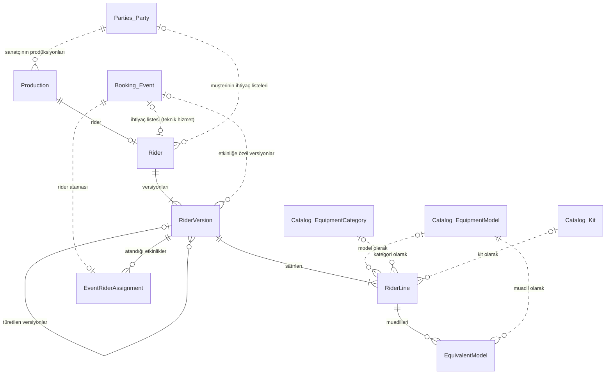

| | Varlık | Türkçe | Temel nitelikler |
|---|---|---|---|
| ★ | `Production` | Prodüksiyon | sanatçı, ad, açıklama, aktif mi |
| ★ | `Rider` | Rider | kaynak (prodüksiyon / müşteri), prodüksiyon **ya da** etkinlik ve müşteri |
| ★ | `RiderVersion` | Rider versiyonu | rider, versiyon numarası, türetildiği versiyon, etkinlik (yalnızca etkinliğe özel versiyonda), oluşturma zamanı. Değişmez. |
| | `RiderLine` | Rider satırı | sıra, hedef (model, kategori ya da kit, tam olarak biri), adet, esneklik, not |
| | `EquivalentModel` | Muadil | sıra, model |
| ★ | `EventRiderAssignment` | Rider ataması | etkinlik (tekil), rider versiyonu |

**Kısıtlar:**
- Bir prodüksiyonun en fazla bir rider'ı, bir teknik hizmet etkinliğinin en fazla bir ihtiyaç listesi, bir etkinliğin en fazla bir rider ataması vardır.
- Satırın tam olarak bir hedefi vardır ve kit hedefi yalnızca ihtiyaç listesinde kullanılır (BR-RDR-001).
- Muadil yalnızca esnek ve hedefi model olan satırda bulunur (BR-RDR-002).
- Versiyonlar değişmez (BR-RDR-003).
- Atanan versiyon, etkinliğin prodüksiyonunun rider'ına ya da o etkinliğin ihtiyaç listesine aittir (BR-RDR-004, BR-RDR-007).
- Etkinliğe özel versiyon, atanmış versiyondan türetilir (BR-RDR-006).

### 5.7 Booking — Etkinlik ve opsiyon

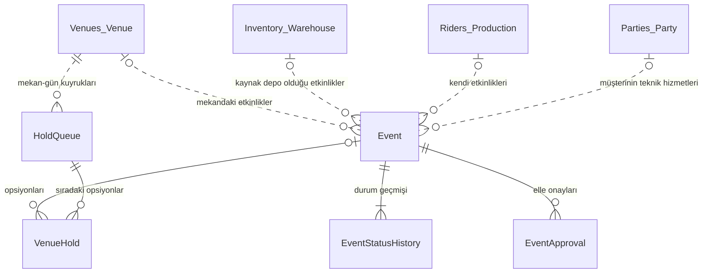

| | Varlık | Türkçe | Temel nitelikler |
|---|---|---|---|
| ★ | `Event` | Etkinlik | ad, tür, durum, başlangıç ve bitiş zamanı, kapı açılışı, söküm başlangıcı, hazırlık payı, dönüş payı, operasyon geçiş modu, mekan, kaynak depo, prodüksiyon ya da müşteri, iptal nedeni ve notu |
| | `EventStatusHistory` | Durum geçmişi | önceki durum, yeni durum, zaman, yapan (kullanıcı ya da sistem), otomatik mi, not. Değişmez. |
| | `EventApproval` | Elle onay | onay türü (sözleşme imzalandı / hesaplaşma onaylandı / mekan yeni tarihi onayladı), veren, zaman, geçerli mi |
| ★ | `HoldQueue` | Opsiyon kuyruğu | mekan, takvim günü |
| | `VenueHold` | Opsiyon | sıra, durum, etkinlik (dış opsiyonda boş), dış sahip adı, son tarih, düşme nedeni |
| ★ | `EventDefaults` | Etkinlik varsayılanları | varsayılan hazırlık payı, varsayılan dönüş payı, varsayılan operasyon geçiş modu. Tek kayıttır. |

**Kısıtlar:**
- Kuyrukta **Aktif** ve **Kesinleşti** opsiyonların sırası 1'den başlar ve boşluksuzdur (BR-EVT-002).
- Bir etkinliğin aynı kuyrukta en fazla bir aktif opsiyonu olur (BR-EVT-004).
- Kendi etkinliğinde prodüksiyon, teknik hizmette müşteri doludur (BR-EVT-016).
- Zaman noktaları sıralıdır: başlangıç ≤ kapı açılışı ≤ söküm başlangıcı ≤ bitiş (BR-EVT-020).
- Kapanmış etkinlik ve bağlı kayıtları değişmez (BR-EVT-013).

### 5.8 Planning — Planlama (MRP)

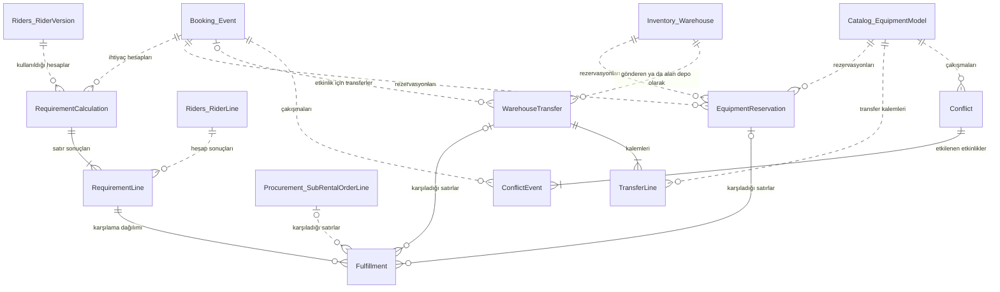

| | Varlık | Türkçe | Temel nitelikler |
|---|---|---|---|
| ★ | `RequirementCalculation` | İhtiyaç hesabı | etkinlik, rider versiyonu, çalışma zamanı, çalıştıran, son hesap mı, güncel mi |
| | `RequirementLine` | İhtiyaç satırı | rider satırı, brüt ihtiyaç, mekandan karşılanan, net ihtiyaç |
| | `Fulfillment` | Karşılama | kaynak (depo / mekan / muadil / dış kiralama), model, depo, adet, rezervasyon, transfer ya da dış kiralama satırı, karşılanamayan kısım mı |
| ★ | `EquipmentReservation` | Rezervasyon | etkinlik, model, depo, adet, aralık başlangıcı ve bitişi, durum, fazla mı, kaynağı (hesap / çıkış / transfer), serbest bırakma nedeni |
| ★ | `WarehouseTransfer` | Transfer | gönderen depo, alan depo, etkinlik (varsa), planlanan çıkış ve varış, gerçekleşen varış, durum, gecikmiş mi, kaynağı (öneri / elle) |
| | `TransferLine` | Transfer kalemi | model, planlanan adet, gelen adet |
| ★ | `Conflict` | Çakışma | tür, kaynak türü (S1'de yalnızca ekipman), model, depo, aralık, istenen ve müsait adet, eksik adet, durum, kabul notu ve kabul anındaki eksik |
| | `ConflictEvent` | Çakışmadan etkilenen etkinlik | çakışma, etkinlik |

**Kısıtlar:**
- Onaylı rezervasyonların toplamı hiçbir anda müsaitliği aşmaz; aşarsa aşırı rezervasyon çakışması açılır (BR-MRP-013, BR-MRP-017).
- Transferin gönderen ve alan deposu farklıdır; varış çıkıştan önce olamaz ve etkinliğin rezervasyon aralığından sonra olamaz (BR-MRP-007).
- Bir etkinliğin yalnızca son ihtiyaç hesabı geçerlidir; eskiler geçmiş olarak saklanır.

### 5.9 Inventory — Stok ve depo

Birim, kasa ve adetli stoğun **konumu** depo, etkinlik ya da transfer olabilir (karar 9). Okunabilirlik için model iki diyagrama bölünmüştür.

**Stok ve konum.** Konum ilişkileri birim için ayrıntılı gösterilmiştir; kasa ve adetli stok için de aynıdır.

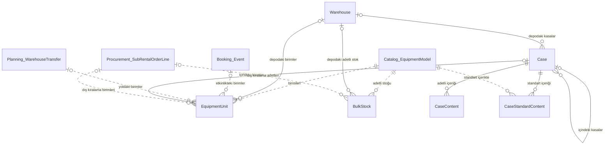

**Hareketler ve kayıtlar.**

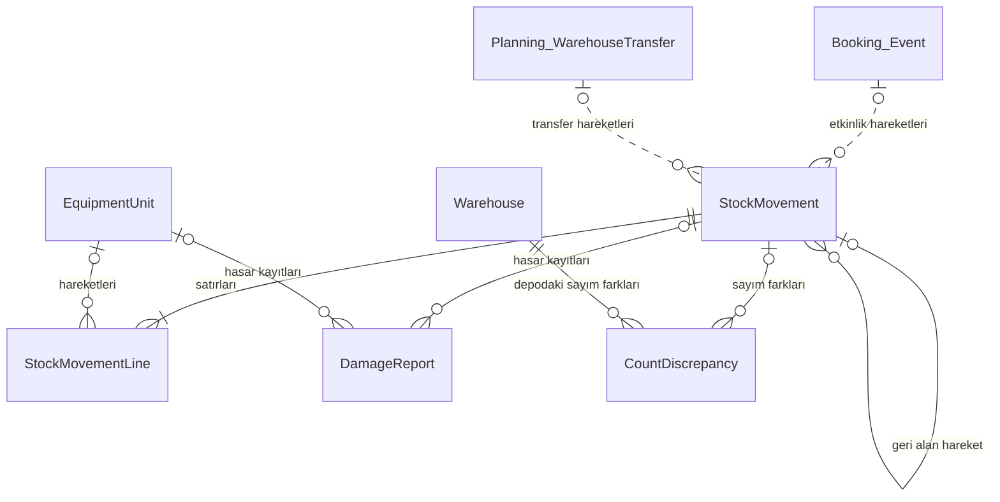

| | Varlık | Türkçe | Temel nitelikler |
|---|---|---|---|
| ★ | `Warehouse` | Depo | ad, şehir, adres, aktif mi |
| ★ | `EquipmentUnit` | Birim | model, seri no, etiket kodu, sahiplik, dış kiralama satırı, tedarikçi seri no, durum, konum, kasa, edinme tarihi |
| ★ | `BulkStock` | Adetli stok | model, konum, durum kümesi (Depoda / Yolda / Etkinlikte / Bakımda), sahiplik, dış kiralama satırı, adet |
| ★ | `Case` | Kasa | etiket kodu, ad, konum, üst kasa, aktif mi |
| | `CaseStandardContent` | Kasa standart içeriği | model, adet |
| | `CaseContent` | Kasa içeriği | model, adet (yalnızca adetli kalemler) |
| ★ | `StockMovement` | Stok hareketi | tür (çıkış / giriş / transfer çıkışı / transfer varışı / düzeltme / geri alma / durum değişikliği), zaman, yapan, etkinlik, transfer, nereden, nereye, neden, geri aldığı hareket. Değişmez. |
| | `StockMovementLine` | Hareket satırı | birim **ya da** model ve adet, hasarlı mı |
| ★ | `DamageReport` | Hasar kaydı | birim ya da model ve adet, etkinlik ya da transfer, hareket, açıklama, kapanma zamanı |
| ★ | `CountDiscrepancy` | Sayım farkı | model, adet (eksik −, fazla +), depo, etkinlik ya da transfer, hareket, sahiplik. Değişmez. |

**Kısıtlar:**
- Seri no aynı model içinde tekildir. Etiket kodu birim ve kasalar arasında tekildir ve tekrar kullanılmaz (BR-EQP-004).
- Birim en fazla bir kasadadır, kasa hiyerarşisinde döngü olmaz, kasa ile içeriği aynı konumdadır (BR-EQP-006).
- Kasadaki adetli miktar, kasanın konumundaki adetli stoktan fazla olamaz (BR-EQP-006).
- Adetli stok eksiye düşmez (BR-EQP-005).
- Dış kiralama sahipli kayıtların dış kiralama satırı doludur, şirket sahipli kayıtlarınki boştur (BR-EQP-009).

### 5.10 Procurement — Satın alma ve dış kiralama

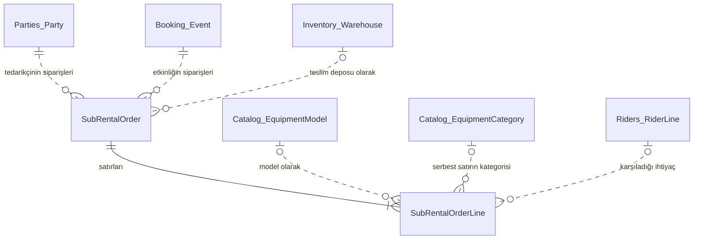

| | Varlık | Türkçe | Temel nitelikler |
|---|---|---|---|
| ★ | `SubRentalOrder` | Dış kiralama siparişi | tedarikçi, etkinlik, kiralama başlangıcı ve bitişi, teslim yeri (depo / mekan), teslim deposu, durum, sipariş / teslim / iade zamanları |
| | `SubRentalOrderLine` | Sipariş satırı | model **ya da** serbest açıklama ve kategori, karşıladığı rider satırı, adet, QR ile takip, teslim alınan / iade edilen / eksik adet |

**Kısıtlar:** Teslim yeri mekan ise etkinliğin mekanı kullanılır ve QR ile takip seçilemez (BR-WHS-013). İade edilen ve eksik adetlerin toplamı teslim alınanı aşmaz.

## 6. Modüller arası referanslar (S1)

Her kesikli ilişkinin yazılırken nasıl doğrulandığı. "Senkron" = sahibi modülün sözleşmesi çağrılır; "kopya" = modülün yerel kopyasından okunur ([05 §4.3](05-module-map.md#43-izin-verilen-senkron-çağrılar), [05 §8](05-module-map.md#8-yerel-kopyalar-projeksiyonlar)).

| Referans veren | Referans verilen | Doğrulama |
|---|---|---|
| Identity: depo ataması | Inventory: depo | Senkron. Depo pasifleşince atama olayla kaldırılır. |
| Venues: mekan işletmecisi | Parties: taraf (Mekan işletmecisi) | Senkron |
| Venues: mekan ekipmanı | Catalog: model, kategori | Senkron |
| Riders: prodüksiyonun sanatçısı | Parties: taraf (Sanatçı) | Senkron |
| Riders: ihtiyaç listesinin etkinliği ve müşterisi | Booking: etkinlik; Parties: taraf | Etkinlik kopyası; Parties senkron |
| Riders: etkinliğe özel versiyon, rider ataması | Booking: etkinlik | Etkinlik kopyası |
| Riders: rider satırı, muadil | Catalog: model, kategori, kit | Senkron |
| Booking: etkinliğin mekanı, opsiyon kuyruğunun mekanı | Venues: mekan | Senkron |
| Booking: kaynak depo | Inventory: depo | Senkron |
| Booking: prodüksiyon | Riders: prodüksiyon | Senkron |
| Booking: müşteri | Parties: taraf (Müşteri) | Senkron |
| Planning: etkinlik referansları | Booking: etkinlik | Etkinlik kopyası |
| Planning: rider versiyonu ve satırı | Riders | Senkron; hesap anında okunur |
| Planning: model referansları | Catalog | Senkron |
| Planning: depo referansları | Inventory: depo | Stok kopyası |
| Planning: karşılamanın dış kiralama satırı | Procurement: sipariş satırı | Dış kiralama kapsamı kopyası |
| Inventory: birim, adetli stok, kasa standart içeriği | Catalog: model | Senkron |
| Inventory: konum, hareket ve kayıtlardaki etkinlik | Booking: etkinlik | Etkinlik kopyası |
| Inventory: konum ve hareketlerdeki transfer | Planning: transfer | Transfer beklentisi kopyası |
| Inventory: dış kiralama birimi ve stoğu | Procurement: sipariş satırı | `SubRentalOrderReceived` olayından gelir |
| Procurement: tedarikçi | Parties: taraf (Tedarikçi) | Senkron |
| Procurement: etkinlik | Booking: etkinlik | Etkinlik kopyası |
| Procurement: teslim deposu | Inventory: depo | Depo kopyası |
| Procurement: satırın modeli ve kategorisi | Catalog | Senkron |
| Procurement: karşıladığı rider satırı | Riders: rider satırı | Planning'in önerisinden değer olarak gelir |
| Audit: kullanıcı | Identity: kullanıcı | Doğrulanmaz; kullanıcı adı o anki haliyle yazılır |

Procurement ile Inventory aynı katmanda olduğu için Procurement depoyu senkron doğrulayamaz. Etkinliğin durumunu da Booking'den senkron alamaz. Bu yüzden Procurement, etkinlik ve depo için birer yerel kopya tutar. Bu ihtiyaç modeli çıkarırken ortaya çıktı ve modül haritasına eklendi ([05 v1.1](05-module-map.md#16-değişiklik-kaydı)).

## 7. Toplu kökler ve eşzamanlılık

Toplu kök, birlikte tutarlı kalması gereken varlıkların sınırıdır. Her toplu kök bir sürüm numarası taşır. Kaydederken sürüm değişmişse işlem reddedilir; bu iyimser kilitlemedir (BR-SYS-011). Bir komut, **aynı modül içinde** birden fazla toplu kökü tek işlem biriminde değiştirebilir. Örneğin ilk opsiyonun eklenmesi hem opsiyon kuyruğunu hem etkinliği değiştirir (T-EVT-01).

| Modül | Toplu kök | İçindekiler | Eşzamanlılık notu |
|---|---|---|---|
| Identity | `User` | `UserRole`, `UserWarehouseAssignment` | İyimser kilit |
| Parties | `Party` | `Person` / `Organization`, `PartyRole`, `ContactPoint`, `OrganizationContact` (firma tarafında), `ArtistRepresentation` (sanatçı tarafında) | İyimser kilit |
| Catalog | `EquipmentCategory`, `EquipmentModel`, `Kit` | `KitLine` | İyimser kilit |
| Venues | `Venue` | `VenueEquipment` | İyimser kilit |
| Riders | `Production`, `Rider` | — | İyimser kilit |
| Riders | `RiderVersion` | `RiderLine`, `EquivalentModel` | Değişmez; kilide gerek yoktur |
| Riders | `EventRiderAssignment` | — | Etkinlik başına tekil |
| Booking | `Event` | `EventStatusHistory`, `EventApproval` | İyimser kilit |
| Booking | `HoldQueue` | `VenueHold` | Mekan ve gün başına tek kuyruk; iki opsiyonun aynı sıraya yazılmasını iyimser kilit önler |
| Planning | `RequirementCalculation` | `RequirementLine`, `Fulfillment` | Hesap sonucu değişmez; yeni hesap yeni kayıttır |
| Planning | `EquipmentReservation`, `WarehouseTransfer` (`TransferLine`) | — | **Müsaitlik kilidi:** Onay, transfer planı ve çıkışta rezervasyon ekleme, ilgili her (model, depo) çifti için kısa süreli bir kilit altında müsaitliği yeniden hesaplar (BR-MRP-013). Aynı çift için iki onay aynı anda yapılamaz; farklı çiftler birbirini beklemez. |
| Planning | `Conflict` | `ConflictEvent` | Aynı model, depo ve aralık için tek açık çakışma |
| Inventory | `Warehouse` | — | İyimser kilit |
| Inventory | `EquipmentUnit` | — | Aynı birimin iki okutmasından yalnızca ilki geçer (BR-WHS-006) |
| Inventory | `Case` | `CaseStandardContent`, `CaseContent` | Kasa okutulunca kasa ve içindeki birimler aynı işlem biriminde güncellenir |
| Inventory | `BulkStock` | — | Miktar değişiklikleri satır bazında atomiktir; eksiye düşme işlem anında kontrol edilir |
| Inventory | `StockMovement` | `StockMovementLine` | Değişmez defter |
| Inventory | `DamageReport`, `CountDiscrepancy` | — | Sayım farkı değişmez; hasar kaydı yalnızca kapanır |
| Procurement | `SubRentalOrder` | `SubRentalOrderLine` | İyimser kilit |
| Audit | `AuditEntry` | — | Değişmez |

## 8. Değişmez kayıtlar

Aşağıdaki varlıklar bir kez yazılır, hiç güncellenmez ve silinmez. Düzeltme gerekirse yeni bir kayıt yazılır:

| Varlık | Düzeltme nasıl yapılır |
|---|---|
| `AuditEntry` | Yapılmaz |
| `EventStatusHistory` | Yeni geçiş yazılır |
| `RiderVersion` | Yeni versiyon oluşturulur |
| `RequirementCalculation` | Hesap yeniden çalıştırılır |
| `StockMovement` | Ters hareket (geri alma) yazılır |
| `CountDiscrepancy` | Karşı yönde düzeltme hareketi yazılır |

## 9. Sonraki sürümler (S2–S6)

Bu diyagramlar varlıkları ve ilişkileri gösterir. Nitelikler, ilgili sürümün başında modül tasarımında netleşir. Birden fazla modülü kapsadıkları için tüm varlıklar `Modül_Varlık` biçimindedir.

### 9.1 S2 — Kaynak planlama

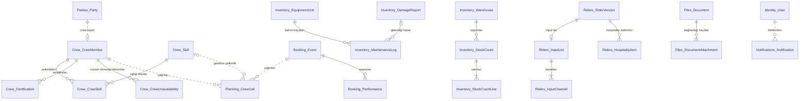

| Varlık | Açıklama |
|---|---|
| `CrewMember`, `Skill`, `CrewSkill`, `Certification`, `CrewUnavailability` | Crew modülü: ücret, çalışma tipi, yetkinlik, geçerlilik tarihli sertifika, müsait olmama dönemleri |
| `CrewCall` (Planning) | Etkinliğe, göreve ve saate atama. Rezervasyon gibi bir taahhüttür; bu yüzden Planning'dedir ve aynı çakışma motorunu kullanır. |
| `Performance` (Booking) | Seans. S2'de kapı açılışı seans bazına iner; etkinliğin kapı açılışı ilk seansınkinden türetilir, otomatik geçiş kuralı (BR-EVT-018) değişmez. |
| `MaintenanceLog`, `StockCount`, `StockCountLine` (Inventory) | Bakım kaydı hasar kaydına bağlanabilir. Sayım farkları mevcut `CountDiscrepancy` ile yazılır. |
| `InputList`, `InputChannel`, `HospitalityItem` (Riders) | Rider versiyonunun parçasıdır ve onunla birlikte değişmezdir. Stage plot bir belge olarak bağlanır. |
| `Document`, `DocumentAttachment` (Files) | Bir belge birden fazla kayda bağlanabilir. Bağlantı, sahibi modülü, kayıt türünü ve kimliğini tutar. |
| `Notification` (Notifications) | Alıcı, tür, başlık, bağlantı, okunma zamanı |
| `Conflict` genişlemesi | Kaynak türüne ekip, mekan değerleri eklenir (karar 13) |

### 9.2 S3 — Ticari (CRM)

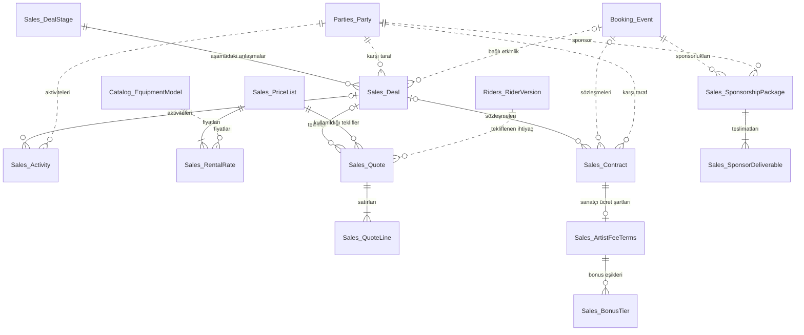

| Varlık | Açıklama |
|---|---|
| `Deal`, `DealStage`, `Activity` | Anlaşma hunisi; anlaşma türü: sanatçı booking'i, teknik hizmet, sponsorluk |
| `PriceList`, `RentalRate` | Geçerlilik tarihli fiyat listesi; model başına günlük fiyat (`Money`) |
| `Quote`, `QuoteLine` | Teknik hizmet teklifi; rider versiyonundan ve fiyat listesinden hesaplanır. S2'deki ekip maliyeti satır olarak eklenir. |
| `Contract` | Sözleşme ve imza durumu; belge olarak Files'a bağlanır. BR-EVT-009'daki elle onayın yerini alır. |
| `ArtistFeeTerms`, `BonusTier` | Sanatçı ücret modeli (garanti, yüzde, hangisi yüksekse, bonus) ve eşikleri; S4'teki hesaplaşmanın girdisidir |
| `SponsorshipPackage`, `SponsorDeliverable` | Sponsorluk paketi ve teslim edilecek haklar |
| Procurement genişlemesi | Sipariş satırına birim fiyat (`Money`); sipariş formu PDF |

### 9.3 S4 — Finans

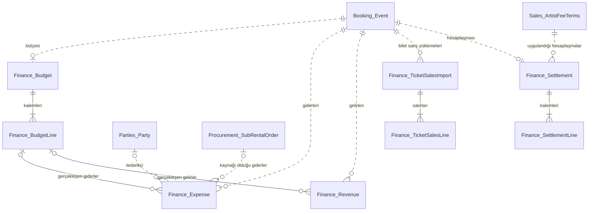

| Varlık | Açıklama |
|---|---|
| `Budget`, `BudgetLine` | Etkinlik başına bir bütçe; planlanan gelir ve gider kalemleri |
| `Expense`, `Revenue` | Gerçekleşen tutarlar. Gider kaynağı elle, dış kiralama siparişi ya da crew çağrısı olabilir; bunlar olaylardan otomatik oluşur. |
| `TicketSalesImport`, `TicketSalesLine` | Dış platformdan yüklenen satışlar; brüt ve net hasılat bu satırlardan hesaplanır |
| `ExchangeRate` | Tarihli kur (diyagramda ilişkisi yoktur) |
| `Settlement`, `SettlementLine` | Hesaplaşma; BR-EVT-012'deki elle onayın yerini alır |
| `AccountingExport` | Muhasebe yazılımına yapılan dışa aktarımların kaydı |

### 9.4 S5 — Turne ve lojistik

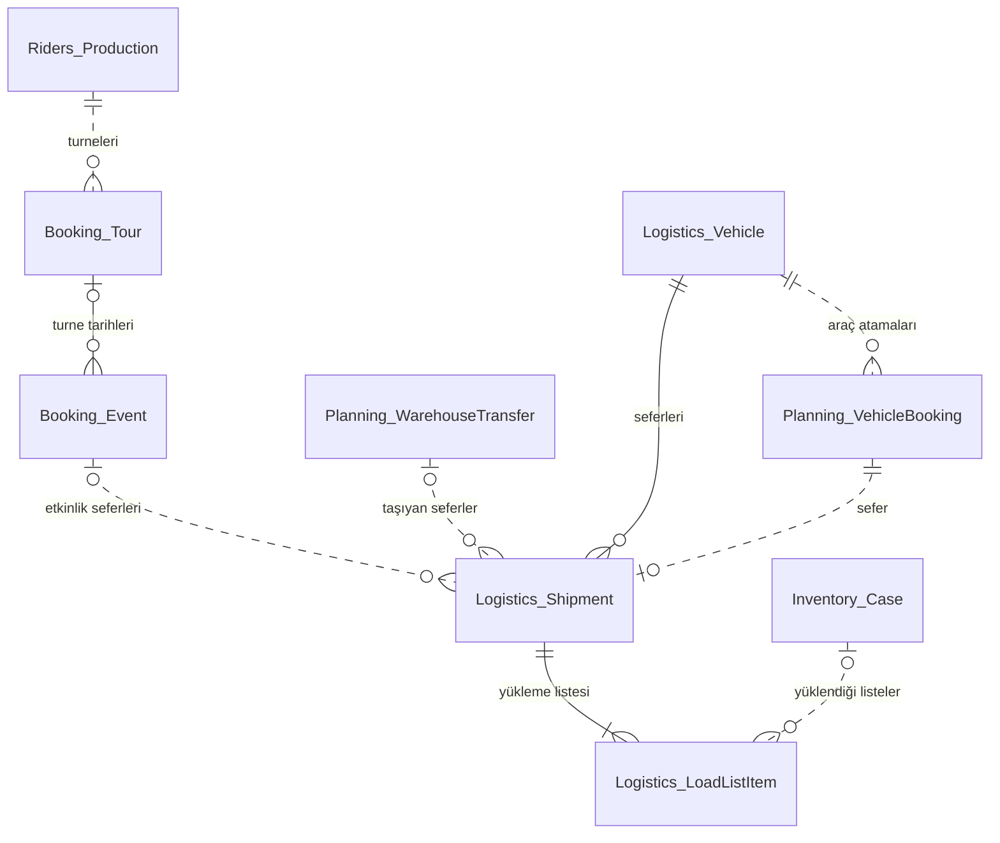

| Varlık | Açıklama |
|---|---|
| `Tour` (Booking) | Bir prodüksiyonun turnesi. **Turne tarihi ayrı bir varlık değildir;** turneye bağlı etkinliktir. Sözlükteki "turne tarihi" terimi buna göre güncellendi. |
| `Vehicle`, `Shipment`, `LoadListItem` (Logistics) | Araç, sefer ve yükleme listesi. Yükleme hesabı kasa ağırlık ve hacimlerinden yapılır; Logistics bunları Inventory olaylarından kopyalar ([05 §4.5](05-module-map.md#45-sonraki-sürümlerde-beklenen-bağımlılıklar)). |
| `VehicleBooking` (Planning) | Aracın bir zaman aralığı için ayrılması. Rezervasyon gibi bir taahhüttür; çakışma motoru araçları da kapsar. |
| `RouteEstimate` (Logistics) | İki konum arası mesafe ve süre tahmini; geçiş kontrolü ve mesafeye göre depo seçimi bunu kullanır |
| Konum genişlemesi | Depo ve mekana enlem ve boylam eklenir |

### 9.5 S6 — Analiz ve yayın

| Değişiklik | Modül |
|---|---|
| Kârlılık, kullanım oranı, iş yükü, satın al / kirala gibi rapor modelleri | Reporting. Olaylardan beslenen salt okunur kopyalardır; yeni iş varlığı değildir. |
| Sarf malzeme | Catalog: takip tipine üçüncü değer (**Sarf**). Inventory: çıkışta stoktan düşülür, dönüş beklenmez. |
| İki adımlı doğrulama, kayıt bazlı ince yetki | Identity |
| E-posta bildirimi | Notifications |
| Mükerrer taraf birleştirme | Parties: birleştirme kaydı; birleşen tarafa verilen referanslar olaylarla güncellenir |

### 9.6 S1 modelinin sonraki sürümlere hazırlığı

S1'de alınan ve ileride yeniden tasarımı önleyen önlemler:

| Sonraki ihtiyaç | S1'deki hazırlık |
|---|---|
| Ekip, mekan ve araç çakışmaları (S2, S5) | Çakışmanın kaynak türü baştan var (karar 13) |
| Crew çağrısı, araç ataması (S2, S5) | Tüm taahhütler Planning'de; aynı müsaitlik ve kilit yaklaşımı kullanılır |
| Seanslar (S2) | Kapı açılışı etkinlikte tek alan; S2'de ilk seanstan türetilir |
| Sözleşme ve hesaplaşma (S3, S4) | Elle onaylar ayrı varlık; yerleri gerçek kayıtlarla değiştirilir (karar 12) |
| Çoklu para birimi (S4) | Tutar her yerde para birimiyle birlikte (karar 15) |
| Gider kaynakları (S4) | Dış kiralama ve (S2'de) crew çağrıları olay yayınlıyor |
| Turne (S5) | Etkinlik, turneye yalnızca bir referansla bağlanacak; etkinlik yapısı değişmez |
| Mesafe (S5) | Depo ve mekan şehir ve adres tutuyor; enlem / boylam eklenmesi ek alandır |
| Kullanım oranı (S6) | Stok hareketi değişmez bir defter; rezervasyonlar **Tamamlandı** durumuyla saklanıyor |

## 10. Bu modelle önceki belgelerde yapılan düzeltmeler

Modeli çıkarırken bulunan eksik ve tutarsızlıklar ile yapılan düzeltmeler:

| Bulgu | Düzeltme |
|---|---|
| Ajans–sanatçı bağı hiçbir yerde modellenmemişti | Sözlüğe **Temsil** (`ArtistRepresentation`) eklendi; Parties kartı güncellendi |
| Opsiyon sırasının tutarlılık birimi tanımsızdı | Sözlüğe **Opsiyon kuyruğu** (`HoldQueue`) eklendi |
| Kapı açılışı ve söküm başlangıcının etkinlik zamanıyla ilişkisi tanımsızdı | BR-EVT-020 eklendi: zaman noktaları sıralıdır |
| Transferin gönderen ve alan deposunun farklı olması ve varışın çıkıştan sonra olması yazılmamıştı | BR-MRP-007'ye eklendi |
| Kasadaki adetli miktarın stokla ilişkisi tanımsızdı | BR-EQP-006'ya eklendi; sözlüğe **Kasa içeriği** eklendi |
| Serbest açıklamalı dış kiralama satırının hangi ihtiyacı karşıladığı belirsizdi | BR-MRP-008 güncellendi |
| Procurement, etkinlik durumunu ve depoyu katman kuralına uyarak doğrulayamıyordu | Procurement'a etkinlik ve depo kopyası eklendi ([05 v1.1](05-module-map.md#16-değişiklik-kaydı)) |
| Turne tarihi ayrı bir varlık gibi tanımlanmıştı | Sözlükte turneye bağlı etkinlik olarak düzeltildi |
| Hesap sonuçlarının satır ve karşılama yapısı sözlükte yoktu | Sözlüğe **İhtiyaç satırı** eklendi; **Karşılama** tanımı netleştirildi |

## 11. Kararlar

| No | Soru | Karar | Gerekçe |
|---|---|---|---|
| E-01 | Prodüksiyonun kaç rider'ı olur? | Tek rider. Ses, ışık ve backline bölümleri satırların kategorisinden anlaşılır; ekranda kategoriye göre gruplanır. | Sektörde teknik rider tek belge olarak gelir. |
| E-02 | Bir sanatçıyı birden fazla ajans temsil edebilir mi? | Evet. Temsil ilişkisi çokludur; açıklama alanında bölge ya da kapsam yazılır. | Sanatçılar farklı bölgelerde farklı ajanslarla çalışabilir. |
| E-03 | Mekan ekipmanı sabit mi? | Hayır, tarihe göre değişir. Satırların geçerlilik aralığı ve geçici kullanılamama dönemleri vardır (karar 16, BR-VEN-001, BR-VEN-002). | Mekanlar ekipman alır, elden çıkarır ya da ekipmanını belirli tarihlerde başka etkinliğe verir. |

## 12. Değişiklik kaydı

| Tarih | Versiyon | Değişiklik |
|---|---|---|
| 2026-09-25 | v0.1 | İlk taslak: S1 ayrıntılı, S2–S6 varlık ve ilişki seviyesinde |
| 2026-09-25 | v1.0 | Kararlar: tek rider, çoklu temsil, tarihe göre değişen mekan ekipmanı (`VenueEquipmentUnavailability` eklendi). |
