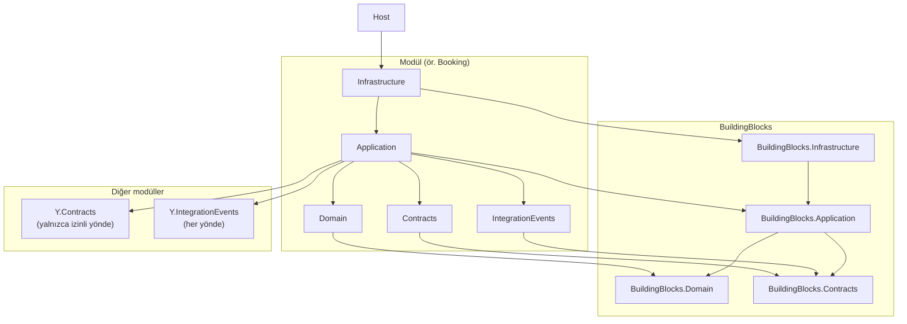
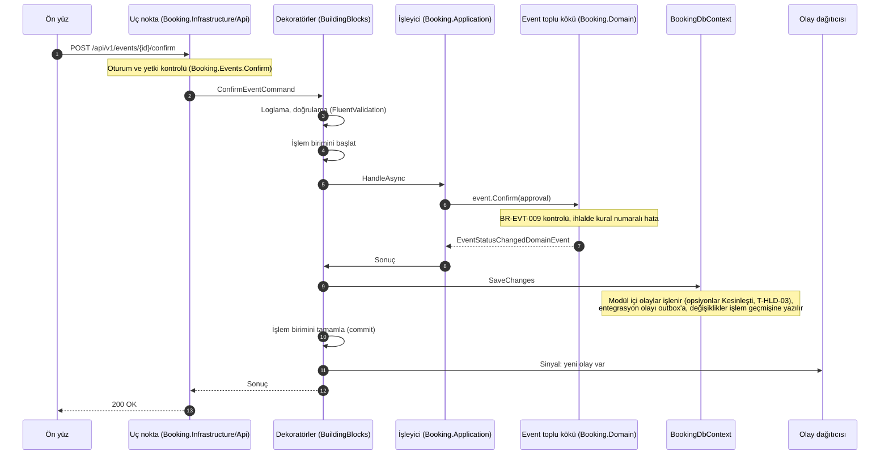
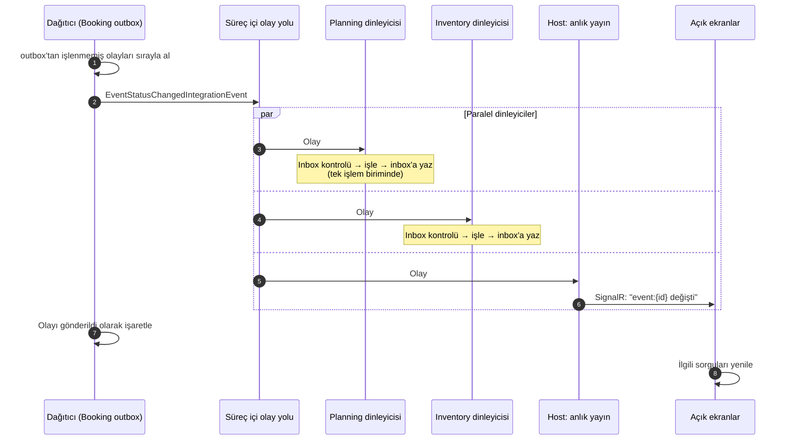

# 08 — Mimari ve Klasör Yapısı

> **Durum:** v1.9 · **Son güncelleme:** 2026-09-26
> **Kararlar:** [Bölüm 13](#13-kararlar)

## 1. Bu belge ne işe yarar

Kodun repoda nasıl düzenleneceğini ve parçaların birbirine nasıl bağlanacağını tanımlar:
- repo ve solution düzeni,
- bir modülün içindeki projeler ve bağımlılık yönleri,
- ortak yapı taşları,
- ana uygulamanın (Host) modülleri nasıl bir araya getirdiği,
- bir isteğin ve bir olayın kod içindeki yolculuğu,
- ön yüz klasör yapısı,
- testlerin yeri ve modül sınırlarını koruyan mimari testler.

Bu belge [05-module-map.md](05-module-map.md)'deki modül sınırlarını ve [07-tech-stack.md](07-tech-stack.md)'deki teknoloji seçimlerini koda indirger. Adlar [standards/naming.md](standards/naming.md)'ye, kod biçimi [standards/code-style.md](standards/code-style.md)'ye uyar.

Kök ad `FestOS`'tur ([A-01](#13-kararlar)).

## 2. Repo düzeni

Sunucu, ön yüz, testler, belgeler ve araçlar tek repodadır (monorepo).

```
etkinlik-konser-yonetim-sistemi/
├── docs/                           Faz 0 belgeleri, ADR'ler, modül tasarımları
│   ├── adr/
│   ├── modules/                    her modülün fiziksel tasarımı (geliştirme başlarken)
│   └── standards/                  isimlendirme, veritabanı, API, kod ve git standartları
├── src/
│   ├── AppHost/                    Aspire başlatıcısı (yalnızca yerel geliştirme)
│   ├── ServiceDefaults/            ortak telemetri ve sağlık kontrolü ayarları
│   ├── Host/                       ana uygulama: API, SignalR, zamanlanmış işler, ön yüzün sunulması
│   ├── BuildingBlocks/             tüm modüllerin kullandığı ortak kod (4 proje)
│   ├── Modules/                    iş modülleri (her biri 5 proje)
│   │   ├── Identity/
│   │   ├── Audit/
│   │   ├── Parties/
│   │   ├── Catalog/
│   │   ├── Venues/
│   │   ├── Riders/
│   │   ├── Booking/
│   │   ├── Planning/
│   │   ├── Inventory/
│   │   └── Procurement/
│   └── web/                        React + Vite ön yüz
├── tests/
│   ├── ArchitectureTests/          modül sınırlarını ve katman kurallarını doğrulayan testler
│   ├── BuildingBlocks/             ortak kodun testleri (ör. outbox ve inbox)
│   ├── Database/                   veritabanı testleri: migration'lar, roller, kısıtlar
│   ├── Modules/                    her modül için birim ve entegrasyon testleri
│   ├── Testing/                    ortak test yardımcıları (veritabanı konteyneri, sahte zaman, veri kurucular)
│   └── e2e/                        Playwright uçtan uca testleri
├── tools/
│   ├── docs/                       belge ve izlenebilirlik kontrol betikleri
│   ├── git/                        Git kancalarının betikleri
│   ├── licenses/                   lisans izin ve istisna listeleri, npm lisans denetimi
│   └── templates/                  yeni modül iskeleti üreten şablon
├── deploy/                         demo sunucusu: Compose tanımı, Caddy ve Alloy ayarları, PostgreSQL imajı, kurulum, yayın ve yedekleme betikleri
├── .github/                        CI iş akışları, PR ve issue şablonları, Dependabot ayarı
├── .config/dotnet-tools.json       .NET yerel araçları: CSharpier, dotnet-ef, nuget-license
├── FestOS.slnx                   solution dosyası (.NET 10'un XML biçimi)
├── global.json                     .NET SDK sürümünün sabitlenmesi
├── Directory.Build.props           tüm projelerin ortak derleme ayarları
├── Directory.Packages.props        merkezi paket sürümleri
├── BannedSymbols.txt               kodda kullanımı yasak API'ler
├── .editorconfig                   kod biçimi kuralları (C.3)
├── .nvmrc                          Node.js sürümü
├── commitlint.config.mjs           commit mesajı kuralları
├── package.json                    kök pnpm çalışma alanı: commit kancaları, commit mesajı denetimi, Prettier
├── pnpm-workspace.yaml             çalışma alanı paketleri (src/web, tests/e2e) ve paket güvenliği ayarları
├── lefthook.yml                    commit öncesi kontroller
├── .gitleaks.toml                  gizli bilgi taraması ayarı
├── release-please-config.json      sürüm PR'ı ayarı
├── CHANGELOG.md                    değişiklik günlüğü (otomatik üretilir)
└── README.md
```

## 3. Bir modülün yapısı

### 3.1 Beş proje

Her modül beş projeden oluşur. Modülün adı `Booking` ise:

| Proje | İçerik | Başka modüller görebilir mi? |
|---|---|---|
| `FestOS.Modules.Booking.Domain` | Varlıklar, değer tipleri, toplu kökler, iş kuralları, modül içi olaylar (`…DomainEvent`) | Hayır |
| `FestOS.Modules.Booking.Application` | Komutlar, sorgular ve işleyicileri; doğrulayıcılar; entegrasyon olayı dinleyicileri; modülün senkron sözleşmesinin uygulaması | Hayır |
| `FestOS.Modules.Booking.Infrastructure` | Veritabanı bağlamı, tablo eşlemeleri, migration'lar, API uç noktaları, zamanlanmış işler, modülün Host'a kaydı | Hayır (yalnızca Host) |
| `FestOS.Modules.Booking.Contracts` | Modülün **senkron sözleşmesi**: diğer modüllerin çağırabileceği arayüz ve veri tipleri | Evet, yalnızca [05 §4.3](05-module-map.md#43-i̇zin-verilen-senkron-çağrılar)'te izin verilen modüller |
| `FestOS.Modules.Booking.IntegrationEvents` | Modülün yayınladığı **entegrasyon olayları** (`…IntegrationEvent`) | Evet, her modül |

**Sözleşme ile olayların neden ayrı projelerde olduğu:** Senkron çağrılar yalnızca aşağı katmana yapılabilir ([ADR-0002](adr/0002-module-boundaries-and-layers.md)). Ama olaylar her yöne akar; örneğin Planning (katman 2), Booking'in (katman 4) olaylarını dinler. İkisi aynı projede olsaydı, Planning'in Booking'in olaylarını dinleyebilmesi için Booking'in sözleşmesini de görmesi, yani katman kuralını çiğnemesi gerekirdi. Ayrı projeler bu iki kuralı derleyici seviyesinde ayırır ([ADR-0018](adr/0018-integration-events-project.md)).

Bir modülün yayınladığı ya da sunduğu bir şey yoksa ilgili proje boş kalır ama yine de bulunur. Böylece her modül aynı düzendedir ve yeni bir olay eklemek yeni bir proje gerektirmez.

### 3.2 Proje bağımlılıkları



| Proje | Referans verebildikleri |
|---|---|
| Domain | Yalnızca `BuildingBlocks.Domain`. Veritabanı, web ya da başka bir altyapı paketi yoktur. |
| Application | Kendi Domain'i, kendi Contracts'ı ve IntegrationEvents'i; `BuildingBlocks.Application`; izin verilen modüllerin Contracts'ı ([§3.3](#33-modüller-arası-referanslar)); dinlediği modüllerin IntegrationEvents'i |
| Infrastructure | Kendi Application'ı; `BuildingBlocks.Infrastructure`; EF Core, Npgsql, ASP.NET Core |
| Contracts, IntegrationEvents | Yalnızca `BuildingBlocks.Contracts` |
| Host | Tüm modüllerin Infrastructure ve IntegrationEvents projeleri; ServiceDefaults |

Başka bir modülün Domain, Application ya da Infrastructure projesine hiçbir proje referans veremez.

### 3.3 Modüller arası referanslar

Bu tablo [05 §4.3](05-module-map.md#43-i̇zin-verilen-senkron-çağrılar) ve [05 §7](05-module-map.md#7-entegrasyon-olayları-s1)'den türetilmiştir. Mimari testler (AT-05) bu tablonun dışına çıkan referansı derlemeyi durdurarak engeller.

| Modül (Application) | Referans verdiği Contracts | Dinlediği IntegrationEvents |
|---|---|---|
| Identity | Inventory | Inventory |
| Audit | — | — |
| Parties | — | — |
| Catalog | — | Inventory |
| Venues | Catalog, Parties | — |
| Riders | Catalog, Parties | Booking |
| Booking | Parties, Venues, Riders, Inventory | Planning, Inventory, Riders |
| Planning | Riders, Venues, Catalog | Booking, Riders, Venues, Inventory, Procurement |
| Inventory | Catalog, Planning | Booking, Planning, Procurement |
| Procurement | Planning, Parties, Catalog | Booking, Inventory |

Host, anlık yayın için tüm modüllerin IntegrationEvents projelerine referans verir.

### 3.4 Proje içi klasörler

Klasörler teknik türe göre değil, **iş özelliğine** göre düzenlenir. Bir özelliğe ait komut, işleyici ve doğrulayıcı yan yana durur.

```
FestOS.Modules.Booking.Domain/
├── Events/                         Event, EventStatus, EventKind, geçiş kuralları
├── Holds/                          HoldQueue, VenueHold, HoldStatus
├── Defaults/                       EventDefaults
└── DomainEvents/                   EventStatusChangedDomainEvent, …

FestOS.Modules.Booking.Application/
├── Events/
│   ├── CreateEvent/                CreateEventCommand, CreateEventHandler, CreateEventValidator
│   ├── ChangeEventStatus/
│   ├── CancelEvent/
│   └── GetEvents/                  GetEventsQuery, GetEventsHandler, EventListItem
├── Holds/
│   ├── PlaceVenueHold/
│   └── ReleaseVenueHold/
├── AutomaticTransitions/           RunAutomaticTransitionsCommand (zamanlanmış işin çağırdığı komut)
├── IntegrationEventHandlers/       diğer modüllerin olaylarına verilen tepkiler (ör. etkinlik göstergeleri)
├── Contracts/                      BookingModule: modülün senkron sözleşmesinin uygulaması (S1'de boş)
└── DomainEventHandlers/            modül içi olay tepkileri; entegrasyon olayına dönüştürme

FestOS.Modules.Booking.Infrastructure/
├── Persistence/
│   ├── BookingDbContext.cs
│   ├── Configurations/             varlık başına tablo eşlemesi
│   └── Migrations/
├── Api/                            uç nokta grupları (EventEndpoints, VenueHoldEndpoints)
├── Jobs/                           AutomaticTransitionsJob
└── BookingModuleDefinition.cs      modülün Host'a kaydı (§5)

FestOS.Modules.Booking.Contracts/
└── IBookingModule.cs               senkron sözleşme arayüzü ve veri tipleri

FestOS.Modules.Booking.IntegrationEvents/
├── EventCreatedIntegrationEvent.cs
├── EventDetailsChangedIntegrationEvent.cs
├── EventScheduleChangedIntegrationEvent.cs
└── EventStatusChangedIntegrationEvent.cs
```

**Kurallar:**
- Uygulama katmanındaki sınıflar varsayılan olarak `internal`'dır. Modül dışına yalnızca Contracts ve IntegrationEvents projelerindeki tipler açılır.
- API istek ve yanıt modelleri: komut ve sorgu sonuç tipleri yanıt olarak doğrudan kullanılabilir. HTTP'ye özgü bir biçim gerekiyorsa `Api/` klasöründe ayrı bir istek modeli yazılır.
- Zamanlanmış işler yalnızca tetikleyicidir; asıl iş, Application'daki bir komuttur. Böylece iş kuralı testte doğrudan çağrılabilir.

## 4. Ortak yapı taşları (BuildingBlocks)

| Proje | İçerik |
|---|---|
| `BuildingBlocks.Domain` | Varlık ve toplu kök temel sınıfları (modül içi olay listesi, sürüm numarası), `IDomainEvent`, kural numarasını taşıyan `BusinessRuleViolationException`, `Money`, zaman aralığı (`TimeRange`: çakışma ve kapsama hesapları), Europe/Istanbul takvim günü dönüşümleri |
| `BuildingBlocks.Application` | Komut ve sorgu arayüzleri (`ICommand<TResult>`, `ICommandHandler<,>`, `IQuery<TResult>`, `IQueryHandler<,>`); dekoratörler (loglama, doğrulama, işlem birimi); `IIntegrationEventHandler<T>`; oturumdaki kullanıcı (`ICurrentUser`); `NotFoundException`, `ConcurrencyConflictException`; sayfalama tipleri |
| `BuildingBlocks.Infrastructure` | Modül veritabanı bağlamı temel sınıfı (şema, sürüm kontrolü, işlem geçmişi ve outbox yazımı); outbox ve inbox tabloları; olay dağıtıcısı ve süreç içi olay yolu; inbox dekoratörü; PostgreSQL advisory lock; zamanlanmış iş temel sınıfı (Cronos + kilit); modül kayıt arayüzü (`IModuleDefinition`); demo verisi yükleyici arayüzü (`IDemoDataSeeder`, [09 §9](09-environments-and-deployment.md#9-demo-verisi-ve-sıfırlama)) |
| `BuildingBlocks.Contracts` | `IIntegrationEvent` ve olay temel tipi (olay kimliği, oluşma zamanı, ilişki kimliği, sıra anahtarı olarak kayıt kimliği) |

BuildingBlocks iş kuralı içermez; hiçbir modüle referans vermez.

## 5. Ana uygulama (Host) ve modüllerin kaydı

Her modül, Infrastructure projesinde bir **modül tanımı** (`IModuleDefinition`) sunar:

| Üye | Görevi |
|---|---|
| `Name`, `Schema` | Modülün adı ve veritabanı şeması |
| `RegisterServices` | Veritabanı bağlamı, işleyiciler, dekoratörler, senkron sözleşme uygulaması, olay dinleyicileri, zamanlanmış işler, modül ayarları |
| `MapEndpoints` | Modülün uç noktaları (`/api/v1/…`, [api §3](standards/api.md#3-adres-yapısı)) |
| `Permissions` | Modülün tanımladığı yetkiler (ör. `Planning.Reservations.Confirm`) |

Host, modülleri **açık bir liste** ile kaydeder; yansıma (reflection) ile otomatik tarama yapılmaz. Yeni bir modülün eklendiği tek yer bu listedir:

```csharp
builder.AddModules(
    new IdentityModuleDefinition(),
    new AuditModuleDefinition(),
    new PartiesModuleDefinition(),
    new CatalogModuleDefinition(),
    new VenuesModuleDefinition(),
    new RidersModuleDefinition(),
    new BookingModuleDefinition(),
    new PlanningModuleDefinition(),
    new InventoryModuleDefinition(),
    new ProcurementModuleDefinition());
```

**Host'un görevleri:**

| Görev | Açıklama |
|---|---|
| Modüllerin kaydı | Yukarıdaki liste; tüm modüllerin yetkileri birleştirilerek yetki kataloğu oluşturulur ve Identity'ye verilir. Böylece Identity, diğer modüllere referans vermeden rolleri yetkilerle eşleyebilir. |
| Kimlik doğrulama ve yetki | Çerez ve oturum doğrulaması ([ADR-0011](adr/0011-authentication.md)); her uç nokta bir yetki ister. |
| Hata biçimi | Tüm hatalar tek bir hata işleyicide Problem Details biçimine çevrilir ([api §8](standards/api.md#8-hata-yanıtları)). |
| Anlık yayın | SignalR hub'ı (`/hubs/notifications`). Tüm modüllerin entegrasyon olaylarını dinler ve ilgili gruplara değişiklik bildirimi gönderir ([ADR-0012](adr/0012-realtime-signalr.md)). |
| Zamanlanmış işler | Modüllerin kaydettiği işleri çalıştırır ([ADR-0013](adr/0013-scheduled-jobs.md)). |
| API belgesi | OpenAPI belgesi; geliştirmede Scalar arayüzü. |
| Ön yüzün sunulması | Yayın ortamında derlenmiş ön yüzü aynı adresten sunar; bilinmeyen adresleri ön yüzün giriş sayfasına yönlendirir. |
| Kültür ayarı | Sunucu kodu sabit kültürle (invariant) çalışır ([§9](#9-türkçe-karakter-güvenliği)). |
| Güvenlik başlıkları | Ön yüz ve API yanıtlarına güvenlik başlıklarını ekler ([security §8](standards/security.md#8-tarayıcı-güvenlik-başlıkları), [api §11](standards/api.md#11-güvenlik-kuralları)). |
| Sağlık uçları | `/alive` ve `/health`; demo ve yayında dışarıya açılmayan iç portta ([observability §6](standards/observability.md#6-sağlık-kontrolleri)). |
| Ters proxy arkasında çalışma | Yalnızca Caddy'nin iç ağ adresinden gelen `X-Forwarded-For` ve `X-Forwarded-Proto` başlıklarına güvenir ([09 §6](09-environments-and-deployment.md#6-ters-proxy-ve-https)). |
| Komutlar | Aynı çalıştırılabilir dosya `migrate`, `seed-demo`, `reset-demo`, `recalculate-local-times` ve `probe-health` komutlarını da çalıştırır ([09 §5](09-environments-and-deployment.md#5-konteyner-imajı)). |

**Adres düzeni:**

| Adres | İçerik |
|---|---|
| `/api/v1/…` | Modüllerin uç noktaları ([api §3](standards/api.md#3-adres-yapısı)) |
| `/hubs/notifications` | SignalR |
| `/openapi/…`, `/scalar` | API belgesi (Scalar yalnızca geliştirmede) |
| `/health`, `/alive` | Sağlık kontrolleri |
| diğer her şey | Ön yüz |

**Migration'lar:** Her modülün kendi migration seti vardır ve şemalar arası yabancı anahtar olmadığı için sıra önemli değildir. Geliştirmede Host açılırken tüm modüllerin migration'larını uygular. Demo ve yayın ortamlarında migration'lar, uygulama başlamadan önce yayın betiğinde aynı imajdaki `migrate` komutuyla ayrı bir adım olarak çalışır ([09 §5](09-environments-and-deployment.md#5-konteyner-imajı)).

**Ayarlar:** Her modülün ayarları yapılandırmada kendi bölümündedir (`Modules:Booking:…`) ve tip güvenli ayar sınıflarıyla okunur. İş kuralı parametreleri (P-01…P-15) bu bölümlerdedir. Arayüzden değiştirilen parametreler (P-06, P-07, P-14) veritabanında, sahibi olan modülde tutulur.

## 6. Bir isteğin yolculuğu

Bir komut örneği: booking müdürünün etkinliği onaylaması (T-EVT-05).



**Komut dekoratörlerinin sırası (dıştan içe):**
1. **Loglama:** Komutun adı, süresi, sonucu. İz kimliği loga yazılır.
2. **Doğrulama:** Biçim doğrulaması. Hata varsa işleyiciye hiç gidilmez.
3. **İşlem birimi:** İşlemi başlatır. İşleyici bitince `SaveChanges` çağrılır. Bu adımda modül içi olaylar aynı işlemde işlenir; entegrasyon olayları outbox'a, değişiklikler işlem geçmişine yazılır. Ardından işlem tamamlanır ve dağıtıcıya sinyal gönderilir. Herhangi bir adımda hata olursa her şey geri alınır.
4. **İşleyici:** İş mantığı; kurallar alan katmanında uygulanır.

**Sorgular** yalnızca loglama ve doğrulamadan geçer. İşlem birimi açmazlar ve veriyi değişiklik takibi olmadan okurlar.

## 7. Bir olayın yolculuğu



- Dinleyiciler, işleme sırasında yeni olay üretebilir (ör. Planning'in `ConflictOpened` olayı). Bu olaylar dinleyicinin kendi outbox'ına yazılır ve aynı yolla dağıtılır.
- Hata alan dinleyici, diğer dinleyicileri etkilemez; yalnızca kendisi için yeniden denenir ([ADR-0010](adr/0010-messaging-infrastructure.md)).

## 8. Senkron sözleşmeler nasıl çalışır

- Sözleşme, sahibi modülün Contracts projesinde bir arayüzdür (ör. `IInventoryModule`). Uygulaması sahibi modülün Application projesindedir; Host'a kayıt sırasında DI'ya eklenir.
- Çağıran modül arayüzü DI ile alır ve süreç içinde çağırır; arada ağ yoktur.
- Çağrılan modül kendi veritabanı bağlamıyla ve **kendi işlem birimiyle** çalışır. Çağıranın işlemine katılmaz ([05 §9.3](05-module-map.md#93-senkron-komutlar)).
- Sözleşme tipleri modülün iç varlıklarını dışarı açmaz; yalnızca o çağrıya özgü veri tipleri döner.

## 9. Türkçe karakter güvenliği

.NET'te metin küçük / büyük harfe çevrilirken işletim sisteminin kültürü kullanılırsa Türkçe "I / ı / İ / i" dönüşümleri beklenmedik sonuçlar verir. Örneğin Türkçe kültürde `"INVENTORY".ToLower()` sonucu `"ınventory"` olur. Bu klasik bir hata kaynağıdır; kod adları, yetki kodları ve anahtarlar bu yüzden bozulabilir. Önlemler:

- Sunucu kodu **sabit kültürle** (`InvariantCulture`) çalışır. Kültüre bağlı dönüşüm yalnızca kullanıcıya gösterilen metinlerde, açıkça `tr-TR` belirtilerek yapılır.
- Kod içindeki metin karşılaştırmaları sıralı (ordinal) yapılır.
- .NET analizörlerinin kültür ve karşılaştırma kuralları (CA1304, CA1305, CA1307, CA1309, CA1310, CA1311) hata seviyesinde açıktır; kültür belirtmeyen çağrı derlemeyi durdurur.
- Ön yüzde arama ve sıralama `tr-TR` yerel ayarıyla yapılır (`localeCompare`, `toLocaleLowerCase`); yerel ayarsız çağrılar lint hatasıdır ([code-style §5.5](standards/code-style.md#55-türkçe-metin)).
- Metin içine yazılan sayı ve tarihlerin (`$"{amount}"`) örtük kültürle biçimlenmesi de derleme hatasıdır (Meziantou MA0076, [code-style §4.6](standards/code-style.md#46-kültür-ve-metin)).
- Kod adları yalnızca ASCII harflerdir ([naming §2](standards/naming.md#2-temel-ilkeler)). Veritabanı adları, Türkçe bilgisayarda da doğru üretilmesi için açıkça `InvariantCulture` ile snake_case'e çevrilir ([naming §5](standards/naming.md#5-veritabanı-adları)).
- Kullanıcıya giden metinler (PDF gibi) açıkça `tr-TR` ile biçimlendiği için `InvariantGlobalization` açılmaz; konteyner imajında ICU bulunur.
- Veritabanında Türkçe sıralama için ICU tabanlı Türkçe harmanlama kullanılır (ayrıntı `standards/database.md`, C.4).

## 10. Derleme ayarları

| Dosya | İçerik |
|---|---|
| `global.json` | .NET 10 SDK sürümü; yalnızca yama güncellemelerine izin verilir |
| `Directory.Build.props` | Hedef çatı `net10.0`; null güvenliği açık; uyarılar sürekli entegrasyonda ve Release'te hata sayılır; .NET analizörleri güncel önerilen seviyede; kültür kuralları hata seviyesinde (tam liste [code-style §4](standards/code-style.md#4-c)) |
| `Directory.Packages.props` | Tüm paket sürümleri tek yerde (merkezi paket yönetimi) |
| `BannedSymbols.txt` | Yasak API'ler (BannedApiAnalyzers): `DateTime.Now`, `DateTime.UtcNow`, `DateTimeOffset.Now`, `DateTimeOffset.UtcNow` (yerine `TimeProvider`, [ADR-0017](adr/0017-time-and-money-types.md)); `Thread.Sleep`; `Console.WriteLine` |
| OpenAPI belgesi | Host derlenirken OpenAPI belgesi dosyaya üretilir (`src/web/openapi/festos.json`). Ön yüzün API istemcisi bu dosyadan üretilir; ön yüzü derlemek için API'nin çalışıyor olması gerekmez. Sürekli entegrasyonda üretilen istemcinin güncel olduğu kontrol edilir. |

## 11. Ön yüz yapısı

```
src/web/
├── openapi/festos.json           sunucudan üretilen API belgesi (elle değiştirilmez)
├── src/
│   ├── app/                        uygulama kabuğu: sağlayıcılar, düzen (layout), menü, oturum koruması
│   ├── routes/                     TanStack Router dosya tabanlı yönlendirme; yalnızca modül sayfalarını bağlar
│   ├── api/                        Orval'ın ürettiği tipler, TanStack Query kancaları ve Zod şemaları (elle değiştirilmez)
│   ├── modules/                    sunucudaki modüllerle eşleşen özellik klasörleri
│   │   ├── booking/
│   │   │   ├── pages/              ekranlar (etkinlik listesi, etkinlik detayı)
│   │   │   ├── components/         yalnızca bu modülde kullanılan bileşenler
│   │   │   ├── hooks/
│   │   │   └── index.ts            modülün diğer modüllere açtığı tek giriş noktası
│   │   ├── riders/ · venues/ · parties/ · catalog/
│   │   ├── planning/
│   │   ├── inventory/              mobil okutma ekranları dahil
│   │   ├── procurement/
│   │   ├── identity/ · audit/
│   ├── components/
│   │   ├── ui/                     shadcn/ui bileşenleri (projeye kopyalanmış)
│   │   └── common/                 uygulama geneli bileşenler: veri tablosu, sayfa başlığı, durum rozeti, okutma alanı ([ui §6.2](standards/ui.md#62-ortak-bileşenler))
│   ├── styles/                     tasarım değişkenleri (tokens.css) ve yazı tipi
│   ├── lib/                        SignalR istemcisi, sorgu istemcisi, i18n kurulumu, tarih ve sayı biçimleri (format)
│   ├── test/                       Vitest kurulum dosyası
│   ├── routeTree.gen.ts            yönlendirme eklentisinin ürettiği rota ağacı (elle değiştirilmez)
│   └── locales/tr/                 modül başına çeviri dosyaları
├── .storybook/                     tasarım sistemi kataloğunun ayarı ([ui §18](standards/ui.md#18-tasarım-sisteminin-belgelenmesi-ve-testi))
├── vite.config.ts                  geliştirmede /api ve /hubs isteklerini Host'a yönlendirir
└── orval.config.ts
```

**Kurallar:**
- Bir modül klasörü başka bir modülün yalnızca `index.ts` dosyasından içe aktarma yapabilir; iç dosyalarına erişemez. Bu kural `eslint-plugin-boundaries` ile zorlanır ([code-style §5.3](standards/code-style.md#53-lint-eslint)).
- `api/` ve `components/ui/` altındaki üretilmiş ya da kopyalanmış kod elle değiştirilmez. shadcn/ui bileşenleri tasarım sistemine göre bir kez uyarlanır, sonra yalnızca bilinçli güncellemelerle değişir.
- Sunucu verisi yalnızca TanStack Query ile alınır; sunucu verisini tutan ayrı bir global durum deposu kullanılmaz.
- Tüm kullanıcı metinleri `locales/` altındadır; bileşenlerde sabit Türkçe metin yazılmaz (K-02).

## 12. Testlerin yeri ve mimari testler

### 12.1 Test projeleri

| Proje | İçerik |
|---|---|
| `tests/Modules/{Modül}/FestOS.Modules.{Modül}.UnitTests` | Alan kuralları ve işleyiciler; veritabanı yok |
| `tests/Modules/{Modül}/FestOS.Modules.{Modül}.IntegrationTests` | Gerçek PostgreSQL ile: kalıcılık, migration'lar, uç noktalar, olay dinleyicileri |
| `tests/BuildingBlocks/FestOS.BuildingBlocks.IntegrationTests` | Outbox, inbox, dağıtıcı, işlem geçmişi yazıcısı, advisory lock |
| `tests/ArchitectureTests/FestOS.ArchitectureTests` | Aşağıdaki mimari testler |
| `tests/Database/FestOS.DatabaseTests` | Gerçek PostgreSQL üzerinde veritabanı testleri DT-01…DT-05 ([database §17.1](standards/database.md#171-veritabanı-testleri)) |
| `tests/Testing/FestOS.Testing` | Ortak yardımcılar: PostgreSQL konteyneri, Respawn, sahte zaman, veri kurucular |
| `tests/e2e` | Playwright (TypeScript); MVP demo senaryosu |
| `src/web` içinde | Ön yüz birim ve bileşen testleri (Vitest), test edilen dosyanın yanında |

### 12.2 Mimari testler

Her derlemede çalışır; biri başarısız olursa derleme başarısız olur.

| No | Kural | Nasıl sınanır |
|---|---|---|
| AT-01 | Domain projeleri yalnızca `BuildingBlocks.Domain`'e bağımlıdır; EF Core, ASP.NET Core ya da başka bir altyapı paketi kullanmaz. | Tip bağımlılıkları (ArchUnitNET) |
| AT-02 | Hiçbir proje başka bir modülün Domain, Application ya da Infrastructure projesine bağımlı değildir. | Tip bağımlılıkları |
| AT-03 | Contracts ve IntegrationEvents projeleri yalnızca `BuildingBlocks.Contracts`'a bağımlıdır. | Tip bağımlılıkları |
| AT-04 | Modül içinde yön: Domain → hiçbiri; Application → Domain; Infrastructure → Application. Tersi yoktur. | Tip bağımlılıkları |
| AT-05 | Bir modülün başka modüllerin Contracts'ına bağımlılığı [§3.3](#33-modüller-arası-referanslar)'teki tablodan ibarettir; tablo katman kuralına uyar. | Tip bağımlılıkları + tablonun katman sırasıyla karşılaştırılması |
| AT-06 | Olay adları: modül içi olaylar `…DomainEvent`, entegrasyon olayları `…IntegrationEvent` ile biter; entegrasyon olayları değiştirilemez (`record`, yalnızca `init`). | Tip adları ve üyeleri |
| AT-07 | Komutlar `…Command`, sorgular `…Query`, işleyiciler `…Handler` ile biter; işleyiciler `internal sealed`'dır. | Tip adları ve erişim belirleyicileri |
| AT-08 | Her modülün veritabanı bağlamı yalnızca kendi modülünün varlıklarını (ve ortak outbox / inbox tablolarını) eşler ve varsayılan şeması modülün şemasıdır. | EF Core modelinin çalışma zamanında incelenmesi |
| AT-09 | Her uç nokta bir yetki ister ya da açıkça anonim olarak işaretlenmiştir (yalnızca giriş ve sağlık uçları). | Uç noktaların çalışma zamanında listelenmesi |
| AT-10 | Her entegrasyon olayı dinleyicisi inbox dekoratörüyle kaydedilmiştir. | DI kayıtlarının incelenmesi |
| AT-11 | Uygulama katmanındaki tipler `internal`'dır; modül dışına yalnızca Contracts ve IntegrationEvents tipleri açılır. | Tip erişim belirleyicileri |
| AT-12 | Tüm tip ve üye adları yalnızca ASCII harf, rakam ve alt çizgiden oluşur. | Tip ve üye adları |
| AT-13 | Veritabanı adları: şema, tablo, kolon, indeks ve kısıt adları küçük harf snake_case ve ASCII; en fazla 63 bayt; PostgreSQL ayrılmış kelimesi değil; tablo adları çoğul; indeks ve kısıt önekleri `pk_`, `fk_`, `ix_`, `ux_`, `ck_`, `ex_` ([naming §5](standards/naming.md#5-veritabanı-adları)). | EF Core modelinin çalışma zamanında incelenmesi |
| AT-14 | Her uç noktanın tüm API'de benzersiz bir işlem adı (operationId), modül adıyla aynı bir OpenAPI etiketi ve bir açıklaması (summary) vardır; adres kalıbı + yöntem tekildir ve her kalıbın ilk bölümü tek bir modüle aittir ([naming §6](standards/naming.md#6-api-adları)). | Uç noktaların çalışma zamanında listelenmesi |
| AT-15 | Toplu kök değiştiren her uç nokta OpenAPI'de zorunlu `If-Match`, değiştiren her uç nokta zorunlu `Idempotency-Key` başlığı bildirir ([api §9–10](standards/api.md#9-eşzamanlı-düzenleme)). | OpenAPI belgesinin incelenmesi |

Yasak API kullanımı (`DateTime.UtcNow` gibi) mimari testle değil, derleyici analizörüyle (`BannedSymbols.txt`) engellenir.

## 13. Kararlar

| No | Soru | Karar | Gerekçe |
|---|---|---|---|
| A-01 | Kod içindeki kök ad | `FestOS`. Proje ve namespace adları `FestOS.` ile başlar (ör. `FestOS.Modules.Booking.Domain`); küçük harf gereken yerlerde `festos` kullanılır (ör. `festos.json`). | Kullanıcının seçtiği ürün adı. .NET isimlendirme kurallarına uyar (iki harfli kısaltma büyük yazılır, `System.IO` gibi) ve "I" harfi içermediği için Türkçe büyük / küçük harf dönüşümünden etkilenmez. Aynı adla, farklı bir alanda (Hindistan'da eğitim kurumlarının festivalleri) bir ürün bulunduğu için ad ileride ticari marka olarak kullanılacaksa önce marka araştırması yapılır; kod içindeki ad ile müşteriye görünen marka adı farklı olabilir. |

## 14. Değişiklik kaydı

| Tarih | Versiyon | Değişiklik |
|---|---|---|
| 2026-09-25 | v0.1 | İlk taslak |
| 2026-09-25 | v1.0 | A-01: kök ad `FestOS`. ADR-0018 kabul edildi. |
| 2026-09-25 | v1.1 | C.3 ile uyum: standart belgelerine bağlantılar, Türkçe karakter önlemleri genişletildi, uyarıların hata sayılma kapsamı netleşti, ön yüz sınır aracı seçildi, AT-12…AT-14 eklendi. |
| 2026-09-25 | v1.2 | Veritabanı testleri projesi eklendi (C.4). |
| 2026-09-25 | v1.3 | C.5 ile uyum: `/api/v1` kökü, hata biçimi bağlantısı, AT-14 genişletildi, AT-15 eklendi. |
| 2026-09-25 | v1.4 | Host görevlerine güvenlik başlıkları ve sağlık uçları eklendi (C.6). |
| 2026-09-25 | v1.5 | Repo ağacına geliştirme süreci dosyaları eklendi: `.github/`, kök pnpm çalışma alanı, Lefthook, gitleaks, release-please (D.1). |
| 2026-09-25 | v1.6 | D.3 ile uyum: `deploy/`, `.config/dotnet-tools.json`, `tools/licenses/`; Host'un komutları ve ters proxy ayarı; `IDemoDataSeeder`; yayında migration komutu. |
| 2026-09-25 | v1.7 | Ön yüz ağacına `styles/`, `.storybook/` ve biçim yardımcıları eklendi (D.4). |
| 2026-09-26 | v1.8 | Repo ağacına `.nvmrc`, `commitlint.config.mjs` ve `tools/git/` eklendi (Faz 1.0). |
| 2026-09-26 | v1.9 | Ön yüz ağacına `test/` ve üretilen rota ağacı eklendi (Faz 1.0). |
