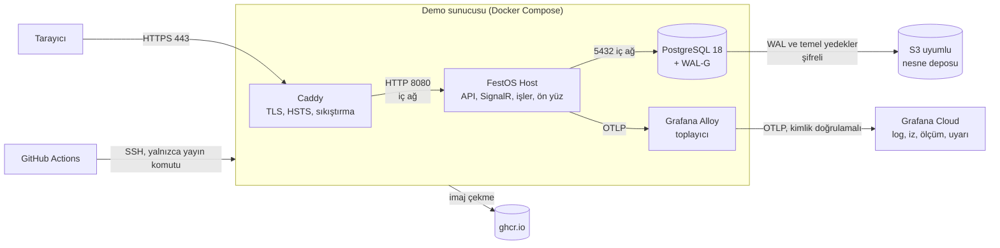
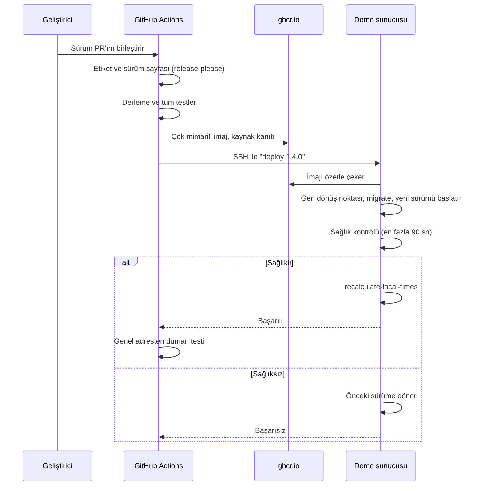

# 09 — Ortamlar ve Yayın

> **Durum:** v1.0 · **Son güncelleme:** 2026-09-25
> **Kararlar:** [Bölüm 13](#13-kararlar)

## 1. Bu belge ne işe yarar

Uygulamanın nerede ve nasıl çalıştığını tanımlar:
- ortamlar ve geliştirme ortamının kurulumu,
- demo ortamının yapısı: sunucu, konteynerler, ters proxy,
- konteyner imajı ve yayın akışı,
- veritabanının kurulumu, yedeklenmesi ve geri dönüşü,
- demo verisi ve sıfırlanması,
- gizli bilgilerin yeri,
- telemetrinin ve uyarıların gideceği yer,
- sunucu güvenliği.

Sürekli entegrasyon hattı [standards/ci.md](standards/ci.md)'de, adım adım işletim yordamları (kurulum, geri dönüş, parola yenileme) [10-operations.md](10-operations.md)'dedir. Ortamların yapılandırma farkları [configuration §2](standards/configuration.md#2-ortamlar)'dedir.

**Temel ilke: sağlayıcıdan bağımsızlık.** Demo ortamı, Docker çalıştırabilen herhangi bir Linux sunucuya kurulabilir. Sağlayıcıya özgü tek şey sunucunun kendisi ve yedeklerin gittiği S3 uyumlu depodur. Kurulum repodaki betiklerle yapıldığı için sunucu kaybolursa ya da sağlayıcı koşullarını değiştirirse ortam başka bir yere taşınabilir.

## 2. Ortamlar

| Ortam | Nerede | Veri | Ne zaman güncellenir |
|---|---|---|---|
| `Development` | Geliştiricinin bilgisayarı, Aspire ile (§3) | İstenirse demo verisi | Her kod değişikliğinde |
| `Testing` | CI makineleri (birim, entegrasyon, veritabanı testleri) | Her testin kendi verisi | Her PR'da |
| `Demo` | Demo sunucusu (§4) | Kurgusal demo verisi, her gece sıfırlanır (§9) | Her sürümde otomatik (§7) |
| `Production` | İleride gerçek bir şirket kurulumu | Gerçek veri | S1'de yayın yok |

- CI'daki uçtan uca testler, demo yığınının bir kopyasında (Caddy, uygulama imajı, PostgreSQL) `Demo` yapılandırmasıyla çalışır ([ci §4](standards/ci.md#4-pr-hattı)). Böylece yayında çalışacak imaj, migration komutu ve demo verisi her PR'da denenmiş olur.
- `Production`, `Demo` ile aynı imajı ve aynı yapıyı kullanır. Farkları: demo verisi ve demo hesapları yoktur, yedekler farklı bir sağlayıcıya gider, saklama süreleri uzundur (§8.2).

## 3. Geliştirme ortamının kurulumu

| Gerekli | Sürüm | Not |
|---|---|---|
| .NET SDK | `global.json`'daki sürüm | Yalnızca yama güncellemesine izin verilir |
| Node.js | Güncel LTS ([07 §7](07-tech-stack.md#7-sürüm-politikası)) | pnpm, Node'la gelen Corepack ile etkinleştirilir; sürümü kök `package.json`'daki `packageManager` alanından gelir |
| Docker | Docker Desktop ya da Docker Engine | Aspire ve Testcontainers için |
| gitleaks | Güncel | Commit öncesi gizli bilgi taraması ([git §10](standards/git.md#10-gizli-bilgi-taraması)) |

İlk kurulum:

```
git clone <repo>
cd etkinlik-konser-yonetim-sistemi
corepack enable
pnpm install                              # JavaScript bağımlılıkları ve commit kancaları
dotnet tool restore                       # CSharpier, dotnet-ef, lisans aracı
dotnet run --project src/AppHost          # PostgreSQL, API ve ön yüz birlikte açılır
```

- Aspire, veritabanı parolasını ilk çalıştırmada üretir ve kullanıcı gizlileri deposuna yazar; elle gizli bilgi girilmez ([security §6](standards/security.md#6-gizli-bilgiler)).
- Demo verisi istenirse: `dotnet run --project src/Host -- seed-demo` (§9).
- Windows'ta commit kancaları Git'in kendi kabuğuyla çalışır; ek bir kurulum gerekmez. Satır sonları `.gitattributes` ile sabittir.

## 4. Demo ortamının yapısı

### 4.1 Genel görünüm



### 4.2 Bileşenler

| Bileşen | İmaj | Görevi | Dışarıya açık |
|---|---|---|---|
| Caddy | `caddy:2` (özetle sabitlenmiş) | HTTPS sertifikası, HTTP→HTTPS yönlendirme, HSTS, sıkıştırma, ters proxy (§6) | 80, 443 (TCP ve UDP) |
| FestOS Host | `ghcr.io/<hesap>/festos:<sürüm>` (§5) | API, SignalR, zamanlanmış işler, ön yüz | Hayır; 8080 yalnızca iç ağda, 8081 (sağlık) yalnızca iç ağda |
| PostgreSQL | `ghcr.io/<hesap>/festos-postgres:18` — resmi `postgres:18` + WAL-G | Veritabanı ve sürekli arşivleme (§8) | Hayır |
| Grafana Alloy | `grafana/alloy` (özetle sabitlenmiş) | Uygulamanın telemetrisini, sunucu ölçümlerini ve yedekleme betiklerinin sonuçlarını toplayıp Grafana Cloud'a iletir (§11) | Hayır |

Zamanlanmış sunucu işleri (systemd zamanlayıcıları, saatler Europe/Istanbul):

| Saat | İş |
|---|---|
| Her gece 04:00 | Demo verisini sıfırlama (§9) |
| Her gece 04:30 | Temel yedek (§8.2) |
| Pazar 06:00 | Geri yükleme tatbikatı (§8.3) |
| Günlük, ihtiyaç halinde 05:00 | İşletim sistemi güvenlik güncellemeleri ve gerekirse yeniden başlatma (§12) |

Uygulamanın kendi zamanlanmış işleri (otomatik geçişler, 03:00 çakışma kontrolü; [ADR-0013](adr/0013-scheduled-jobs.md)) uygulamanın içinde çalışır; sunucu zamanlayıcısına bağlı değildir.

### 4.3 Sunucu

| Konu | Gereksinim |
|---|---|
| İşlemci ve bellek | En az 2 çekirdek, 4 GB RAM. Mimari x64 ya da ARM64 olabilir (imaj ikisini de içerir, §5). |
| Disk | En az 50 GB |
| Ağ | Sabit genel IPv4 adresi; 22, 80, 443 portları |
| İşletim sistemi | Ubuntu Server 24.04 LTS |
| Yazılım | Docker Engine ve Compose eklentisi; başka hiçbir şey kurulmaz |
| Dosyalar | `/opt/festos/` altında: `compose/` (repodaki `deploy/` klasöründen), `secrets/` (§10), `bin/` (yayın ve bakım betikleri) |

**Sağlayıcı ([E-01](#13-kararlar)):** Oracle Cloud "Always Free":
- 2 ARM (Ampere A1) çekirdek, 12 GB RAM, 200 GB disk; yedekler için Oracle'ın S3 uyumlu nesne deposu (20 GB ücretsiz) ([kaynak](https://docs.oracle.com/en-us/iaas/Content/FreeTier/freetier_topic-Always_Free_Resources.htm)).
- Hesap, demo gerektiğinde (S1 sonunda) açılır. Kayıtta kimlik doğrulaması için kredi kartı istenir; ücret alınmaz.
- Ana bölge kayıtta seçilir ve sonradan değiştirilemez. Türkiye'ye yakınlık ve AB veri konumu için tercih sırası: Frankfurt, Amsterdam, Milano, Marsilya (ARM kapasitesi olan ilk bölge).
- Yalnızca ücretsiz kaynaklar kullanılır; hesap ücretli plana (Pay As You Go) yükseltilmez.
- Oracle, 7 gün boyunca işlemci, ağ ve bellek kullanımı %20'nin altında kalan ücretsiz sunucuları geri alabilir. PostgreSQL'in bellek ayarı bu eşiğin üzerindedir; sunucu yine de geri alınırsa [10 §11](10-operations.md#11-sunucuyu-yeniden-kurma-ya-da-taşıma)'le yeniden kurulur.
- Oracle koşullarını yeniden değiştirirse (Haziran 2026'da ARM sınırını habersiz yarıya indirdi; [kaynak](https://www.infoq.com/news/2026/07/oracle-cloud-free-tier-limits/)) ortam §1'deki ilkeyle başka bir sağlayıcıya taşınır.

## 5. Konteyner imajı

| Konu | Karar |
|---|---|
| Üretim | .NET SDK'nın yerleşik konteyner üretimi (`dotnet publish -t:PublishContainer`); Dockerfile yok. Ön yüz, CI'da derlenir ve Host'un `wwwroot` klasörüne konur. |
| Temel imaj | `mcr.microsoft.com/dotnet/aspnet:10.0-noble-chiseled-extra`. "Chiseled" imajlarda kabuk ve paket yöneticisi yoktur, uygulama root olmayan kullanıcıyla (UID 1654) çalışır. `-extra` sürümü ICU ve saat dilimi verisini içerir; Türkçe kültür ve Europe/Istanbul için gereklidir ([kaynak](https://github.com/dotnet/dotnet-docker/blob/main/documentation/image-variants.md), [code-style §4.6](standards/code-style.md#46-kültür-ve-metin)). |
| Mimari | Tek imaj adıyla hem `linux-x64` hem `linux-arm64` (`ContainerRuntimeIdentifiers`); SDK iki imajı bir OCI dizininde birleştirir ([kaynak](https://learn.microsoft.com/en-us/dotnet/core/containers/publish-configuration)). |
| Kayıt | GitHub Container Registry (`ghcr.io`), repo açıldıktan sonra herkese açık paket. Son 20 sürüm tutulur, eskiler CI'da silinir. |
| Etiketler | Sürüm (`1.4.0`) ve commit (`sha-a1b2c3d`). Yayında her zaman sürüm etiketi ve özet (digest) kullanılır; değişen `latest` etiketi yoktur. |
| Kaynak kanıtı | Her sürüm imajı için GitHub'ın derleme kaynağı kanıtı (build provenance attestation) üretilir: imajın hangi commit'ten, hangi iş akışıyla üretildiği imzalı olarak kayıtlıdır ([kaynak](https://docs.github.com/actions/security-for-github-actions/using-artifact-attestations/using-artifact-attestations-to-establish-provenance-for-builds)). |
| Güvenlik taraması | Yayındaki imaj haftalık Grype ile taranır ([ci §5](standards/ci.md#5-gece-ve-haftalık-işler)). |

**Host'un komutları.** Aynı imaj, argümanla şu işleri de yapar; ayrı bir araç imajı yoktur:

| Komut | Ne yapar | Kim çalıştırır |
|---|---|---|
| (argümansız) | Uygulamayı başlatır | Compose |
| `migrate` | Tüm modüllerin bekleyen migration'larını `festos_migrator` rolüyle uygular ve çıkar | Yayın betiği (§7) |
| `seed-demo` | Demo verisini yükler; yalnızca `Development` ve `Demo` ortamlarında çalışır | Sıfırlama işi, uçtan uca testler (§9) |
| `reset-demo` | Modül verilerini siler, migration'ları ve demo verisini yeniden yükler; yalnızca `Demo` ortamında | Gece zamanlayıcısı (§9) |
| `recalculate-local-times` | Gelecekteki kayıtların yerel saatten türetilen UTC değerlerini yeniden hesaplar ([ADR-0022](adr/0022-future-wall-clock-times.md)) | Yayın betiği, her yayından sonra |
| `probe-health` | İç sağlık portunu sorgular, sonuca göre 0 ya da 1 ile çıkar | Konteyner sağlık kontrolü (chiseled imajda `curl` yoktur) |

**Neden aynı imajda `migrate` komutu:** EF'in migration paketi (bundle) veritabanı bağlamı başına ayrı bir çalıştırılabilir dosyadır; 10 modül ve iki mimari için 20 ayrı dosya üretmek ve saklamak gerekir. Aynı imajdaki komut, migration'ların uygulamanın o sürümüyle birebir aynı olmasını garanti eder. Microsoft'un açılışta migration'a karşı uyarıları (birden fazla örneğin aynı anda çalışması, uygulama rolünün şema değiştirme yetkisi) ayrı adım ve ayrı rolle zaten karşılanır ([kaynak](https://learn.microsoft.com/en-us/ef/core/managing-schemas/migrations/applying)). [database §16.2](standards/database.md#162-uygulama) buna göre güncellenir.

**Saat dilimi ve ICU güncellemeleri** temel imajla gelir. Temel imaj her derlemede güncel yamasıyla çekilir; bu yüzden `recalculate-local-times` her yayından sonra çalıştırılır. Komut yalnızca gelecekteki kayıtlara bakar ve değer değişmediyse hiçbir şey yazmaz.

## 6. Ters proxy ve HTTPS

[Caddy](https://caddyserver.com/) (Apache 2.0) kullanılır.

| Konu | Karar |
|---|---|
| Sertifika | Let's Encrypt'ten otomatik alınır ve yenilenir. |
| HTTP | 80 portu yalnızca HTTPS'e yönlendirir. |
| HSTS | `Strict-Transport-Security: max-age=31536000`. `preload` listesine başvurulmaz. |
| Sıkıştırma | zstd ve gzip |
| WebSocket | Varsayılan ayarla SignalR bağlantıları geçer ([kaynak](https://anthonysimmon.com/securely-reverse-proxy-aspnet-core-web-apps/)). |
| Uygulamaya iletilen başlıklar | `X-Forwarded-For` ve `X-Forwarded-Proto`. Uygulama yalnızca Caddy'nin iç ağ adresinden gelen bu başlıklara güvenir (ASP.NET ileten başlıklar ayarı, bilinen proxy). `__Host-` çerezinin `Secure` olabilmesi için uygulamanın isteği HTTPS olarak görmesi gerekir. |
| Sağlık portu | 8081 Caddy'ye bağlanmaz ([observability §6](standards/observability.md#6-sağlık-kontrolleri)). |

**Alan adı ([E-03](#13-kararlar)):** [deSEC](https://desec.io/)'in ücretsiz `dedyn.io` alt alan adı (ör. `festos.dedyn.io`; ad boşta değilse benzeri). deSEC, Berlin'de kâr amacı gütmeyen bir kuruluştur; A kaydı orada yönetilir. Sertifika HTTP doğrulamasıyla alındığı için Caddy'ye DNS eklentisi gerekmez. Kendi alan adına geçmek yalnızca DNS kaydı ve Caddy'deki adres satırının değişmesidir.

**Neden Caddy:** Sertifikayı ek araç olmadan alır ve yeniler; varsayılan ayarı WebSocket ve ileten başlıklar için yeterlidir; tüm yapılandırma birkaç satırdır. Nginx aynı işi certbot ve daha uzun bir yapılandırmayla yapar.

## 7. Yayın akışı

### 7.1 Adımlar

Yayın, sürüm PR'ının birleştirilmesiyle başlar ([git §7](standards/git.md#7-sürüm-numaraları-ve-etiketler)); ek bir onay adımı yoktur.



Sunucudaki yayın betiği (`/opt/festos/bin/deploy <sürüm>`):
1. Sürüm biçimini doğrular, imajı çeker.
2. Veritabanında bir geri dönüş noktası oluşturur (`pg_create_restore_point('deploy-1.4.0')`). Yayından sonra veri bozulursa zamana göre geri dönüş bu noktayı hedef alabilir (§8.2).
3. `migrate` komutunu çalıştırır. Migration başarısız olursa yayın durur; eski sürüm çalışmaya devam eder.
4. Yeni sürümü başlatır ve sağlık kontrolünün geçmesini bekler.
5. Sağlık kontrolü geçmezse önceki sürüme döner ve hata verir. Migration'lar bir önceki sürümle uyumlu yazıldığı için bu güvenlidir ([database §16.3](standards/database.md#163-güvenli-şema-değişikliği)).
6. `recalculate-local-times` komutunu çalıştırır ve çalışan sürümü kaydeder.

**SSH erişimi:** GitHub Actions sunucuya ayrı bir yayın kullanıcısıyla bağlanır. Bu kullanıcının anahtarı `authorized_keys`'te zorunlu komutla kısıtlıdır (`command="/opt/festos/bin/deploy"`, port yönlendirme ve terminal kapalı): anahtar çalınsa bile yalnızca belirli bir sürümü yayınlamak için kullanılabilir. Sunucunun kimlik parmak izi Actions'ta sabittir; bağlantı başka bir sunucuya yönlendirilemez. Anahtar yalnızca GitHub'daki `demo` ortamının gizli bilgisidir ve yalnızca sürüm etiketlerinden çalışan yayın işi erişebilir ([ci §6](standards/ci.md#6-yayın-hattı)).

### 7.2 Geri alma

- **Uygulama:** Elle çalıştırılan yayın iş akışı, istenen eski sürümü aynı betikle yayınlar. Veritabanı geri alınmaz; migration'lar geriye uyumlu olduğu için eski sürüm yeni şemayla çalışır.
- **Veri:** Uygulama hatası veriyi bozduysa zamana göre geri dönüş kullanılır ([10 §4](10-operations.md#4-yedekten-geri-dönüş)).
- Yayında migration'lar geri çalıştırılmaz (`Down`). Hatalı bir migration yeni bir migration ile düzeltilir.

### 7.3 Kesinti

Tek uygulama örneği vardır. Yayın sırasında uygulama birkaç saniye yanıt vermez; SignalR bağlantıları kendiliğinden yeniden kurulur, açık sekmeler "Yeni sürüm hazır" uyarısını görür ([api §12](standards/api.md#12-sürümleme-ve-uyumluluk)). Demo için kabul edilebilir. Kesintisiz yayın (iki örnek arasında geçiş) gerekirse Caddy'nin arkasına ikinci örnek eklenerek yapılır; uygulama buna hazırdır (oturumlar ve veri koruma anahtarları veritabanında).

## 8. Veritabanı

### 8.1 Kurulum

| Konu | Karar |
|---|---|
| İmaj | Resmi `postgres:18` üzerine WAL-G eklenmiş imaj; repodaki `deploy/postgres/` tanımından CI'da çok mimarili üretilir. |
| Başlatma | `initdb` yerleşik `C.UTF-8` sıralamasıyla ([database §3](standards/database.md#3-veritabanı-ve-şemalar)); ilk açılışta rolleri ve eklentileri kuran betik çalışır. Rol parolaları gizli bilgi dosyalarından okunur. |
| Erişim | Port dışarıya açılmaz. Yönetici erişimi SSH tüneliyle yapılır. |
| İzleme rolü | `festos_monitor`: PostgreSQL'in yerleşik `pg_monitor` rolünün üyesi; hiçbir tabloda yetkisi yoktur. Alloy yalnızca sunucu istatistiklerini okumak için kullanır. [database §4](standards/database.md#4-roller-ve-yetkiler)'e eklenir. |
| Veri | Sunucu diskinde kalıcı bir birimde |
| Ayarlar | Sunucu belleğine göre `shared_buffers` (belleğin yaklaşık %25'i), `effective_cache_size`; `max_connections` modül havuzlarının toplamına göre ([database §17](standards/database.md#17-bağlantı-ve-işletim-ayarları)) |

### 8.2 Yedekleme ve zamana göre geri dönüş

[WAL-G](https://github.com/wal-g/wal-g) (Apache 2.0) kullanılır:
- **Sürekli arşivleme:** PostgreSQL'in her tamamlanan WAL dosyası (işlem günlüğü) sıkıştırılıp şifrelenerek nesne deposuna gönderilir.
- **Temel yedek:** Her gece bir temel yedek alınır; hafta içi değişen blokları içeren artımlı (delta) yedek, haftada bir tam yedek.
- **Şifreleme:** Yedekler sunucudan çıkmadan önce libsodium anahtarıyla şifrelenir. Anahtar gizli bilgidir ve sunucu dışında da saklanır; anahtar kaybolursa yedekler açılamaz (§10).
- **Zamana göre geri dönüş (PITR):** Temel yedek ve arşivlenmiş WAL dosyalarıyla veritabanı saklama süresi içindeki herhangi bir ana ya da yayın betiğinin oluşturduğu geri dönüş noktasına döndürülebilir. Yordam [10 §4](10-operations.md#4-yedekten-geri-dönüş)'tedir.

| Hedef | Demo | Yayın (tasarım) |
|---|---|---|
| Kabul edilebilir en fazla veri kaybı (RPO) | 5 dakika (`archive_timeout = 300`) | 1 dakika (`archive_timeout = 60`) |
| Yeniden hizmete dönme süresi (RTO) | 1 saat | 1 saat |
| Saklama | 7 gün | 30 gün |
| Yedeklerin yeri | Sunucuyla aynı sağlayıcının S3 uyumlu deposu | Farklı sağlayıcı ya da bölge |
| Geri yükleme tatbikatı | Haftalık, otomatik | Haftalık otomatik; üç ayda bir elle zamana göre geri dönüş |

Demo yedekleri sunucuyla aynı sağlayıcıda durur; sağlayıcı hesabı kaybolursa ikisi birlikte kaybolur. Demo verisi repodan yeniden üretilebildiği için bu kabul edilir. Gerçek kullanımda yedeklerin farklı bir sağlayıcıda olması zorunludur.

**Neden WAL-G:** Tek çalıştırılabilir dosyadır, S3 uyumlu her depoyla çalışır, şifreleme ve artımlı yedek destekler. pgBackRest (MIT) daha geniş özellikli bir alternatiftir; ama Nisan 2026'da tek bakımcısı projeyi bıraktığını duyurdu ve proje Mayıs'ta bir sponsor grubuyla ancak kurtarıldı ([kaynak](https://www.theregister.com/databases/2026/05/20/postgresql-backup-tool-gets-some-backup-of-its-own-after-sole-maintainer-sounds-alarm/5242822)). Barman GPL 3 lisanslıdır. Her gece alınan `pg_dump` ise zamana göre geri dönüş sağlamaz; en kötü durumda bir günlük veri kaybolur.

### 8.3 Geri yükleme tatbikatı

Denenmemiş yedek, yedek sayılmaz. Her hafta sunucuda otomatik bir tatbikat çalışır:
1. Boş bir geçici konteynerde son temel yedek ve WAL dosyalarıyla veritabanı geri yüklenir.
2. Denetimler: her modül şemasının migration geçmişi var; işlem geçmişindeki en son kayıt son 24 saat içinde (RPO'nun tuttuğunu gösterir).
3. Geçici konteyner silinir; sonuç ve süre ölçüm olarak gönderilir.

Temel yedeğin ve tatbikatın sonucu `festos.backup.base.success` ve `festos.backup.restore_drill.success` ölçümleriyle izlenir; beklenen sürede başarı gelmezse uyarı üretilir (§11).

## 9. Demo verisi ve sıfırlama

**Veri seti** üç katmandır:

| Katman | İçerik | Nasıl üretilir |
|---|---|---|
| Başvuru verisi | Gerçekçi ekipman kataloğu (gerçek ürün sınıfları, ağırlık ve güç değerleri), kurgusal mekanlar ve depolar, kullanıcılar ve rolleri | Elle yazılmış veri |
| Toplu veri | Kişiler, firmalar, geçmiş etkinlikler (kayıp raporu ve geçmiş ekranları için) | [Bogus](https://github.com/bchavez/Bogus) (MIT), Türkçe yerel ayar ve sabit tohumla; her çalıştırmada aynı veri |
| Senaryolar | MVP demo senaryosunun ([00 §6.1](00-scope.md#61-bitti-kriteri-mvp-demo-senaryosu)) farklı adımlarında bekleyen etkinlikler; aynı hafta sonu çakışan iki etkinlik; depolar arası transfer; dış kiralama | Elle yazılmış senaryo betikleri |

**Kurallar:**
- **Tarihler görelidir.** Tüm tarihler, verinin yüklendiği güne göre (Europe/Istanbul) hesaplanır. Demo her gün açıldığında yaklaşan etkinlikler hâlâ gelecektedir.
- **İş kurallarından geçer.** Her modül kendi demo verisini kendi komutlarıyla yükler (`IDemoDataSeeder`, modülün Infrastructure projesinde). Doğrudan SQL yazılmaz. Böylece demo verisi de iş kurallarına uyar, işlem geçmişine yazılır ve entegrasyon olaylarını yayımlar. Host'un `seed-demo` komutu modülleri katman sırasıyla çalıştırır ve her katmandan sonra olayların işlenmesini bekler.
- **Modüller arası başvuru doğal anahtarlarla** (ör. depo kodu `IST-01`) ve modüllerin senkron sözleşmeleriyle yapılır; sabit kimlik gerekmez.
- **Tek veri seti** geliştirme ortamında, CI'daki uçtan uca testlerde ve demo ortamında kullanılır.
- Veri tamamen kurgusaldır; gerçek kişi ya da şirket bilgisi içermez ([00 §9](00-scope.md#9-fonksiyonel-olmayan-varsayımlar)).

**Sıfırlama:** Demo verisi her gece 04:00'te `reset-demo` ile silinip yeniden yüklenir.

**Demo erişimi ([E-02](#13-kararlar)): kapalı, hesaplar istek üzerine verilir.**
- Demo verisi her rol için bir hesap içerir: sistem yöneticisi, booking müdürü, teknik müdür, farklı depolara bağlı iki depo sorumlusu (eşzamanlı çalışmayı göstermek için) ve genel müdür.
- Hesapların parolaları sunucudaki gizli bilgi dosyasından okunur (§10); sıfırlamada hesaplar aynı parolalarla yeniden oluşturulur. Parolalar şifre kurallarına uyar (BR-SYS-007).
- Erişim isteyen kişiye ilgili rolün hesabı ve parolası güvenli bir kanalla verilir. Erişimi geri almak için o rolün parolası değiştirilir ([10 §8](10-operations.md#8-demo-verisini-sıfırlama-ve-erişim)).
- Demoya özel bir giriş yolu (şifresiz ya da hızlı giriş) yoktur. Demo, yayın ortamıyla aynı giriş ve güvenlik kurallarıyla çalışır.
- CI'daki uçtan uca testlerde demo hesaplarının parolaları her çalıştırmada yeniden üretilir.

## 10. Gizli bilgiler

Demo ortamındaki gizli bilgiler ve yerleri ([security §6](standards/security.md#6-gizli-bilgiler)):

| Gizli bilgi | Nerede | Kullanan |
|---|---|---|
| Modül rollerinin, `festos_audit`'in ve `festos_migrator`'ın parolaları | Sunucuda `/opt/festos/secrets/`, konteynere `/run/secrets/` olarak bağlanır | Uygulama, `migrate` komutu |
| `festos_owner` ve PostgreSQL yönetici parolası | Aynı yer | Veritabanı kurulumu, `reset-demo` |
| Veri koruma sertifikası ve parolası ([security §7](standards/security.md#7-veri-koruma-anahtarları)) | Aynı yer | Uygulama |
| WAL-G nesne deposu anahtarları ve libsodium şifreleme anahtarı | Aynı yer | PostgreSQL konteyneri |
| Grafana Cloud erişim belirteci ve `festos_monitor` parolası | Aynı yer | Yalnızca Alloy |
| Demo hesaplarının parolaları | Aynı yer | `seed-demo`, `reset-demo` |
| Yayın SSH anahtarı (özel) | GitHub, `demo` ortamının gizli bilgisi | Yayın işi |

- Gizli bilgi dosyaları root'a aittir ve yalnızca ilgili konteynerin kullanıcısı okuyabilir.
- **Sunucu dışında yedek:** Veri koruma sertifikası, libsodium anahtarı ve nesne deposu anahtarları bir parola yöneticisinde de saklanır. Sunucu kaybolursa yedekleri açmak için bunlar gerekir.
- Yenileme yordamları [10 §6](10-operations.md#6-gizli-bilgilerin-yenilenmesi)'dadır.

## 11. Telemetri ve uyarılar

| Konu | Karar |
|---|---|
| Hedef | [Grafana Cloud](https://grafana.com/products/cloud/free-tier/) ücretsiz planı, AB bölgesi. Kredi kartı istemez; log, iz ve ölçüm için 14 gün saklama, 10.000 etkin ölçüm serisi, ayda 50 GB log ve 50 GB iz ([kaynak](https://grafana.com/docs/grafana-cloud/platform/pricing-and-usage/usage-limits/)). |
| Yol | Uygulama OTLP ile sunucudaki Grafana Alloy'a (Apache 2.0) gönderir; Alloy toplar, gruplar ve kimlik doğrulamalı olarak Grafana Cloud'a iletir. Alloy ayrıca sunucu ölçümlerini (işlemci, bellek, disk), PostgreSQL'in sunucu istatistiklerini (bağlantılar, WAL arşivleme, veritabanı boyutu) ve yedekleme betiklerinin sonuçlarını toplar. PostgreSQL'e yalnızca izleme yetkili `festos_monitor` rolüyle bağlanır (§8.1). |
| Gizli bilgi | Grafana Cloud belirteci yalnızca Alloy'dadır. Uygulama iç ağdaki Alloy'a kimlik bilgisi olmadan gönderir; uygulamanın yapılandırmasında telemetri için gizli bilgi yoktur. |
| Kaynak öznitelikleri | `service.name = festos`, `service.version` (§5 sürümü), `deployment.environment.name = demo` |
| Saklama | Demo'da 14 gün (ücretsiz planın sınırı). [observability §2](standards/observability.md#2-hangi-bilgi-nerede)'deki süreler (log 30, iz 7, ölçüm 90 gün) yayın hedefidir. |
| Örnekleme | Tüm izler alınmaya devam eder; demo hacmi ücretsiz planın çok altındadır ([observability §4](standards/observability.md#4-dağıtık-izleme)). |
| Kişisel veri | Loglarda yalnızca kimlikler bulunduğu için telemetri kişisel veri taşımaz ([observability §3](standards/observability.md#3-loglar)). Gerçek kullanımda sağlayıcı ve bölge KVKK'ya göre yeniden değerlendirilir. |

**Uyarılar** Grafana'nın uyarı kurallarıyla tanımlanır ve e-postayla gelir. Kurallar dışa aktarılıp repoda (`deploy/grafana/`) saklanır.

| Uyarı ([observability §7](standards/observability.md#7-uyarılar)) | Kural |
|---|---|
| Hatalı olaylar listesinde olay var | `festos.messaging.dead_letters` son 5 dakikada arttı |
| Olay gecikmesi P-15'i sürekli aşıyor | `festos.messaging.event.latency` %95'lik değeri 10 dakika boyunca 1 saniyenin üstünde |
| `500` oranı artıyor | Son 10 dakikada `5xx` yanıtların oranı %1'in üstünde (en az 20 istekte) |
| Uygulama erişilemiyor | Grafana'nın dışarıdan erişim kontrolü (Synthetic Monitoring) genel adreste art arda iki kez başarısız |
| Zamanlanmış iş çalışmadı | `festos.jobs.run.duration` ölçümünde bir iş için beklenen aralığın iki katı süre boyunca kayıt yok |
| Temel yedek alınmadı | 26 saat boyunca `festos.backup.base.success` gelmedi |
| Geri yükleme tatbikatı başarısız | 8 gün boyunca `festos.backup.restore_drill.success` gelmedi |
| WAL arşivleme başarısız | PostgreSQL'in arşivleme hata sayacı (`pg_stat_archiver.failed_count`) son 10 dakikada arttı. Arşivleme durursa WAL dosyaları diskte birikir ve disk dolar. |
| Veritabanı bağlantıları sınıra yakın | Açık bağlantılar `max_connections`'ın %80'inin üstünde |
| Disk doluyor | Disk kullanımı %80'in üstünde |

**Neden Grafana Cloud:** Kurulumu ve bakımı yoktur, uyarı ve dışarıdan erişim kontrolü aynı yerdedir, ücretsiz planı kredi kartı istemez. Aynı yığını sunucuda çalıştırmak mümkündür, ama Grafana'nın tek konteynerlik paketi yalnızca geliştirme ve demo için önerilir ve kalıcılık garantisi vermez; bileşenlerinin bir kısmı AGPL lisanslıdır ([kaynak](https://github.com/grafana/docker-otel-lgtm)). Aspire panelinin bağımsız sürümü veriyi saklamaz ve uyarı üretmez ([kaynak](https://aspire.dev/dashboard/standalone/)). Telemetri standart OTLP ile gönderildiği için hedef, uygulama değişmeden Alloy'un ayarıyla değiştirilebilir ([ADR-0016](adr/0016-observability-and-local-dev.md)).

## 12. Sunucu güvenliği

| Konu | Kural |
|---|---|
| SSH | Yalnızca anahtarla giriş; parola ve root girişi kapalı. Yönetici kullanıcısı ve zorunlu komutlu yayın kullanıcısı (§7.1) ayrıdır. |
| Güvenlik duvarı | Gelen trafik yalnızca 22, 80 ve 443 (TCP) ile 443 (UDP, HTTP/3). Hem sağlayıcının ağ kurallarında hem sunucuda. Yalnızca Caddy port yayımlar; Docker'ın port yayımlaması sunucu güvenlik duvarını atlayabildiği için diğer konteynerler hiç port yayımlamaz. |
| Güncellemeler | Ubuntu'nun otomatik güvenlik güncellemeleri açık; çekirdek güncellemesinde 05:00'te yeniden başlatma. |
| Konteynerler | Root olmayan kullanıcı; salt okunur kök dosya sistemi (yazılabilir yalnızca geçici klasör); tüm Linux yetenekleri kapalı (`cap_drop: ALL`); yetki yükseltme kapalı (`no-new-privileges`). |
| Konteyner logları | Docker log dosyaları boyutla sınırlı (10 MB × 3). Asıl loglar telemetri sistemindedir. |

## 13. Kararlar

| No | Konu | Karar | Gerekçe |
|---|---|---|---|
| E-01 | Demo sunucusunun sağlayıcısı | Oracle Cloud "Always Free" ARM sunucusu; yalnızca ücretsiz kaynaklar; hesap S1 sonunda açılır | Her zaman açık, ücretsiz ve yeterli kaynaklı tek seçenek (2 çekirdek, 12 GB RAM, 200 GB disk, 20 GB nesne deposu; [kaynak](https://docs.oracle.com/en-us/iaas/Content/FreeTier/freetier_topic-Always_Free_Resources.htm)). Uyuyan ücretsiz platformlarda zamanlanmış işler ve SignalR çalışmaz. |
| E-02 | Demo erişimi | Kapalı: rol başına demo hesabı, istek üzerine verilir; parolalar gizli bilgi; veri her gece sıfırlanır | Kullanıcının kararı. Kötüye kullanım riski yoktur ve demoya özel bir giriş yolu kodda bulunmaz; demo, yayın ortamıyla aynı güvenlik kurallarıyla çalışır. Bedeli: inceleyen kişinin önce hesap istemesi gerekir. |
| E-03 | Alan adı | Ücretsiz alt alan adı (deSEC, `dedyn.io`) | Ücretsiz ve kalıcı; alan adı sonradan yalnızca DNS ve Caddy ayarıyla değiştirilebilir. |
| E-04 | Sunucu yapısı | Tek Linux sunucu + Docker Compose; Kubernetes yok | Tek örnekli bir demo için Kubernetes'in işletim yükü karşılıksız kalır; Compose yapılandırması repoda ve okunur. |
| E-05 | Konteyner imajı | .NET SDK ile Dockerfile'sız; chiseled-extra temel imaj; x64 + ARM64; ghcr.io; kaynak kanıtı | Küçük saldırı yüzeyi, root olmayan kullanıcı, Türkçe kültür ve saat dilimi verisi dahil; sağlayıcı mimarisinden bağımsız. |
| E-06 | Ters proxy | Caddy | Otomatik sertifika, kısa yapılandırma, SignalR için ek ayar gerekmez. |
| E-07 | Yayın tetikleyicisi | Sürüm oluşunca otomatik; SSH ile zorunlu komutlu kullanıcı; sağlıksızsa otomatik geri dönüş | Sürüm PR'ını birleştirmek zaten bilinçli bir karardır; ikinci bir onay adımı değer katmaz. Çalınan anahtar yalnızca yayın komutunu çalıştırabilir. |
| E-08 | Yayında migration yöntemi | Aynı imajdaki `migrate` komutu, ayrı adımda, `festos_migrator` rolüyle (migration paketi yerine) | Migration ve uygulama sürümü birebir aynı; 20 ayrı paket dosyası gerekmez (§5). V-14'ün yerini alır. |
| E-09 | Yedekleme | WAL-G ile sürekli arşivleme ve zamana göre geri dönüş; şifreli; haftalık otomatik geri yükleme tatbikatı | Günlük döküm bir günlük veri kaybına izin verir; tatbikat yedeğin gerçekten çalıştığını kanıtlar. |
| E-10 | Telemetri hedefi | Grafana Cloud ücretsiz plan (AB), sunucuda Alloy toplayıcı | Bakımsız; uyarılar ve dış erişim kontrolü dahil; belirteç uygulamada değil yalnızca toplayıcıda. |
| E-11 | Demo verisinin yüklenmesi | Modül başına demo veri yükleyici, modülün kendi komutlarıyla; Host'un `seed-demo` komutu; göreli tarihler; Bogus sabit tohumla | Demo verisi de iş kurallarından geçer; modül sınırları korunur; demo her gün güncel görünür. |
| E-12 | Veritabanı izleme rolü | `festos_monitor` (`pg_monitor` üyesi, tablo yetkisi yok) | WAL arşivleme ve bağlantı sayısı gibi sunucu sorunları, uygulama hatası olarak görünmeden önce yakalanır; izleme aracı iş verisine erişemez. |

## 14. Değişiklik kaydı

| Tarih | Versiyon | Değişiklik |
|---|---|---|
| 2026-09-25 | v0.1 | İlk taslak |
| 2026-09-25 | v1.0 | E-01 (Oracle Always Free), E-02 (kapalı demo, hesaplar istek üzerine), E-03 (deSEC ücretsiz alt alan adı) kararlaştırıldı; ADR-0030…0032 kabul edildi. |
