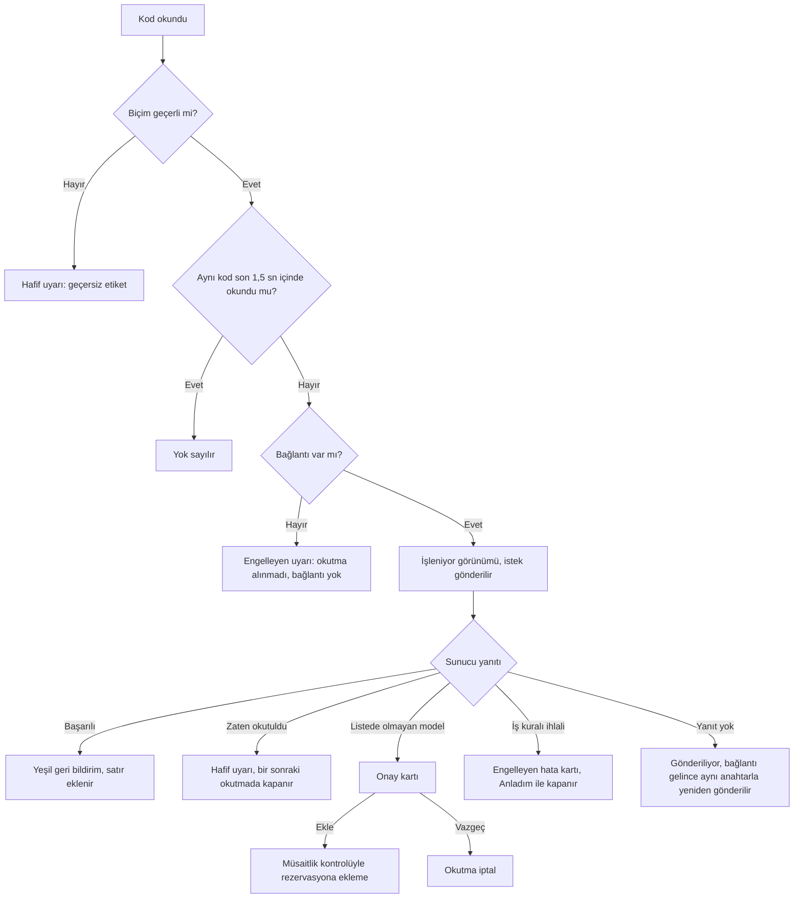

# 11 — Ekran Şablonları ve Ekran Envanteri

> **Durum:** v1.0 · **Son güncelleme:** 2026-09-25

## 1. Bu belge ne işe yarar

- S1 ekranlarının türetildiği **şablonları** çizer: kabuk, liste, detay, form, panel, depo iş listesi, okutma ekranı, giriş.
- Kullanıcı hikayelerinden çıkan **S1 ekran envanterini** listeler: her ekranın adresi, şablonu, cihazı, kullanan rolleri ve hikayeleri.
- Depo okutma akışını adım adım gösterir.

Kurallar (renk, boyut, davranış) [standards/ui.md](standards/ui.md)'dedir; bu belge o kuralların ekranlara nasıl oturduğunu gösterir. Çizimler yerleşimi ve bilgi sırasını anlatır; renk ve oran tasarım sistemi kataloğundadır ([ui §18](standards/ui.md#18-tasarım-sisteminin-belgelenmesi-ve-testi)). Ekranlar modül geliştirilirken ayrıntılanır ve bu belge güncellenir.

## 2. Şablonlar

### 2.1 Uygulama kabuğu

```text
┌──────────────────────────────────────────────────────────────────────────┐
│ ⓘ Yeni sürüm hazır.                                            [Yenile]  │ ← şerit (varsa)
├────────────────┬─────────────────────────────────────────────────────────┤
│ FestOS         │ Etkinlikler › Yaz Festivali 2027    [Ara  Ctrl K]  AK ▾ │ ← üst çubuk
│                ├─────────────────────────────────────────────────────────┤
│ Etkinlik       │                                                         │
│   Etkinlikler  │                                                         │
│   Taraflar     │                   sayfa içeriği                         │
│   Mekanlar     │                                                         │
│   Sanatçılar   │                                                         │
│ Planlama       │                                                         │
│   Çakışmalar   │                                                         │
│   Müsaitlik    │                                                         │
│ Depo           │                                                         │
│   Stok         │                                                         │
│   Transferler  │                                                         │
│ Katalog        │                                                         │
│ Yönetim        │                                                         │
│                │                                                         │
│ [«] Daralt     │                                                         │
└────────────────┴─────────────────────────────────────────────────────────┘
```

- Menü yalnızca kullanıcının yetkili olduğu ekranları gösterir; boş kalan grup başlığı gizlenir.
- Kullanıcı menüsü: ad, roller, şifre değiştirme, tema (varsa), çıkış. Genel müdürde "Salt okunur erişim" yazar.
- 1024 px'in altında menü kapanır ve üst çubuktaki düğmeyle açılan panele dönüşür.

### 2.2 Liste sayfası

```text
┌──────────────────────────────────────────────────────────────────────────┐
│ Etkinlikler                                             [+ Yeni etkinlik]│
│ 312 etkinlik                                                             │
├──────────────────────────────────────────────────────────────────────────┤
│ [Ara…                    ] [Durum ▾] [Tarih aralığı ▾] [Filtreler (2)]   │
│ Durum: Onaylı ✕   Kaynak depo: IST-01 ✕                  Tümünü temizle  │
├──────────────────────────────────────────────────────────────────────────┤
│ Ad ▲                │ Başlangıç       │ Mekan       │ Durum       │ ⚠ │ ⋯│
├─────────────────────┼─────────────────┼─────────────┼─────────────┼───┼──┤
│ Yaz Festivali 2027  │ 12.06.2027 Cmt  │ Açıkhava    │ ✓ Onaylı    │ 2 │ ⋯│
│ Kurumsal Lansman    │ 14.06.2027 Pzt  │ Kongre M.   │ ◉ Opsiyonda │   │ ⋯│
│ …                                                                        │
├──────────────────────────────────────────────────────────────────────────┤
│ 1–25 / 312      Sayfa başına [25 ▾]                 ‹  1  2  3  …  13  › │
└──────────────────────────────────────────────────────────────────────────┘
```

- Başlık, kayıt sayısı ve sayfanın ana işlemi en üstte. Filtreler ve sayfa numarası adreste ([ui §5.1](standards/ui.md#51-adresler-ekranın-durumunu-taşır)).
- "⚠" sütunu durum dışı işaretleri toplar (opsiyon süresi, açık çakışma, dönmemiş ekipman; US-EVT-007).
- Boş, yükleniyor ve hata durumları [ui §10](standards/ui.md#10-yükleniyor-boş-ve-hata-durumları)'daki gibidir.

### 2.3 Detay sayfası

```text
Etkinlikler › Yaz Festivali 2027
┌──────────────────────────────────────────────────────────────────────────┐
│ Yaz Festivali 2027    ✓ Onaylı    ⚠ Opsiyon son tarihi: 14.05.2027       │
│ 12.06.2027 Cmt 14:00 – 13.06.2027 02:00 · Açıkhava · Kaynak depo: IST-01 │
│                                        [Hazırlığa geç]  [İptal et]  [⋯]  │
│                         Hazırlığa geç: rider versiyonu bağlanmamış.      │
├──────────────────────────────────────────────────────────────────────────┤
│ Genel │ Opsiyonlar │ Rider │ İhtiyaç ve rezervasyon │ Depo │ Geçmiş      │
├──────────────────────────────────────────────────────────────────────────┤
│ ┌ Bilgiler ───────────────────────────┐ ┌ Durum geçmişi ───────────────┐ │
│ │ Tür            Konser               │ │ ✓ Onaylı     11.03.2027 A.K. │ │
│ │ Sanatçı        …                    │ │ ◉ Müzakere   02.03.2027 A.K. │ │
│ │ Hazırlık payı  1 gün                │ │ ◉ Opsiyonda  20.02.2027 A.K. │ │
│ │ Dönüş payı     1 gün                │ │ ○ Talep      18.02.2027 A.K. │ │
│ └─────────────────────────────────────┘ └──────────────────────────────┘ │
└──────────────────────────────────────────────────────────────────────────┘
```

- Başlık bölümü her sekmede görünür: ad, durum, önemli işaretler, özet bilgiler, **o durumdan geçerli geçişler** (US-EVT-007). Koşulu sağlanmayan geçiş pasiftir ve nedeni altında yazar ([ui §12](standards/ui.md#12-yetkiye-göre-arayüz)).
- Sekmeler adreste ayrı yollardır (`/events/{id}/holds`); doğrudan açılabilir ve paylaşılabilir.
- Başka bir kullanıcının değişikliği sayfa yenilenmeden gelir ve kısa süre vurgulanır ([ui §11.1](standards/ui.md#111-değişikliklerin-ekrana-gelmesi)).

### 2.4 Form: diyalog ve sayfa

Küçük kayıt, diyalogda:

```text
┌ Opsiyon ekle ─────────────────────────────────────── ✕ ┐
│ * zorunlu alan                                         │
│                                                        │
│ Mekan *                                                │
│ [Açıkhava Tiyatrosu                                ▾]  │
│                                                        │
│ Tutulan tarih aralığı *                                │
│ [12.06.2027] [14:00]  –  [13.06.2027] [02:00]          │
│                                                        │
│ Opsiyon son tarihi *                                   │
│ [14.05.2027]                                           │
│                                                        │
│ ⓘ Bu mekanda aynı tarihlerde 1 aktif opsiyon var.      │
│   Bu opsiyon 2. sırada olacak.                         │
│                                                        │
│                              [Vazgeç]  [Opsiyon ekle]  │
└────────────────────────────────────────────────────────┘
```

Büyük kayıt (etkinlik, rider, model) kendi sayfasında; bölümler başlıklarla ayrılır, ana düğme sayfa başlığında ve formun sonunda:

```text
Etkinlikler › Yeni etkinlik
┌──────────────────────────────────────────────────────────────┐
│ Yeni etkinlik                          [Vazgeç] [Kaydet]     │
├──────────────────────────────────────────────────────────────┤
│ ⚠ 2 alanda hata var: Etkinlik türü, Başlangıç                │ ← özet (hata varsa)
│                                                              │
│ Genel bilgiler                                               │
│ Ad *                 [                                  ]    │
│ Etkinlik türü *      (•) Promotör  ( ) Teknik hizmet         │
│ Müşteri              [Ara…                             ▾]    │
│                                                              │
│ Zaman                                                        │
│ Başlangıç *          [gg.aa.yyyy] [ss:dd]                    │
│ Bitiş *              [gg.aa.yyyy] [ss:dd]                    │
│ …                                                            │
│                                        [Vazgeç] [Kaydet]     │
└──────────────────────────────────────────────────────────────┘
```

### 2.5 Panel

Karar vermek için birden çok kaydı bir arada gösteren ekranlar (çakışma paneli, stok görünümü, kayıp görünümü): üstte özet sayılar, altta liste şablonu (§2.2).

```text
┌──────────────────────────────────────────────────────────────────────────┐
│ Çakışmalar                                                               │
│ ┌ Açık ────────┐ ┌ Rakip talep ─┐ ┌ Aşırı rezervasyon ┐ ┌ Kabul edildi ┐ │
│ │ ✕ 7          │ │ 5            │ │ 2                 │ │ ⚠ 3          │ │
│ └──────────────┘ └──────────────┘ └───────────────────┘ └──────────────┘ │
│ [Depo ▾] [Tarih aralığı ▾] [Etkinlik ▾]                                  │
├──────────────────────────────────────────────────────────────────────────┤
│ Model             │ Depo   │ Aralık            │ İstenen │ Müsait │ …    │
│ Robe MegaPointe   │ IST-01 │ 12–13.06.2027     │      24 │     18 │ ›    │
└──────────────────────────────────────────────────────────────────────────┘
```

- Özet kutuları filtre gibi çalışır: tıklanınca liste o gruba süzülür.
- Anlık güncellenir (US-WHS-005).

### 2.6 Depo: iş listesi (telefon)

```text
┌──────────────────────────────┐
│ FestOS · Depo       IST-01 ▾ │
│ ● Bağlı                      │
├──────────────────────────────┤
│ Bugün                        │
│ ┌──────────────────────────┐ │
│ │ ↑ Çıkış                  │ │
│ │ Yaz Festivali 2027       │ │
│ │ 34 / 52 kalem            │ │
│ └──────────────────────────┘ │
│ ┌──────────────────────────┐ │
│ │ ⇄ Transfer varışı        │ │
│ │ ANK-01 → IST-01          │ │
│ │ Planlanan: 14:00         │ │
│ └──────────────────────────┘ │
│ Yarın                        │
│ ┌──────────────────────────┐ │
│ │ ↓ Giriş                  │ │
│ │ Kurumsal Lansman         │ │
│ └──────────────────────────┘ │
│ Tümünü göster                │
└──────────────────────────────┘
```

- Bugün ve yarın olan işler başta (US-WHS-002 madde 1). Her kart 72 px'ten yüksektir; kartın tamamı dokunma alanıdır.
- Depo sorumlusunun birden fazla deposu varsa üstte depo seçimi; tek deposu varsa gizlenir.

### 2.7 Depo: okutma ekranı (telefon)

```text
┌──────────────────────────────┐
│ ‹  Çıkış · Yaz Festivali 2027│
│ 34 / 52 kalem       ● Bağlı  │
├──────────────────────────────┤
│ [Etiketi okutun…][Kamera]    │ ← her zaman odakta
├──────────────────────────────┤
│ ✓ Shure SM58 · E-10234       │ ← son sonuç
├──────────────────────────────┤
│ Kalanlar (18)                │
│ ▣ Kasa: XLR 10 m × 20        │
│ Shure SM58          6 / 8    │
│ XLR 10 m                     │
│ ┌──────┐  18 / 20  ┌──────┐  │
│ │  −   │  2 eksik  │  +   │  │ ← 72 px düğmeler
│ └──────┘           └──────┘  │
│ …                            │
│ Tamamlananlar (34)         ▾ │
├──────────────────────────────┤
│ [      Çıkışı tamamla      ] │ ← sabit işlem çubuğu
└──────────────────────────────┘
```

Engelleyen hata kartı (okutma durur, yalnızca "Anladım" ile kapanır):

```text
┌──────────────────────────────┐
│ ✕ Bu birim zaten çıkışta     │
│ Shure SM58 · E-10234         │
│ Çıkışı yapan: Ayşe Yılmaz    │
│ Saat: 17:03                  │
│                              │
│ [          Anladım         ] │
└──────────────────────────────┘
```

Aynı şablon; çıkış, giriş, transfer çıkışı ve varışı ile tedarikçiye iade için kullanılır. Farkları başlık, beklenen liste ve girişteki hasar / eksik bildirimi düğmeleridir (US-WHS-003).

### 2.8 Giriş

```text
┌──────────────────────────────┐
│           FestOS             │
│                              │
│ E-posta                      │
│ [                          ] │
│ Şifre                        │
│ [                 ][Göster]  │
│                              │
│ [          Giriş yap       ] │
│                              │
│ ⚠ E-posta ya da şifre hatalı.│ ← hangi alanın yanlış olduğu söylenmez
└──────────────────────────────┘
```

- Hatalı girişte hangi alanın yanlış olduğu söylenmez (US-SYS-010). Hesap kilitliyse bu açıkça ve süresiyle yazılır.
- Geçici şifreyle girişte bir sonraki ekran yeni şifre belirlemedir; kural metni alanın altında görünür (US-SYS-011).

## 3. S1 ekran envanteri

Kısaltmalar: SY sistem yöneticisi, BM booking müdürü, TM teknik müdür, DS depo sorumlusu. Genel müdür tüm ofis ekranlarını salt okunur görür (BR-SYS-004).

**Genel ve yönetim**

| Ekran | Adres | Şablon | Cihaz | Roller | Hikayeler |
|---|---|---|---|---|---|
| Giriş | `/login` | Giriş | Tümü | Tümü | US-SYS-010 |
| Yeni şifre belirleme | `/set-password` | Giriş | Tümü | Tümü | US-SYS-010, US-SYS-011 |
| Şifre değiştirme | Kullanıcı menüsünden diyalog | Form (diyalog) | Tümü | Tümü | US-SYS-011 |
| Kullanıcılar | `/admin/users` | Liste + diyalog | Masaüstü | SY | US-SYS-001, US-SYS-002 |
| Roller ve yetkiler | `/admin/roles` | Liste (salt okunur matris) | Masaüstü | SY | US-SYS-003 |
| Depolar | `/admin/warehouses` | Liste + diyalog | Masaüstü | SY | US-SYS-005 |
| Etkinlik varsayılanları | `/admin/event-defaults` | Form (sayfa) | Masaüstü | SY | US-SYS-007 |
| İşlem geçmişi | `/audit` | Liste (imleçli) | Masaüstü | SY, GM | US-SYS-004 |

**Taraflar, mekanlar, sanatçılar**

| Ekran | Adres | Şablon | Cihaz | Roller | Hikayeler |
|---|---|---|---|---|---|
| Taraflar | `/parties`, `/parties/{id}` | Liste, detay, diyalog | Masaüstü | BM | US-PTY-001, US-PTY-002 |
| Mekanlar | `/venues`, `/venues/{id}` | Liste, detay (Genel, Ekipman) | Masaüstü | BM, TM | US-VEN-001, US-VEN-002 |
| Sanatçılar | `/artists`, `/artists/{id}` | Liste, detay (prodüksiyonlar) | Masaüstü | BM | US-ART-001 |
| Prodüksiyon ve rider | `/productions/{id}`, `/productions/{id}/rider/edit`, `/productions/{id}/rider/compare` | Detay, form (sayfa), karşılaştırma | Masaüstü | TM | US-RDR-001, US-RDR-002 |

**Etkinlik**

| Ekran | Adres | Şablon | Cihaz | Roller | Hikayeler |
|---|---|---|---|---|---|
| Etkinlikler | `/events` | Liste | Masaüstü | BM, TM | US-EVT-007 |
| Yeni etkinlik | `/events/new` | Form (sayfa) | Masaüstü | BM | US-EVT-001 |
| Etkinlik: Genel | `/events/{id}` | Detay | Masaüstü | BM, TM | US-EVT-004, US-EVT-005, US-EVT-006, US-EVT-007, US-EVT-008 |
| Etkinlik: Opsiyonlar | `/events/{id}/holds` | Detay + diyalog | Masaüstü | BM | US-EVT-002, US-EVT-003 |
| Etkinlik: Rider | `/events/{id}/rider` | Detay | Masaüstü | TM | US-RDR-003, US-RDR-004, US-RDR-005 |
| Etkinlik: İhtiyaç ve rezervasyon | `/events/{id}/requirements` | Detay (tablo, toplu onay) | Masaüstü | TM | US-MRP-001, US-MRP-002, US-MRP-003, US-MRP-005, US-MRP-006, US-MRP-008 |
| Etkinlik: Depo işlemleri | `/events/{id}/warehouse` | Detay (toplama listesi, çıkış / giriş durumu) | Masaüstü | TM, DS | US-WHS-001 |
| Etkinlik: Geçmiş | `/events/{id}/history` | Detay (durum geçmişi, işlem geçmişi) | Masaüstü | BM, TM | US-EVT-007 |

**Planlama ve satın alma**

| Ekran | Adres | Şablon | Cihaz | Roller | Hikayeler |
|---|---|---|---|---|---|
| Çakışmalar | `/planning/conflicts` | Panel | Masaüstü | TM | US-MRP-004 |
| Müsaitlik sorgulama | `/planning/availability` | Form + sonuç tablosu | Masaüstü | TM, BM | US-MRP-007 |
| Dış kiralama siparişleri | `/procurement/rental-orders`, `/procurement/rental-orders/{id}` | Liste, detay | Masaüstü | TM, DS | US-MRP-005, US-WHS-007 |

**Katalog ve stok**

| Ekran | Adres | Şablon | Cihaz | Roller | Hikayeler |
|---|---|---|---|---|---|
| Kategoriler | `/catalog/categories` | Liste (ağaç) + diyalog | Masaüstü | TM | US-EQP-001 |
| Modeller | `/catalog/models`, `/catalog/models/{id}` | Liste, detay, form (sayfa) | Masaüstü | TM | US-EQP-002 |
| Kitler | `/catalog/kits`, `/catalog/kits/{id}` | Liste, detay | Masaüstü | TM | US-EQP-005 |
| Stok görünümü | `/inventory/stock` | Panel | Masaüstü | DS, TM | US-EQP-008 |
| Birimler | `/inventory/units`, `/inventory/units/{id}` | Liste, detay; toplu ekleme ve durum değiştirme diyalogları | Masaüstü | DS | US-EQP-003, US-EQP-008, US-WHS-006 |
| Adetli stok düzeltme | Stok görünümünden diyalog | Form (diyalog) | Masaüstü | DS | US-EQP-004 |
| Kasalar | `/inventory/cases`, `/inventory/cases/{id}` | Liste, detay | Masaüstü | DS | US-EQP-006 |
| Etiket yazdırma | Birim ve kasa listelerinde toplu işlem → PDF | Liste (toplu işlem) | Masaüstü | DS | US-EQP-007 |
| Kayıp görünümü | `/inventory/losses` | Panel | Masaüstü | DS, TM, GM | US-EQP-009 |
| Transferler | `/inventory/transfers`, `/inventory/transfers/{id}` | Liste, detay; elle transfer diyaloğu | Masaüstü | DS, TM | US-WHS-004 |

**Depo (telefon)**

| Ekran | Adres | Şablon | Cihaz | Roller | Hikayeler |
|---|---|---|---|---|---|
| Depo işleri | `/warehouse` | Depo iş listesi | Telefon | DS | US-WHS-002 |
| Etkinlik çıkışı | `/warehouse/check-outs/{eventId}` | Okutma ekranı | Telefon | DS | US-WHS-001, US-WHS-002, US-WHS-005 |
| Etkinlikten giriş | `/warehouse/check-ins/{eventId}` | Okutma ekranı | Telefon | DS | US-WHS-003, US-WHS-005 |
| Transfer çıkışı | `/warehouse/transfers/{id}/dispatch` | Okutma ekranı | Telefon | DS | US-WHS-004 |
| Transfer varışı | `/warehouse/transfers/{id}/receive` | Okutma ekranı | Telefon | DS | US-WHS-004 |
| Tedarikçiye iade | `/warehouse/rental-returns/{orderId}` | Okutma ekranı | Telefon | DS | US-WHS-007 |

Adreslerdeki `{id}` yönlendirme dosyalarında `$` parametresidir ([naming §7](standards/naming.md#7-ön-yüz-adları)).

## 4. Başlangıç ekranı

`/` adresi kullanıcıyı rolüne göre yönlendirir; S1'de ayrı bir özet paneli yoktur (S6'da raporlama paneli gelir).

| Rol | Başlangıç |
|---|---|
| Sistem yöneticisi | Kullanıcılar |
| Booking müdürü | Etkinlikler |
| Teknik müdür | Çakışmalar |
| Depo sorumlusu | Telefonda depo işleri; masaüstünde stok görünümü |
| Genel müdür | Etkinlikler |

Birden fazla rolü olan kullanıcı, tablodaki ilk rolünün başlangıcına gider.

## 5. Okutma akışı



Ayrıntılar [ui §14.4–14.8](standards/ui.md#144-okutma-alanı)'dedir.

## 6. Değişiklik kaydı

| Tarih | Versiyon | Değişiklik |
|---|---|---|
| 2026-09-25 | v0.1 | İlk taslak |
| 2026-09-25 | v1.0 | Bağlantı yokken okutma dalı eklendi (U-01); kesinleşti. |
