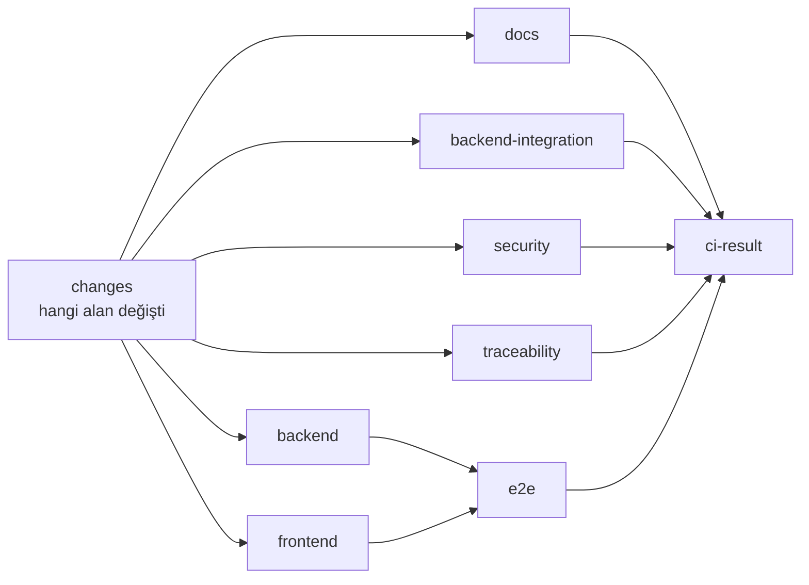

# Sürekli Entegrasyon Standardı

> **Durum:** v1.4 · **Son güncelleme:** 2026-09-26
> **Kararlar:** [Bölüm 13](#13-kararlar)

## 1. Bu belge ne işe yarar

GitHub Actions'ta hangi kontrollerin, ne zaman ve hangi kurallarla çalıştığını tanımlar:
- iş akışları ve tetikleyicileri,
- PR hattının işleri,
- gece ve haftalık işler,
- yayın hattı,
- iş akışlarının güvenliği,
- lisans ve güvenlik açığı denetimi.

Kontrollerin neyi denetlediği ilgili standarttadır: kod biçimi ve lint [code-style.md](code-style.md)'de, testler [testing.md](testing.md)'de, commit ve PR kuralları [git.md](git.md)'de. Yayının sunucu tarafı [09 §7](../09-environments-and-deployment.md#7-yayın-akışı)'dedir.

## 2. İlkeler

1. **CI yetki kaynağıdır.** Commit kancaları kolaylıktır; bir değişiklik ancak CI yeşilken `main`'e girer ([git §8](git.md#8-commit-öncesi-kontroller)).
2. **Yerelde aynı komutlar.** CI'daki her adım yerelde aynı komutla çalıştırılabilir (§12). CI'a özgü, yerelde denenemeyen mantık yazılmaz.
3. **Tekrarlanabilir.** Aynı commit her zaman aynı bağımlılıklarla derlenir: SDK ve Node sürümü sabit, paketler kilit dosyalarından (§8).
4. **Hızlı.** PR hattının hedefi 10 dakikanın altıdır ([testing §12](testing.md#12-kararsız-testler-ve-hız)). İşler paralel çalışır; değişmeyen alanların işleri atlanır.
5. **En az yetki.** İş akışları varsayılan olarak hiçbir yetkiye sahip değildir; her iş ihtiyacı olanı açıkça ister. Gizli bilgiler yalnızca yayın işinde bulunur (§7).

## 3. İş akışları

| Dosya | Tetikleyici | Ne yapar |
|---|---|---|
| `ci.yml` | PR'daki her push; `main`'e push; başka iş akışlarından çağrılabilir | PR hattı (§4) |
| `pr-title.yml` | PR açılınca, başlığı değişince, yeni push gelince | PR başlığının commit biçimine uygunluğu ([git §5.3](git.md#53-başlık-ve-açıklama)); yerel commit'lerle aynı commitlint yapılandırmasıyla |
| `nightly.yml` | Her gece 00:30 UTC (03:30 İstanbul); elle | Gece işleri (§5) |
| `weekly.yml` | Pazar 01:00 UTC; elle | Haftalık işler (§5) |
| `release.yml` | `main`'e push | Sürüm PR'ı; sürüm oluştuysa imaj ve demo yayını (§6) |
| `deploy.yml` | Elle, sürüm numarası girilerek | Belirli bir sürümü demo ortamına yayınlama (geri alma için) |
| CodeQL | GitHub'ın varsayılan kurulumu (iş akışı dosyası yok); repo açıldıktan sonra | Kod güvenlik taraması ([git §11](git.md#11-github-repo-ayarları)) |
| `dependabot.yml` | — | Bağımlılık güncellemeleri ([git §9](git.md#9-bağımlılık-güncellemeleri)) |

## 4. PR hattı



| İş | Ne zaman çalışır | Adımlar |
|---|---|---|
| `changes` | Her zaman | Hangi alanların değiştiğini bulur: sunucu, ön yüz, testler, belgeler, iş akışları, dağıtım dosyaları (`deploy/`). |
| `docs` | Belge değiştiyse | Bağlantı denetimi; kural referansları betiği çalıştırıldıktan sonra fark kalmamalı ([tools/docs](../../tools/docs/README.md)). |
| `backend` | Sunucu ya da test kodu değiştiyse | .NET araçlarının geri yüklenmesi; kilitli paket geri yükleme (NuGet açık denetimi dahil, §10); `dotnet build -c Release` (uyarılar hata); `dotnet csharpier check .`; birim ve mimari testler; OpenAPI belgesinin güncelliği (derlemenin ürettiği belgeyle repodaki arasında fark olmamalı); kod kapsamı özeti. |
| `backend-integration` | Sunucu ya da test kodu değiştiyse | Modül entegrasyon testleri ve veritabanı testleri (Testcontainers). Test projeleri paralel matris işlerine bölünür. |
| `frontend` | Ön yüz ya da OpenAPI belgesi değiştiyse | `pnpm install --frozen-lockfile`; API istemcisinin Orval ile yeniden üretilmesi ve fark denetimi; `pnpm lint`, `pnpm format:check`, `pnpm typecheck`, `pnpm test` (tasarım sistemi örnekleri tarayıcıda dahil), `pnpm build`, paket boyutu denetimi (size-limit, [ui §16](ui.md#16-performans)). |
| `e2e` | `backend` ve `frontend` başarılıysa, sunucu ya da ön yüz değiştiyse | Uygulama imajı yerel olarak üretilir (x64). Demo yığınının bir kopyası (Caddy, uygulama, PostgreSQL) aynı Compose tanımıyla ve `Demo` yapılandırmasıyla açılır; `migrate` ve `seed-demo` çalışır. Playwright testleri Chromium'da ve erişilebilirlik taraması ([testing §8](testing.md#8-uçtan-uca-testler)). Başarısızlıkta Playwright raporu ve iz kayıtları eser (artifact) olarak saklanır. |
| `security` | Her zaman | gitleaks (PR'ın commit'leri); lisans denetimi (§9); `pnpm audit` (§10); iş akışları değiştiyse actionlint ve zizmor (§7). |
| `traceability` | Sunucu, test ya da belge değiştiyse | Kural ve geçiş izlenebilirliği ([testing §10](testing.md#10-kural-ve-geçiş-izlenebilirliği)). |
| `ci-result` | Her zaman, en son | Diğer işlerin sonucunu toplar. Atlanan iş başarılı sayılır; başarısız ya da iptal edilen iş varsa bu iş de başarısız olur. |

**Kurulum sırası:** Hat Faz 1.0'da `changes`, `docs`, `backend`, `frontend`, `e2e`, `security` ve `ci-result` işleriyle kuruldu. Tabloda olup henüz bulunmayanlar, sınayacakları kod geldiğinde eklenir: `backend-integration` ve `traceability` ile OpenAPI / Orval fark denetimi Faz 1.1'de; kod kapsamı özeti entegrasyon testleriyle; paket boyutu denetimi (size-limit) ilk ekranlarla; `e2e`'nin yayın kopyası yığınla çalışması `deploy/` hazır olunca (1.9). O zamana kadar `e2e`, Playwright'ın derleyip açtığı ön yüze karşı çalışır. Zorunlu kontrol tek olduğu için (C-01) bu eklemeler kural setini değiştirmez.

**Neden tek toplayıcı iş:** Alan filtresi iş akışının tetikleyicisine yazılırsa (`paths`), iş akışı hiç çalışmadığında zorunlu kontrol "bekliyor" durumunda kalır ve PR birleştirilemez. Filtre iş düzeyinde uygulanır ve zorunlu kontrol olarak yalnızca her zaman çalışan `ci-result` tanımlanır. Böylece yeni bir iş eklemek kural setini değiştirmeyi gerektirmez.

**Neden uçtan uca testler yayındaki yığınla:** Aynı imaj, aynı Compose tanımı, aynı `migrate` ve `seed-demo` komutları her PR'da çalışır. Yayında ilk kez denenen bir adım kalmaz. HTTPS de Caddy'nin kendi ürettiği yerel sertifikayla çalışır; `__Host-` çerezi ve güvenlik başlıkları yayındaki gibi sınanır.

## 5. Gece ve haftalık işler

**Kurulum sırası:** Gece işleri şimdilik uçtan uca testler (dört proje) ile açık ve lisans denetimidir; haftalık iş tüm geçmişin gizli bilgi taramasıdır. Performans testleri ölçülebilir ilk ekranlarla, Grype taraması ve eski imajların silinmesi demo ortamıyla (1.9) eklenir. Başarısızlık issue'yu yerel bileşik eylem `.github/actions/report-scheduled-failure` açar; tarama araçlarının sürümleri ve sağlama toplamları tek yerde, `.github/actions/install-scanners`'tadır.

`main` dalında çalışır. Bir iş başarısız olursa iş akışı `type:bug` ve `ci:scheduled` etiketli bir issue açar ya da açık olanı günceller; başarısızlık gözden kaçmaz.

| Sıklık | İş | Neden PR'da değil |
|---|---|---|
| Gece | Uçtan uca testler: Chromium, Firefox, WebKit ve telefon görünümü | Tarayıcı sayısı süreyi katlar ([testing §8](testing.md#8-uçtan-uca-testler)) |
| Gece | Performans testleri (P-08, P-09, P-15) | Paylaşımlı makinede süre ölçümü kararsız ([testing §9.1](testing.md#91-performans)) |
| Gece | NuGet ve pnpm açık denetimi, lisans denetimi | Yeni açıklar kod değişmeden de yayımlanır |
| Haftalık | gitleaks ile tüm geçmişin taranması | Yeni tarama kuralları eski commit'lerde de denenir ([git §10](git.md#10-gizli-bilgi-taraması)) |
| Haftalık | Demo ortamındaki imajın [Grype](https://github.com/anchore/grype) (Apache 2.0) ile taranması; düzeltmesi olan yüksek ve kritik açık varsa issue | Temel imajdaki işletim sistemi paketlerinin açıkları imaj değişmeden ortaya çıkar |
| Haftalık | Kayıttaki eski imajların silinmesi (son 20 sürüm kalır) | — |

## 6. Yayın hattı

`release.yml`:

| Adım | Ne yapar | Yetki |
|---|---|---|
| `release-please` | Sürüm PR'ını oluşturur ya da günceller; sürüm PR'ı birleştirilmişse etiketi ve sürüm sayfasını oluşturur ([git §7](git.md#7-sürüm-numaraları-ve-etiketler)) | `contents: write`, `pull-requests: write` |
| `verify` | Sürüm oluştuysa: `ci.yml`, etiketli commit üzerinde yeniden çalışır | `contents: read` |
| `publish` | Uygulama imajı (SDK ile, x64 + ARM64) ve PostgreSQL + WAL-G imajı üretilir, `ghcr.io`'ya gönderilir; her imaj için derleme kaynağı kanıtı ([09 §5](../09-environments-and-deployment.md#5-konteyner-imajı)) | `packages: write`, `id-token: write`, `attestations: write` |
| `deploy` | `demo` ortamında: SSH ile yayın betiği, ardından genel adresten duman testi: ana sayfa `200` döner ve API yanıtındaki `X-App-Version` yeni sürüme eşittir | `demo` ortamının gizli bilgileri |

- `deploy.yml` aynı `deploy` adımını elle girilen bir sürüm için çalıştırır. Sürüm numarası biçim olarak doğrulanır.
- Yayın işleri aynı anda yalnızca bir tane çalışır (`concurrency: deploy-demo`); çalışan yayın iptal edilmez.
- **Sürüm PR'ında CI onayı:** Sürüm PR'ını release-please, Actions'ın kendi kimliğiyle (`github-actions[bot]`) açar. GitHub Haziran 2026'dan beri böyle açılan PR'larda iş akışlarını, yazma yetkisi olan bir kullanıcı onaylayınca çalıştırıyor; daha önce hiç çalıştırmıyordu ve sürüm PR'ı CI'dan geçmeden birleştirilebiliyordu ([kaynak](https://github.blog/changelog/2026-06-11-bot-created-pull-requests-can-run-workflows-if-approved/)). Bu yüzden sürüm PR'ında iş akışları PR sayfasından bir kez onaylanır; zorunlu kontroller (§11) ancak böyle geçer. Onayı atlamak için kişisel erişim belirteci ya da GitHub App kullanılmaz: ek bir gizli bilgi ve yenileme yükü getirir, sürüm PR'ını birleştirmek zaten bilinçli bir adımdır.
- `release-please`'in `GITHUB_TOKEN` ile oluşturduğu etiket başka iş akışlarını tetiklemez ([kaynak](https://github.com/googleapis/release-please-action)). Bu yüzden yayın, ayrı bir etiket iş akışında değil, aynı iş akışında `release_created` sonucuna bağlı adımlarla yapılır.

## 7. İş akışı güvenliği

| Kural | Neden |
|---|---|
| Her iş akışının başında `permissions: {}`; her iş yalnızca ihtiyacı olan yetkiyi açıkça ister | `GITHUB_TOKEN` ele geçerse yapabilecekleri sınırlı kalır. |
| Tüm dış eylemler tam commit kimliğiyle sabit, yanında sürüm yorumu | Etiketi değiştirilen bir eylem sessizce kötü amaçlı koda dönüşemez ([git §9](git.md#9-bağımlılık-güncellemeleri)). |
| Dış eylem sayısı en azda tutulur: GitHub'ın kendi eylemleri (`actions/*`) dışında yalnızca yol filtresi ve release-please. PR başlığı ayrı bir eylemle değil, commitlint'le denetlenir. pnpm, `packageManager` alanındaki sürümle npm'den kurulur (yerel bileşik eylem `.github/actions/setup-pnpm`). Tarama araçları (gitleaks, Grype, actionlint, zizmor) eylem yerine, sürümü ve sağlama toplamı sabitlenmiş komut satırı araçları olarak çalışır. zizmor'un istisnaları gerekçeleriyle `.github/zizmor.yml`'dadır. | Mart 2026'da Trivy'nin GitHub eylemlerinin 76 sürüm etiketi kimlik bilgisi çalan koda yönlendirildi ([kaynak](https://github.com/aquasecurity/trivy/security/advisories/GHSA-69fq-xp46-6x23)). Güvenlik araçları da saldırı yüzeyidir. |
| `actions/checkout` her zaman `persist-credentials: false` ile | Depo belirteci sonraki adımların erişebileceği bir dosyada kalmaz. |
| `pull_request_target` ve güvenilmeyen eserleri kullanan `workflow_run` yasak | Fork'tan gelen kodu yazma yetkisiyle çalıştırmanın en yaygın yoludur ([kaynak](https://blog.packagist.com/securing-our-github-actions-workflows-with-zizmor/)). |
| PR başlığı, dal adı gibi dışarıdan gelen değerler `run:` betiğine doğrudan yazılmaz; ortam değişkeniyle geçirilir | Betik enjeksiyonunu önler. |
| Gizli bilgiler yalnızca `demo` ortamındadır. Ortama yalnızca `v*` etiketlerinden ve `main`'den çalışan işler erişebilir. | Fork PR'larına gizli bilgi zaten verilmez; ortam kuralı bunu `main` dışındaki dallar için de garanti eder. |
| İş akışı değiştiğinde [actionlint](https://github.com/rhysd/actionlint) (MIT; sözdizimi ve ifade denetimi) ve [zizmor](https://github.com/zizmorcore/zizmor) (MIT; güvenlik denetimi) çalışır | Yukarıdaki kurallar araçla denetlenir. |
| Her işin bir zaman aşımı vardır (varsayılan 20 dakika) | Takılan bir iş dakika harcamaz ve fark edilir. |

## 8. Tekrarlanabilir derleme ve hız

| Konu | Kural |
|---|---|
| .NET SDK | `global.json` ([08 §10](../08-architecture.md#10-derleme-ayarları)) |
| .NET paketleri | Paket kilit dosyaları açık (`RestorePackagesWithLockFile`); CI'da `--locked-mode`. Kilit dosyasıyla uyuşmayan geri yükleme başarısız olur. Dolaylı bağımlılıklar da sabittir. |
| .NET araçları | CSharpier, `dotnet-ef` ve lisans aracı yerel araç bildiriminde (`.config/dotnet-tools.json`) sürümle sabit |
| Node ve pnpm | Node sürümü `.nvmrc`'de; pnpm sürümü kök `package.json`'ın `packageManager` alanında, npm ile kurulur (Corepack kullanılmaz, [09 §3](../09-environments-and-deployment.md#3-geliştirme-ortamının-kurulumu)); `pnpm install --frozen-lockfile` |
| Önbellekler | NuGet paketleri (kilit dosyalarının özetiyle) ve pnpm deposu. Playwright tarayıcıları önbelleğe alınmaz, her çalıştırmada kurulur (Playwright'ın önerisi). |
| Eşzamanlılık | Aynı PR'a yeni push gelince eski çalıştırma iptal edilir. `main` ve yayın çalıştırmaları iptal edilmez. |
| Test sonuçları | Test raporları iş özetine yazılır; başarısız testler PR'da görünür. Kod kapsamı özeti ReportGenerator ile iş özetinde ([testing §13](testing.md#13-kod-kapsamı)). |

## 9. Lisans denetimi

[ADR-0005](../adr/0005-dependency-license-policy.md)'teki politikanın otomatik denetimidir.

| Konu | Kural |
|---|---|
| İzin listesi | `tools/licenses/allowed-licenses.json`: MIT, Apache-2.0, BSD-2-Clause, BSD-3-Clause, 0BSD, ISC, PostgreSQL; yazı tipi paketlerinde OFL-1.1 ([ADR-0033](../adr/0033-design-system.md)). MPL-2.0 yalnızca değiştirilmeden kullanılan paketlerde ve istisna listesi üzerinden. |
| İstisna listesi | `tools/licenses/exceptions.json`: ekosistem, paketler (`*` ile kalıp), sürüm (`*` ya da `4.x` gibi bir ana sürüm; yeni ana sürüm yeniden inceleme ister), lisans, gerekçe ve varsa ADR. Ör. QuestPDF'in topluluk lisansı ([ADR-0014](../adr/0014-documents-and-qr.md)). Hiçbir pakete uymayan istisna uyarı olarak raporlanır ve silinir. |
| Denetim betiği | `node tools/licenses/check-licenses.mjs` (dış bağımlılığı yok): .NET paketlerini [nuget-license](https://github.com/sensslen/nuget-license) (Apache 2.0, yerel .NET aracı) çıktısından, npm paketlerini `pnpm licenses list --json` çıktısından okur; doğrudan ve dolaylı bütün paketleri aynı iki listeye göre denetler. SPDX ifadelerini anlar (`MIT OR Apache-2.0`). `--only npm` ya da `--only nuget` ile tek ekosistem denetlenebilir. |
| Lisansı bilinmeyen paket | Başarısızlık. Lisans elle incelenir ve istisna listesine gerekçesiyle eklenir. |
| Geliştirme bağımlılıkları | Test ve araç paketleri de denetlenir. GPL, AGPL ve ticari lisanslar onlarda da yasaktır; izin listesi dışındaki diğer serbest lisanslar (ör. CC0, Python-2.0) istisna listesine gerekçeyle eklenebilir. |
| Ne zaman | Her PR'da (`security` işi) ve her gece |

## 10. Güvenlik açığı denetimi

| Kaynak | Araç | Kural |
|---|---|---|
| NuGet paketleri | .NET'in yerleşik NuGet denetimi (paket geri yüklemede) | Dolaylı paketler dahil (`NuGetAuditMode=all`). Yüksek (NU1903) ve kritik (NU1904) açıklar derlemeyi durdurur. Orta ve düşük açıklar uyarı olarak kalır (`WarningsNotAsErrors`), çünkü CI'da uyarılar hata sayılır ([code-style §4.1](code-style.md#41-derleme-ayarları)). |
| npm paketleri | `pnpm audit --audit-level high` | Yüksek ve kritik açıklar başarısızlık. |
| Konteyner imajı | Grype, haftalık (§5) | Düzeltmesi olan yüksek ve kritik açıklar issue açar. |
| Tümü | Dependabot uyarıları ve güvenlik güncellemeleri | [git §9](git.md#9-bağımlılık-güncellemeleri) |

**Yanıt süreleri:** Kritik açık 2 gün, yüksek açık 7 gün içinde düzeltilir ya da gerekçesiyle ertelenir (erteleme issue'ya yazılır ve istisna tarihli olur).

## 11. Zorunlu kontroller

Repo açıldıktan sonra `main`'in kural setinde ([git §11](git.md#11-github-repo-ayarları)) zorunlu kontroller yalnızca şunlardır:
- `ci-result`
- `pr-title`

## 12. Yerelde aynı kontroller

```
dotnet tool restore
dotnet build -c Release -warnaserror
dotnet csharpier check .
dotnet test
pnpm lint && pnpm format:check && pnpm typecheck && pnpm test
python tools/docs/check_links.py
python tools/docs/sync_rule_refs.py
```

Uçtan uca testler yerelde Aspire ile açılan uygulamaya karşı ya da `deploy/` altındaki Compose tanımıyla çalıştırılabilir.

## 13. Kararlar

| No | Konu | Karar | Gerekçe |
|---|---|---|---|
| C-01 | Zorunlu kontrol yapısı | Alan filtresi iş düzeyinde; tek toplayıcı iş (`ci-result`) zorunlu kontrol | Atlanan iş akışlarının zorunlu kontrolü bekletmesi önlenir; kural seti iş eklendikçe değişmez. |
| C-02 | PR'da uçtan uca testler | Yayındaki yığının kopyası: aynı imaj, aynı Compose tanımı, `Demo` yapılandırması, HTTPS | Yayın adımları (imaj, migration, demo verisi) her PR'da denenmiş olur. |
| C-03 | Yayın hattı | Sürüm oluşunca etiketli commit'te CI yeniden çalışır, sonra imaj, kaynak kanıtı, yayın ve duman testi | Yayınlanan imajın tam o commit'ten ve testlerden geçerek üretildiği kanıtlanır. |
| C-04 | İş akışı güvenliği | Yetkisiz varsayılan, commit kimliğiyle sabitleme, az sayıda dış eylem, tarama araçları CLI olarak, actionlint + zizmor | 2025–2026'daki eylem ele geçirmelerine karşı katmanlı önlem. |
| C-05 | Lisans denetimi | nuget-license + `pnpm licenses`; izin listesi ve gerekçeli istisna listesi; her PR'da ve gece | ADR-0005'in otomatik denetimi; lisansı değişen paket fark edilir. |
| C-06 | Açık denetimi | NuGet denetimi (yüksek ve kritik hata), `pnpm audit` (yüksek), haftalık Grype; gece ana dalda tekrar | Yeni yayımlanan açıklar kod değişmeden de yakalanır. |
| C-07 | Tekrarlanabilirlik | NuGet kilit dosyaları ve kilitli geri yükleme; donmuş pnpm kilidi; SDK, Node, pnpm ve .NET araçları sürümle sabit | Aynı commit her zaman aynı bağımlılıklarla derlenir. |
| C-08 | Zamanlanmış işlerin başarısızlığı | Otomatik issue | E-posta bildirimi gözden kaçabilir; issue takip edilir ve kapanana kadar görünür. |
| C-09 | İmaj taraması aracı | Grype | Serbest lisanslı ve aktif; Trivy'nin Mart 2026'daki ele geçirilmesi sonrası güvenlik aracı seçiminde temkinli davranıldı. |

## 14. Değişiklik kaydı

| Tarih | Versiyon | Değişiklik |
|---|---|---|
| 2026-09-25 | v0.1 | İlk taslak |
| 2026-09-25 | v1.0 | Kesinleşti. |
| 2026-09-25 | v1.1 | Ön yüz işine tasarım sistemi testleri ve paket boyutu denetimi; yazı tipleri için OFL (D.4). |
| 2026-09-26 | v1.2 | Sürüm PR'ında iş akışlarının elle onaylanması (GitHub'ın Haziran 2026 değişikliği). |
| 2026-09-26 | v1.3 | Faz 1.0'da kurulan hat ve gelecek işlerin sırası; PR başlığı commitlint'le; pnpm npm ile; zizmor istisnaları dosyada. |
| 2026-09-26 | v1.4 | Lisans denetim betiği ve istisna biçimi; gece ve haftalık işlerin kurulum sırası (Faz 1.0). |
